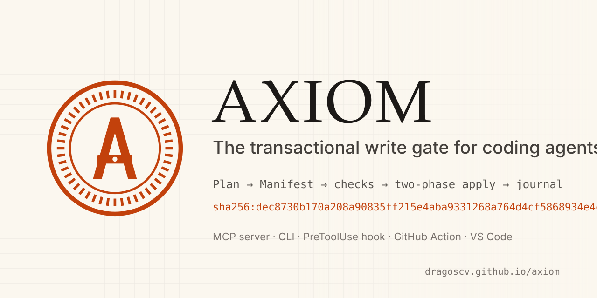
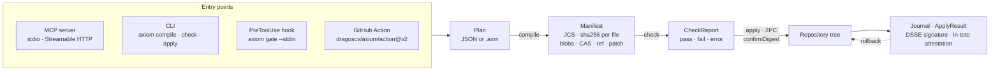
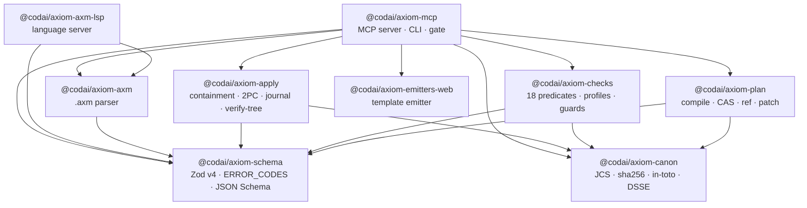

<div align="center">

<a href="https://dragoscv.github.io/axiom/"></a>

[](https://www.npmjs.com/package/@codai/axiom-mcp)
[](https://www.npmjs.com/package/@codai/axiom-mcp)
[](https://github.com/dragoscv/axiom/actions/workflows/ci.yml)
[](https://github.com/dragoscv/axiom/actions/workflows/release.yml)
[](https://scorecard.dev/viewer/?uri=github.com/dragoscv/axiom)
[](LICENSE)
[](https://dragoscv.github.io/axiom/)
[](https://registry.modelcontextprotocol.io/v0.1/servers/io.github.dragoscv%2Faxiom/versions/latest)
[](https://nodejs.org)

[Docs](https://dragoscv.github.io/axiom/) · [Quickstart](#quickstart-60-s) · [Tools](#tools) · [Architecture](#architecture) · [Packages](#packages) · [Contributing](CONTRIBUTING.md)

</div>

An agent describes a change set as a **Plan**. AXIOM compiles it to a canonical,
content-addressed **Manifest**, runs **checks** over the whole set, and **applies** it with a
hash-gated two-phase commit that leaves a journal and, optionally, a signed attestation.
It ships as one npm package — `@codai/axiom-mcp` — that is an MCP server, a CLI, a
PreToolUse hook and a GitHub Action.

## Why

- **Per change set, not per tool call.** Harness hooks (Claude Code, Copilot, Cursor) decide
  one write at a time. A forty-file refactor is forty blind decisions; AXIOM checks the whole
  manifest first — "if you touch X you must also touch Y", dependency budgets, secrets, paths.
- **Byte-exact.** The manifest is JCS-canonical (RFC 8785) and holds only sha256 digests;
  `apply` demands the digest you inspected (`confirmDigest`), re-hashes every pre-image at
  commit, and rolls back to the byte-identical prior tree on any failure — on a tree several
  agents share.
- **Provable.** Every apply leaves a journal keyed by digest. Manifests can be DSSE-signed
  with pinned Ed25519 keys and anti-rollback counters; `verify --tree` proves a tree matches a
  manifest and emits an in-toto attestation that CI uploads to Sigstore.

## What it does



## Install

| Channel | Command | Platforms |
|---|---|---|
| Run without installing | `npx -y @codai/axiom-mcp mcp --root .` | anywhere with Node ≥ 22.14 |
| Global bin (`axiom`) — required for hooks | `npm i -g @codai/axiom-mcp` | anywhere with Node ≥ 22.14 |
| Standalone binary, no Node (from 2.2.1) | `curl -fsSL https://dragoscv.github.io/axiom/install.sh \| sh` | linux-x64 · linux-arm64 · darwin-arm64 · darwin-x64 |
| Standalone binary, no Node (from 2.2.1) | `irm https://dragoscv.github.io/axiom/install.ps1 \| iex` | win-x64 |
| VS Code `.axm` extension | `axiom-axm-<version>.vsix` on the [GitHub release](https://github.com/dragoscv/axiom/releases) | VS Code ≥ 1.138 |
| GitHub Action | `uses: dragoscv/axiom/action@v2` | ubuntu · macos · windows runners |
| MCP Registry | `io.github.dragoscv/axiom` | any registry-aware MCP client |

Binaries ship with `SHA256SUMS` and Sigstore provenance; npm packages carry npm provenance.
How to check them: [SECURITY.md](SECURITY.md#verifying-what-you-download).

## Quickstart (60 s)

**1. Point an MCP client at a repo** — `.vscode/mcp.json` (Claude Desktop config is the same
shape, see [packages/mcp/README.md](packages/mcp/README.md)):

```json
{
  "servers": {
    "axiom": {
      "type": "stdio",
      "command": "npx",
      "args": ["-y", "@codai/axiom-mcp", "mcp", "--root", "${workspaceFolder}"]
    }
  }
}
```

`--root` is an explicit allowlist and may repeat; there is no `cwd` or env fallback.

**2. Write a Plan** — `plan.json`:

```json
{
  "apiVersion": "axiom.dev/v2",
  "kind": "Plan",
  "name": "hello",
  "intent": "Add a greeting module and document it.",
  "artifacts": [
    { "path": "src/hello.ts",
      "source": { "type": "inline", "content": "export const hi = () => 'hi';\n" } },
    { "path": "README.md", "op": "overwrite",
      "source": { "type": "inline", "content": "# hello\n" } }
  ],
  "checks": [{ "id": "no-secrets", "predicate": "content.noSecrets", "params": {} }]
}
```

**3. Compile → check → apply** from the CLI (the MCP tools do the same):

```sh
axiom compile plan.json --root . -o bundle.json        # → { manifestDigest: "sha256:…" }
axiom check   bundle.json --root .                     # → CheckReport, verdict pass|fail|error
axiom apply   bundle.json --root . --dry-run           # unified diff, nothing written
axiom apply   bundle.json --root . --confirm sha256:…  # two-phase commit, journal under .axiom/
axiom rollback sha256:… --root .                       # reverse-replay that journal entry
```

Plan fields, sources (`inline`, `cas`, `ref`, `patch`, `template`) and the `.axm` DSL:
[docs/reference/plan-format.md](docs/reference/plan-format.md) · [docs/reference/axm-syntax.md](docs/reference/axm-syntax.md).

## Use it as a PreToolUse hook

`axiom gate --stdin` reads one harness payload, checks containment, `path.deny/allow`,
`content.noSecrets` and `content.maxBytes` on the write target, scans shell commands for write
primitives, and answers allow (exit 0) or deny (exit 2, JSON reason). Fail-closed; ~100 ms end
to end. Claude Code:

```json
{ "hooks": { "PreToolUse": [ { "matcher": "Write|Edit|MultiEdit|NotebookEdit",
  "hooks": [ { "type": "command", "command": "axiom gate --stdin", "timeout": 5 } ] } ] } }
```

Copilot CLI / VS Code wiring, profile file and the latency budget: [docs/getting-started/hooks.md](docs/getting-started/hooks.md).

> [!WARNING]
> Install the global bin for hooks. `npx` resolution takes seconds even with a warm cache,
> the harness times the hook out, and every harness fails **open** on timeout.

## Use it in CI

Fail a pull request whose tree does not match the manifest an agent applied, and optionally
upload an in-toto attestation:

```yaml
- uses: dragoscv/axiom/action@v2
  with:
    bundle: .axiom/manifests/<hex>.json
    root: .
    attest: true   # needs permissions: id-token: write, attestations: write
```

Scope, `--pre` mode and how to verify the attestation later: [docs/guides/verify-tree.md](docs/guides/verify-tree.md).

## Tools

Seventeen MCP tools, each with `annotations` and an `outputSchema`; errors are `isError` results
carrying a code from the closed `ERROR_CODES` enum — a handler never throws.

| Tool | What it does | Annotations |
|---|---|---|
| `axiom_plan_validate` | Validate a `Plan`; `ERR_*` codes with JSON pointers | read-only |
| `axiom_plan_compile` | `Plan` → `ManifestBundle` (inline blobs or CAS); writes only under `<root>/.axiom/` | act |
| `axiom_manifest_verify` | Recompute the canonical digest, verify every blob and, with a root, the DSSE signatures | read-only |
| `axiom_check` | Run a profile of predicates over a bundle; fails closed; verifies `preImage` against the tree | read-only |
| `axiom_check_start` | Same as `axiom_check`, returned immediately as a task (long `guard.external` suites) | read-only |
| `axiom_task_get` | Poll a task; `result` once `completed`, `error` once `failed`/`cancelled` | read-only |
| `axiom_task_cancel` | Abort a `working` task and kill its guard process trees | act |
| `axiom_plan_begin` | Open a chunked plan session for Plans over the 4 MiB call cap | act |
| `axiom_plan_add` | Append a chunk of `artifacts[]` to a session | act |
| `axiom_plan_seal` | Compile the assembled Plan through the same path as `axiom_plan_compile` | act |
| `axiom_apply_dry_run` | Containment + pre-image check + staging + unified diff; no user files touched | read-only |
| `axiom_apply` | Two-phase commit; requires `confirmDigest === manifestDigest`; single writer via `.axiom/lock` | destructive |
| `axiom_rollback` | Reverse-replay the journal of an applied manifest, scoped to its paths | destructive |
| `axiom_manifest_diff` | Added / removed / changed artifacts between two manifests | read-only |
| `axiom_axm_parse` | `.axm` DSL text → `Plan` with `{line, column}` diagnostics | read-only |
| `axiom_roots_list` | The allowlisted roots | read-only |
| `axiom_repo_snapshot` | Deterministic, content-addressed inventory of a root (`snapshotDigest`) | read-only |

Inputs, outputs, resources (`axiom://…`), transports (`--wire 2026|2025`) and the error
contract: [docs/reference/mcp-tools.md](docs/reference/mcp-tools.md). CLI verbs (`sign`, `trust`, `gc`, `migrate v1`,
`snapshot`, …): [packages/mcp/README.md](packages/mcp/README.md).

## Architecture



`schema` and `canon` are leaves; `plan`, `checks`, `apply` depend only on those two; `axm` on
`schema`; `axm-lsp` on `axm` + `schema`; `emitters-web` has no workspace deps (the emitter
registry is an interface injected into `compilePlan`); `mcp` depends on everything except the
private `testkit`; nobody depends on `mcp`. Enforced by `check-package-deps`.

**Invariants** (never weakened; [PLAN.md](PLAN.md) §2, [design](docs/design/v2-architecture.md)):

1. `ManifestBody` is JCS-canonical; `manifestDigest = sha256(JCS(body))`; nothing hashed contains a timestamp.
2. Content never lives in the manifest — it travels as `blobs` (≤ 256 KiB each, ≤ 4 MiB bundle), CAS (`.axiom/cas/sha256/…`) or a digest-pinned `ref`.
3. `apply` requires `confirmDigest === manifestDigest`; pre-images are re-verified at commit; `.axiom/lock` = single writer per root.
4. Error codes are a closed enum; tests and clients branch on `code`, never on message text.
5. MCP stdout is JSON-RPC only; logs to stderr at `warn`.
6. No shell: child processes get an args array, never `shell: true`.
7. A predicate whose fact provider cannot run yields `verdict: "error"` — fail closed.
8. Roots are an explicit allowlist (`--root`); no `cwd` fallback.
9. The MCP SDK is reached through one seam (`packages/mcp/src/adapter.ts`) and lives in lazy chunks.

## Packages

| Package | What | npm |
|---|---|---|
| [`@codai/axiom-schema`](packages/schema/README.md) | Zod v4 schemas for Plan, Manifest, CheckReport, ApplyResult, Profile, Journal, RepoSnapshot; closed `ERROR_CODES`; JSON Schema export | [](https://www.npmjs.com/package/@codai/axiom-schema) |
| [`@codai/axiom-canon`](packages/canon/README.md) | JCS (RFC 8785), sha256, in-toto Statement v1, DSSE Ed25519 envelopes | [](https://www.npmjs.com/package/@codai/axiom-canon) |
| [`@codai/axiom-plan`](packages/plan/README.md) | Plan → ManifestBundle compiler; inline / CAS / `ref` / `patch` / `template` sources; `verifyBundle`, `diffManifests` | [](https://www.npmjs.com/package/@codai/axiom-plan) |
| [`@codai/axiom-checks`](packages/checks/README.md) | 18 predicates incl. `expr.cel`, `expr.cedar`, `guard.external`, `manifest.requireSigned`; profiles `default` / `strict` / `permissive` | [](https://www.npmjs.com/package/@codai/axiom-checks) |
| [`@codai/axiom-apply`](packages/apply/README.md) | Containment, staging, two-phase commit, journal, rollback, lock, dry-run diff, PR mode, `verifyTree` | [](https://www.npmjs.com/package/@codai/axiom-apply) |
| [`@codai/axiom-axm`](packages/axm/README.md) | `.axm` DSL → `Plan` (Chevrotain) with positioned diagnostics; `formatAxm` | [](https://www.npmjs.com/package/@codai/axiom-axm) |
| [`@codai/axiom-axm-lsp`](packages/axm-lsp/README.md) | Language server for `.axm`: diagnostics, completion, hover, symbols, formatting, semantic tokens | [](https://www.npmjs.com/package/@codai/axiom-axm-lsp) |
| [`@codai/axiom-emitters-web`](packages/emitters-web/README.md) | Optional `template` sources — the `web@2.0.0` emitter (Next 16, Hono 4, Drizzle, Biome, Tailwind v4) | [](https://www.npmjs.com/package/@codai/axiom-emitters-web) |
| [`@codai/axiom-mcp`](packages/mcp/README.md) | **The published bin** — MCP server (stdio + Streamable HTTP), CLI, `gate --stdin` hook, standalone-binary entry | [](https://www.npmjs.com/package/@codai/axiom-mcp) |

Private, not published: `testkit` (golden fixtures, arbitraries), `conformance` (MCP
conformance harness), `vscode-axm` (the `.vsix`). All nine public packages share one version
(fixed Changesets group) and are released together.

## Checks & profiles

A `Profile` is a list of typed predicates. Built-ins: `path.allow` / `path.deny` /
`path.reservedNames`, `content.noSecrets` / `content.maxBytes` / `content.encodingUtf8`,
`manifest.maxArtifacts` / `manifest.maxTotalBytes` / `manifest.requireSigned` / `manifest.noDeletes`,
`deps.max` / `deps.deny`, `repo.noOverwriteOf` / `repo.requireCompanion`, `guard.external`
(your own `scripts/check-*.mjs`), `expr.cel` and `expr.cedar` (offline policy languages).
Verdict is `pass | fail | error`; anything that cannot be evaluated is `error`, which blocks
apply. Catalogue, params and profile authoring: [docs/guides/checks.md](docs/guides/checks.md).

## Signing & provenance

`axiom keygen` → `axiom trust add` → `axiom sign` puts a detached DSSE envelope (Ed25519 over
`JCS(manifest)`) beside the bundle without changing its digest; a profile with
`manifest.requireSigned` then refuses unsigned, tampered, untrusted or replayed
(`antiRollback`) bundles. `axiom verify --tree [--attest]` emits an in-toto Statement
(`https://axiom.dev/attestation/apply/v1`). Envelope, key ceremony, root binding and limits:
[docs/guides/signing.md](docs/guides/signing.md) · [docs/guides/verify-tree.md](docs/guides/verify-tree.md).

## Status & roadmap

**2.3.x shipped.** Plan compiler with every source type, 18 predicates, fail-closed apply with
journal/rollback/PR mode, MCP SDK v2 (2026-07-28 wire, `--wire 2025` fallback) over stdio and
HTTP with 17 tools, fail-closed gate, `.axm` DSL + LSP + VS Code extension, DSSE signing,
`verify --tree` + attestation + GitHub Action, CI on ubuntu/windows/macos, 18 repo guards.
**2.2.1** adds standalone binaries with provenance, the MCP Registry listing, the docs site and
the `action@v2` tag. codai's SWE harness routes every write through the gate by default
([docs/integration/codai.md](docs/integration/codai.md)); brivio and metu wirings are in
[docs/integration/](docs/integration/brivio.md).

Decisions (`D-xx`) and stories (`S-xxx`): [PLAN.md](PLAN.md) · [TRACKER.csv](TRACKER.csv) ·
[MIGRATION.md](MIGRATION.md) for 1.x users · [docs/reference/versioning.md](docs/reference/versioning.md).

## Development

pnpm 12 · Node ≥ 22.14 · TypeScript 7 (tsgo) · tsdown · Biome · Vitest 5 · fast-check · Changesets.

```sh
pnpm install --frozen-lockfile
pnpm lint          # biome check .
pnpm build         # tsdown every package (before typecheck — exports point at dist/)
pnpm typecheck
pnpm test          # vitest run
pnpm guards        # node scripts/run-guards.mjs — 18 repo invariants
```

All five green with output shown, a `.changeset/*.md` for anything under `packages/*/src`, and
the ripple closed (tool → `docs/reference/mcp-tools.md` + `packages/mcp/README.md` + `spec/tools.json`;
schema → regenerated `schemas/*.json`; golden → re-pinned). Details: [CONTRIBUTING.md](CONTRIBUTING.md)
and `.github/instructions/`.

## Community

[Discussions](https://github.com/dragoscv/axiom/discussions) for questions ·
[Issues](https://github.com/dragoscv/axiom/issues/new/choose) for bugs and features ·
[SUPPORT.md](SUPPORT.md) · [SECURITY.md](SECURITY.md) (private reporting) ·
[CODE_OF_CONDUCT.md](CODE_OF_CONDUCT.md) · [CITATION.cff](CITATION.cff).

## License

[MIT](LICENSE) © Dragos Catalin Vladulescu.
