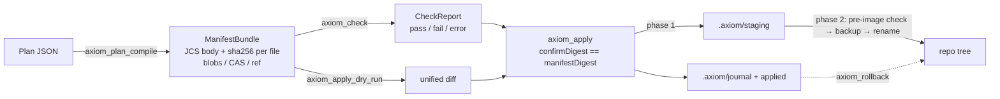

# AXIOM

**Transactional write gate for coding agents.**

An agent describes a change set as a `Plan`. AXIOM compiles it to a canonical,
content-addressed `Manifest`, runs set-level `checks` over the whole change, and
applies it to a repository with a hash-gated two-phase commit that leaves a
durable journal. It ships as an MCP stdio server and a CLI: `@codai/axiom-mcp`.

> v1 (`1.0.x`) is deprecated; its `.axm` emitters and HTTP server were removed.
> See [MIGRATION.md](MIGRATION.md).

## Why

Agent hooks (Claude Code, Copilot CLI, Cursor) gate **one tool call at a time**.
A refactor that touches forty files is forty independent decisions, none of
which can see the whole. AXIOM works on the **change set**:

- checks run over the complete manifest (path allow/deny, secrets, dependency
  budgets, "if you touch X you must also touch Y") before anything is written;
- `apply` requires the caller to echo the manifest digest it inspected, so an
  agent cannot apply "whatever I just generated";
- writes are staged, pre-images are re-verified at commit time, and any failure
  rolls back to the byte-identical prior tree — on a tree several agents share;
- every apply leaves a journal and an `ApplyResult` keyed by digest.

## Quickstart (60 seconds)

```sh
npx @codai/axiom-mcp mcp --root /abs/path/to/repo
```

`.vscode/mcp.json`:

```json
{
  "servers": {
    "axiom": {
      "type": "stdio",
      "command": "npx",
      "args": ["-y", "@codai/axiom-mcp", "mcp", "--root", "${workspaceFolder}"]
    }
  }
}
```

`--root` is an explicit allowlist and may repeat. There is no `cwd` or env-var
fallback. Install, flags, Claude Desktop config and CLI verbs:
[`packages/mcp/README.md`](packages/mcp/README.md).

## Pipeline



## A Plan

```json
{
  "apiVersion": "axiom.dev/v2",
  "kind": "Plan",
  "name": "golden-basic",
  "intent": "Three inline files: text, nested path, and a binary payload.",
  "artifacts": [
    { "path": "src/index.ts",
      "source": { "type": "inline", "content": "export const answer = 42;\n" } },
    { "path": "README.md", "op": "overwrite",
      "source": { "type": "inline", "content": "# golden\n" } },
    { "path": "bin/run.sh", "mode": "0755",
      "source": { "type": "inline", "encoding": "base64",
                  "content": "IyEvYmluL3NoCmVjaG8gAGJpbmFyeQo=" } }
  ],
  "checks": [
    { "id": "no-secrets", "predicate": "content.noSecrets", "params": {} }
  ]
}
```

Full field reference: [docs/plan-format.md](docs/plan-format.md).

## Tools

| Tool | Risk | Purpose |
|------|------|---------|
| `axiom_plan_validate` | read | Validate a `Plan`; `ERR_*` codes with JSON pointers |
| `axiom_plan_compile` | read | `Plan` → `ManifestBundle` (inline blobs or CAS) |
| `axiom_manifest_verify` | read | Recompute canonical digest, verify every blob |
| `axiom_check` | read | Run a profile of predicates; fails closed on provider errors |
| `axiom_apply_dry_run` | read | Containment + pre-image check + unified diff, no writes |
| `axiom_apply` | destructive | Two-phase commit; requires `confirmDigest` |
| `axiom_rollback` | destructive | Reverse a journal entry, scoped to its paths |
| `axiom_manifest_diff` | read | Added / removed / changed between two manifests |
| `axiom_axm_parse` | read | `.axm` DSL text → `Plan` with `{line, column}` diagnostics |
| `axiom_roots_list` | read | The allowlisted roots |

Inputs, outputs, resources and the error contract: [docs/mcp_api.md](docs/mcp_api.md).

## Packages

| Package | One line |
|---------|----------|
| `@codai/axiom-schema` | Zod v4 schemas for Plan, Manifest, CheckReport, ApplyResult, Profile, Journal; closed `ERROR_CODES`; JSON Schema export |
| `@codai/axiom-canon` | JCS (RFC 8785), sha256, in-toto Statement v1 builder |
| `@codai/axiom-plan` | Plan → ManifestBundle compiler, CAS store, `verifyBundle`, `diffManifests` |
| `@codai/axiom-checks` | Predicate registry, fact providers, profiles `default` / `strict` / `permissive` — [docs/checks.md](docs/checks.md) |
| `@codai/axiom-apply` | Containment, staging, two-phase commit, journal, rollback, lock, dry-run diff — [docs/apply.md](docs/apply.md) |
| `@codai/axiom-axm` | `.axm` DSL → `Plan` parser (Chevrotain 13) with `{line, column}` diagnostics, plus `formatAxm` — [docs/syntax_spec.md](docs/syntax_spec.md) |
| `@codai/axiom-axm-lsp` | Language server for `.axm` (bin `axiom-axm-lsp --stdio`): diagnostics, completion, hover, symbols, formatting, semantic tokens — reuses the `axm` parser, one grammar |
| `@codai/axiom-emitters-web` | Optional `template` sources: the `web@2.0.0` emitter — 7 small, deterministic golden-stack file templates (Next 16 route handler / server action, Hono 4 route, Drizzle table, Biome, Tailwind v4, README section) — [docs/emitters.md](docs/emitters.md) |
| `@codai/axiom-mcp` | The published bin: MCP stdio server + CLI |
| `@codai/axiom-testkit` | Private: golden fixtures, fast-check arbitraries, tmp-repo helpers |
| `axiom-axm` (`packages/vscode-axm`) | Private VS Code extension: TextMate grammar + `LanguageClient` for the LSP; packaged to a .vsix, not on the Marketplace |

Dependency direction is enforced: `schema`, `canon` are leaves; `plan`, `checks`,
`apply` depend only on those two; `axm` and `emitters-web` only on `schema` (the emitter registry
is an interface injected into `compilePlan`, not a dep of `plan`); `axm-lsp` on `schema` + `axm`;
`vscode-axm` on `axm-lsp`; `mcp` depends on everything except `testkit`.

## Invariants

1. `ManifestBody` is JCS-canonical; `manifestDigest = sha256(JCS(body))`; nothing
   hashed contains a timestamp.
2. Content never lives in the canonical manifest. It travels as inline `blobs`
   (≤ 256 KiB each, ≤ 4 MiB per bundle), a CAS under `.axiom/cas/sha256/`, or a
   digest-pinned `ref`.
3. `apply` requires `confirmDigest === manifestDigest`; pre-image hashes are
   re-verified at commit; `.axiom/lock` makes each root single-writer.
4. Error codes are a closed enum (`packages/schema/src/errors.ts`). Tests and
   clients branch on `code`, never on message text.
5. MCP stdout carries only JSON-RPC; logs go to stderr at `warn`. Roots are an
   explicit allowlist.
6. No shell: child processes are spawned with an argument array, never `shell: true`.
7. A predicate whose fact provider cannot run yields `verdict: "error"` — fail
   closed, never a constant pass.

## Status and roadmap

**v2.0 (this release).** `schema`, `canon`, `plan` (inline + CAS), `checks`
(15 built-in predicates, three profiles, no external guards), `apply` (fs +
dry-run + journal/rollback + idempotency; no git PR mode), `mcp` (stdio, 9
tools, `axiom://` resources), CLI verbs, repo guards, CI on three OSes.

**v2.1.** `.axm` DSL (Chevrotain) compiling 1:1 to `Plan`, Langium LSP, git PR
mode (spawn args array), `guard.external` predicate, `axiom gate --stdin` hook
mode, streamable HTTP transport, optional template emitters.

**v2.2.** CEL predicates, DSSE signing with `manifest.requireSigned`, `ref`
sources with `--allow-net`, CAS GC, `axiom migrate v1`.

Decisions and stories live in [PLAN.md](PLAN.md) and [TRACKER.csv](TRACKER.csv).

## Development

pnpm 12, Node ≥ 22.14, TypeScript 7 (tsgo), tsdown, Biome, Vitest 5,
fast-check, Changesets, Stryker.

```sh
pnpm install
pnpm lint        # biome check .
pnpm typecheck
pnpm test        # vitest run
pnpm build
pnpm guards      # node scripts/run-guards.mjs — 14 repo invariants
```

Definition of done for any change: all five commands green with output shown; a
`.changeset/*.md` for anything under `packages/*/src`; new tool → `docs/mcp_api.md`
+ `packages/mcp/README.md` + `spec/tools.json`; new schema field → regenerated
`schemas/*.json`; new golden plan → regenerated `.expected.json`. See
[CONTRIBUTING.md](CONTRIBUTING.md) and `.github/instructions/`.

## License

MIT — see [LICENSE](LICENSE). Security reports: [SECURITY.md](SECURITY.md).
