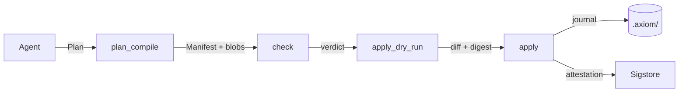

import { Card, CardGrid, Tabs, TabItem, LinkCard } from '@astrojs/starlight/components';

<CardGrid stagger>
  <Card title="Plan → Manifest" icon="document">
    An agent submits a **Plan**; AXIOM compiles it to a canonical, content-addressed
    **Manifest** (JCS/RFC 8785, sha256) with no timestamps and no content inline.
  </Card>
  <Card title="Set-level checks" icon="approve-check">
    Predicates run over the **whole change set**, not one file at a time. A fact provider
    that cannot run yields `error`, never a silent pass — fail closed.
  </Card>
  <Card title="Two-phase apply" icon="seti:git">
    Pre-image hashes are re-verified at commit, writes are staged then atomically renamed,
    and a journal makes every apply **rollback-able** — even after a crash.
  </Card>
  <Card title="Provenance" icon="seti:lock">
    `confirmDigest` must equal the manifest digest. Optional Sigstore signing, anti-rollback
    counters and in-toto attestations put the agent's edit on the record.
  </Card>
  <Card title="Works everywhere" icon="puzzle">
    One package, five surfaces: **MCP** server, **CLI**, PreToolUse **hook**, GitHub
    **Action** and **VS Code** extension. Roots are an explicit allowlist — no `cwd` fallback.
  </Card>
  <Card title="Deterministic" icon="random">
    Same Plan, same Manifest, same digest on Linux, macOS and Windows. Golden fixtures pin
    every digest in CI.
  </Card>
</CardGrid>

## How it flows



Every arrow is a hash boundary. Read the [pipeline](/axiom/concepts/pipeline/) page for the
sequence diagram and the [invariants](/axiom/concepts/invariants/) that hold across all of it.

## Install

<Tabs syncKey="install">
  <TabItem label="npx">
    ```sh
    npx @codai/axiom-mcp --help
    ```
    Nothing to install; the current release is fetched on first run.
  </TabItem>
  <TabItem label="npm">
    ```sh
    npm i -g @codai/axiom-mcp
    axiom --version
    ```
  </TabItem>
  <TabItem label="Binary (sh)">
    ```sh
    curl -fsSL https://dragoscv.github.io/axiom/install.sh | sh
    ```
    Standalone executable, no Node required. Verified against the release `SHA256SUMS`.
  </TabItem>
  <TabItem label="Binary (PowerShell)">
    ```powershell
    irm https://dragoscv.github.io/axiom/install.ps1 | iex
    ```
    Installs to `%LOCALAPPDATA%\axiom\bin` and adds it to your user PATH.
  </TabItem>
  <TabItem label="VS Code">
    Install the `.vsix` attached to the [latest release](https://github.com/dragoscv/axiom/releases/latest),
    or wire the MCP server in `.vscode/mcp.json` — see [VS Code](/axiom/integration/vscode/).
  </TabItem>
  <TabItem label="GitHub Action">
    ```yaml
    - uses: dragoscv/axiom/action@v2
      with:
        bundle: .axiom/manifests/<hex>.json
        root: .
    ```
    Fails the PR when the tree does not match the manifest. Details in
    [GitHub Action](/axiom/integration/github-action/).
  </TabItem>
</Tabs>

## Used by

<CardGrid>
  <LinkCard title="codai" description="The SWE harness routes every write through the gate by default; agent-core tools carry risk classes." href="/axiom/integration/codai/" />
  <LinkCard title="brivio" description="A profile whose guard.external runs brivio's own guard suite, plus the gate profile and Copilot hook." href="/axiom/integration/brivio/" />
  <LinkCard title="metu" description="repo.requireCompanion rules transcribed from metu's own skills, with proof runs." href="/axiom/integration/metu/" />
</CardGrid>

## Why it exists

Coding agents write files. Most of the time that is fine; occasionally it is a half-applied
refactor, a clobbered concurrent edit, or a change nobody can trace back to a decision. AXIOM
makes an agent's write **a transaction**: planned, canonicalised, checked as a set, applied
atomically against verified pre-images, journaled, and — when you want it — signed. It sits
in front of the filesystem as an MCP server or a hook, so the agent does not have to be trusted;
the gate does the trusting.
