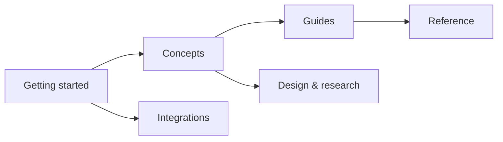

# AXIOM documentation

*Everything about the transactional write gate for coding agents, organised the way the site sidebar is: start here, concepts, guides, reference, integrations, design & research.*

AXIOM takes a **Plan** from an agent, compiles it to a canonical content-addressed **Manifest**,
runs **checks** over the whole change set, and **applies** it with a hash-gated two-phase commit
that leaves a journal and, optionally, a signed attestation. One npm package — `@codai/axiom-mcp` —
is an MCP server, a CLI, a PreToolUse hook and a GitHub Action. These pages are the reference for
2.2.x; the root [README](../README.md) is the one-page tour, [PLAN.md](../PLAN.md) the canonical
tracker of decisions and stories.

## Getting started

| Page | Purpose |
|---|---|
| [Install](getting-started/install.md) | Every channel — `npx`, global bin, standalone binary, VS Code `.vsix`, GitHub Action, MCP Registry — with per-OS notes and how to verify downloads |
| [Quickstart](getting-started/quickstart.md) | The 60-second flow: `mcp.json`, a first Plan, compile → check → apply, what `.axiom/` now contains |
| [Hooks](getting-started/hooks.md) | `axiom gate --stdin` as a fail-closed PreToolUse hook: contract, wiring, profile file, latency budget |

## Concepts

| Page | Purpose |
|---|---|
| [Pipeline](concepts/pipeline.md) | Plan → Manifest → checks → apply → journal, the two-phase commit as a sequence diagram, and the three content transports |
| [Invariants](concepts/invariants.md) | The nine invariants every change must keep, each with what it protects against |
| [Trust model](concepts/trust-model.md) | Roots allowlist, no `cwd` fallback, fail-closed predicates, signing, anti-rollback, attestation |
| [CAS](concepts/cas.md) | The per-root content-addressed store and `axiom gc` |

## Guides

| Page | Purpose |
|---|---|
| [Apply](guides/apply.md) | Guarantees, non-guarantees, `.axiom/` layout, two-phase flow, rollback, dry-run, PR mode, Windows notes |
| [Checks](guides/checks.md) | The 18 predicates with params, verdict semantics, built-in profiles, custom profiles |
| [Signing](guides/signing.md) | DSSE envelopes, trust store, anti-rollback counter, root binding, CI key ceremony |
| [Verify tree](guides/verify-tree.md) | `axiom verify --tree`, `--pre`, in-toto attestation and how to verify it later |
| [Snapshot](guides/snapshot.md) | `axiom_repo_snapshot`: deterministic inventory of a root, diffing two snapshots |
| [Emitters](guides/emitters.md) | `template` sources: determinism contract, the `web@2.0.0` catalogue, authoring an emitter |
| [Migrate](guides/migrate.md) | `axiom migrate v1`: lifting a 1.x manifest into a v2 Plan |

## Reference

| Page | Purpose |
|---|---|
| [CLI](reference/cli.md) | Every verb and flag, exit codes, examples |
| [MCP tools](reference/mcp-tools.md) | The 17 tools, tasks and chunked plans, resources, transports, `--wire` eras |
| [Plan format](reference/plan-format.md) | Field-by-field wire types: Plan, Manifest, Profile, CheckReport, ApplyResult, Journal |
| [Error codes](reference/error-codes.md) | The closed `ERROR_CODES` enum with meaning and raising surface |
| [Profiles](reference/profiles.md) | Profile schema, built-in `default` / `strict` / `permissive`, `extends`, discovery, the gate profile |
| [`.axm` syntax](reference/axm-syntax.md) | EBNF, semantics, heredocs, canonical form, LSP |
| [Versioning](reference/versioning.md) | Fixed version group, wire `apiVersion`, what is breaking |

## Integrations

| Page | Purpose |
|---|---|
| [Harnesses](integration/harnesses.md) | Claude Code / Copilot CLI / VS Code / Codex: hook wiring and MCP config side by side |
| [GitHub Action](integration/github-action.md) | `dragoscv/axiom/action@v2` inputs, outputs, permissions, attestation |
| [VS Code](integration/vscode.md) | The `.axm` extension and language server, `mcp.json` |
| [codai](integration/codai.md) | SWE harness default-on gate, agent-core risk classes, the eval arm |
| [brivio](integration/brivio.md) | `guard.external` over a 75-guard suite, tasks for the full run |
| [metu](integration/metu.md) | `repo.requireCompanion` rules transcribed from skills |

## Design & research

| Page | Purpose |
|---|---|
| [v2 architecture](design/v2-architecture.md) | The design document, annotated as built (2.2.x), with the package graph |
| [Decisions](design/decisions.md) | D-01 … D-31 in one table, pointing at PLAN.md §1 |
| [Research](research/) | Dated records from 2026-09-18/19: landscape, v1 inventory and test audit, red-team critique, mutation baseline, sibling-repo integration, 2.2 roadmap. Kept verbatim; only chat preambles were removed |

## Reading order for a new user

1. [Install](getting-started/install.md) → [Quickstart](getting-started/quickstart.md) — ten minutes, a real apply on a scratch repo.
2. [Pipeline](concepts/pipeline.md) → [Trust model](concepts/trust-model.md) — why `confirmDigest`, why roots, why fail-closed.
3. [Hooks](getting-started/hooks.md) and your harness in [Harnesses](integration/harnesses.md) — the always-on seatbelt.
4. [Checks](guides/checks.md) → [Profiles](reference/profiles.md) — make the gate say what *your* repo requires.
5. [Signing](guides/signing.md) and [Verify tree](guides/verify-tree.md) when you want proof in CI.

## Reading order for a contributor

1. [`.github/instructions/axiom-conventions.instructions.md`](../.github/instructions/axiom-conventions.instructions.md) and [Invariants](concepts/invariants.md) — what must never weaken.
2. [v2 architecture](design/v2-architecture.md) → [Decisions](design/decisions.md) — how it is built and why.
3. [Plan format](reference/plan-format.md) → [Error codes](reference/error-codes.md) — the wire contract you are extending.
4. The skill for your change: [`add-predicate`](../.github/skills/add-predicate/SKILL.md), [`add-mcp-tool`](../.github/skills/add-mcp-tool/SKILL.md), [`add-golden-fixture`](../.github/skills/add-golden-fixture/SKILL.md), [`release-axiom`](../.github/skills/release-axiom/SKILL.md), [`debug-apply-journal`](../.github/skills/debug-apply-journal/SKILL.md).
5. [CONTRIBUTING.md](../CONTRIBUTING.md) — the five green gates and the 18 repo guards.

> [!NOTE]
> Links between pages are plain relative `.md` links; the docs site rewrites them at build time.
> Old top-level paths (`docs/apply.md`, `docs/mcp_api.md`, …) are three-line redirect stubs that
> the site build drops.
