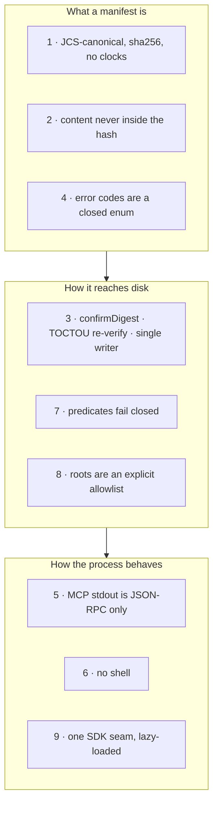

# Invariants

*The nine rules every change to AXIOM must keep — stated for users, each with what it protects you against and how it is enforced.*

These are lifted from [PLAN.md](../../PLAN.md) §2 and the repo's
[conventions file](../../.github/instructions/axiom-conventions.instructions.md), where they
bind contributors. Here they are read the other way round: as promises you can rely on when you
put an agent's writes behind AXIOM. Each has a guard in `scripts/check-*.mjs` or a test that fails
CI when it is weakened.

## 1. The manifest body is canonical and clock-free

`ManifestBody` is serialised with JCS (RFC 8785); `manifestDigest = sha256(JCS(body))`; nothing
inside anything that is hashed contains a timestamp, invocation id or absolute path.

**Protects against:** two machines disagreeing about what "the same change" is. A digest computed
on a Linux CI runner equals the one an agent saw on Windows, so an approval given to one digest
means the same bytes everywhere; a manifest cannot be "refreshed" into a new identity by re-running
compile. **Enforced by:** golden fixtures compared across ubuntu/windows/macos
(`check-golden-digests`), the `NOT_CANONICAL` byte-compare in `verifyBundle`, and property tests
`JCS(parse(JCS(x))) == JCS(x)`.

## 2. Content never lives in the canonical manifest

Bytes travel as `blobs` (≤ 256 KiB each, ≤ 4 MiB per bundle), through the CAS
(`.axiom/cas/sha256/…`) or as a digest-pinned `ref`; the manifest holds digests only.

**Protects against:** the v1 failure where "generate" stripped inline content that "apply" then
needed, and against a manifest whose identity changes with its transport. An inline plan and its
CAS twin have the same `planDigest`; a bundle can be signed once and shipped by any route.
**Enforced by:** the `ManifestArtifact` schema (no content field exists), size caps
(`ERR_BLOB_TOO_LARGE`, `ERR_BUNDLE_TOO_LARGE`), re-hashing at every hop. See [pipeline.md](pipeline.md#content-transport).

## 3. Apply is hash-gated, re-verified at commit, single-writer

`apply` requires `confirmDigest === manifestDigest`; every pre-image hash is re-checked
immediately before its rename (TOCTOU guard); `.axiom/lock` allows one writer per root.

**Protects against:** "apply whatever I just generated" — the caller must echo a digest it has
seen (typically from a dry-run), which is what makes an approval prompt meaningful; a concurrent
editor or second agent changing a file between staging and commit — detected, whole set rolled
back, tree byte-identical; two applies interleaving on one root. **Enforced by:**
`ERR_CONFIRM_DIGEST_MISMATCH`, `ERR_PREIMAGE_CHANGED`, `ERR_LOCKED`, and fast-check properties
(apply-twice is `noop`; rollback after a fault at any step restores the tree). See
[pipeline.md](pipeline.md#the-two-phase-commit).

## 4. Error codes are a closed enum

Every failure carries a `code` from `ERROR_CODES` in `packages/schema/src/errors.ts`; a code is
added there first; tests and clients branch on `code`, never on message text.

**Protects against:** integrations that string-match error messages and break on a wording
change; "unknown error" paths that hide what went wrong; a new failure mode shipping without a
name. **Enforced by:** `check-error-codes` (every `"ERR_*"` literal in source must be in the enum
and asserted by a behavioural test). The table: [error-codes.md](../reference/error-codes.md).

## 5. MCP stdout is JSON-RPC only

Nothing in `packages/mcp/src` writes to stdout except the CLI entry; logs go to stderr as JSON
lines at `warn` by default.

**Protects against:** a stray `console.log` corrupting the MCP stream and hanging the client —
the most common way an MCP server "randomly stops working". **Enforced by:** `check-no-stdout`
and Biome's `noConsole` (error/warn allowed).

## 6. No shell

Child processes (`git` in PR mode, `guard.external` scripts) are spawned with an args array;
`shell: true`, `exec(` and `execSync(` are banned under `packages/*/src`.

**Protects against:** command injection through a branch name, a commit message or a guard
argument — the exact bug v1's `applyPR` had. Branch names are additionally validated by regex and
`git check-ref-format`; commit messages go over stdin (`-F -`); the child environment is a
whitelist. **Enforced by:** `check-no-shell-spawn` and spawn-argument snapshot tests.

## 7. Predicates fail closed

A predicate whose fact provider cannot run — no root for a `repo.*` check, guards disabled, a
missing optional dependency, a thrown error, a timeout — yields `verdict: "error"`, never a pass;
`apply` treats `error` like `fail`.

**Protects against:** v1's constant-pass checks; a profile that silently stops enforcing when
`cedar-wasm` is not installed or a guard script crashes; a gate that answers "allow" because it
could not evaluate. The same rule applies to the PreToolUse gate (D-18) and to the signature
predicate (missing trust store → `error`). **Enforced by:** fail-closed unit tests for every
predicate (the `add-predicate` skill requires them). See [checks.md](../guides/checks.md#verdict-and-fail-closed-semantics).

## 8. Roots are an explicit allowlist

The server and CLI act only on directories passed with `--root`; there is no `cwd`, environment
variable or `.git` walk-up fallback. A tool `root` argument must equal or lie inside an allowlisted
root, after `realpath`.

**Protects against:** an agent writing into whatever directory the server happened to be started
from; a client-side `roots/list` (untrusted, and deprecated in the 2026-07-28 spec) redirecting
writes; `..` escapes and symlinked ancestors. The one deliberate exception is the PreToolUse
gate, where the harness's declared `cwd` *is* the root ([hooks.md](../getting-started/hooks.md#root-discovery)).
**Enforced by:** `createRootsPolicy` / `resolveRoot` (`ERR_ROOT_NOT_ALLOWED`, `ERR_ROOT_REQUIRED`,
`ERR_ROOT_NOT_DIR`) and containment tests. See [trust-model.md](trust-model.md).

## 9. The MCP SDK is reached through one seam

Only `packages/mcp/src/adapter.ts` imports `@modelcontextprotocol/*` at runtime, and the SDK
lives in the lazy `mcp-lazy` / `http-lazy` chunks — never in the eager `cli-main.js`.

**Protects against:** an SDK major (1.30 → 2.0 happened during 2.2) rippling through every tool
file; the SDK's weight landing on `compile`, `check`, `apply` and, critically, on the
`gate --stdin` hook, whose latency budget decides whether harnesses honour it at all.
**Enforced by:** `check-sdk-adapter`, `check-bundle-size` (950 KB over the eager closure) and
`check-cold-start` (p50 < 250 ms for `--version`).

## What is *not* promised

For completeness — the non-guarantees are listed with each feature, notably in
[apply.md](../guides/apply.md#non-guarantees) (a writer that ignores the lock, backups are not
version control, no network, Windows `fsync`/mode caveats) and
[signing.md](../guides/signing.md#limitations) (Ed25519 only, root binding opt-in).

---

**See also**

- [Pipeline](pipeline.md) — where each invariant bites
- [Trust model](trust-model.md) — invariants 3, 7 and 8 as a security boundary
- [v2 architecture](../design/v2-architecture.md) — the design that introduced them
- [Conventions](../../.github/instructions/axiom-conventions.instructions.md) — the contributor-facing statement and the guard names
