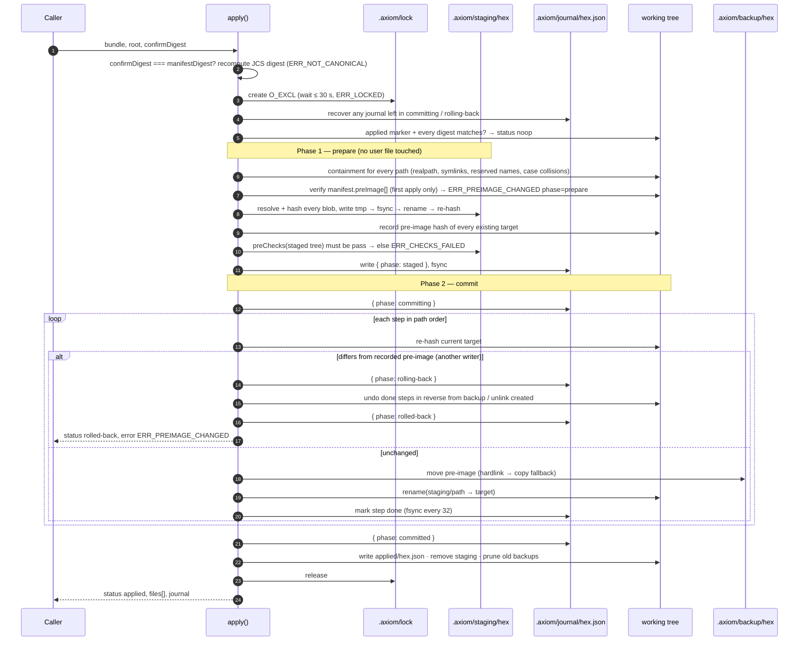

# The pipeline: Plan → Manifest → checks → apply → journal

*What each stage takes and produces, why the manifest is the unit of trust, how the two-phase commit survives a concurrent writer, and where content actually travels.*

AXIOM is a pipeline with one artefact of truth in the middle. An agent describes *what should
exist* (a **Plan**); the compiler turns that into *exactly which bytes at which paths* (a
**Manifest**, content-addressed); the checks judge the whole set at once; and apply either
commits the set atomically or leaves the tree untouched. Everything downstream — checks, apply,
resources, journal, signatures, attestations — is keyed by the manifest's digest.

```mermaid
flowchart LR
  A[Agent or human] -->|JSON or .axm| P[Plan<br/>intent · artifacts · checks]
  P -->|compilePlan<br/>render templates · apply patches · resolve refs| M[ManifestBundle<br/>manifest · manifestDigest · blobs]
  M -->|runChecks profile + plan.checks| C{CheckReport}
  C -- pass --> D[apply --dry-run<br/>staging + diff, nothing written]
  C -- fail / error --> X[stop — ERR_CHECKS_FAILED]
  D -->|confirmDigest = manifestDigest| AP[apply<br/>two-phase commit]
  AP --> J[journal/<hex>.json<br/>applied/<hex>.json]
  J -.->|rollback digest| AP
  M -.->|sign · verify --tree| S[signatures[] · in-toto attestation]
```

## Stage by stage

| Stage | Input | Output | Where | What can fail |
|---|---|---|---|---|
| **Author** | intent | `Plan` (`apiVersion: axiom.dev/v2`) — JSON, or `.axm` parsed by `axiom_axm_parse` / `axiom compile plan.axm` | agent, `.axm` file | `ERR_INVALID_PLAN` with JSON pointers |
| **Compile** | `Plan`, optional `root`, emitter registry, network policy | `ManifestBundle` = `{ manifest, manifestDigest, blobs, attestation?, signatures? }` | `@codai/axiom-plan` `compilePlan`; `axiom compile`; `axiom_plan_compile` / `axiom_plan_seal` | template/patch/ref errors, `ERR_BLOB_TOO_LARGE`, `ERR_BUNDLE_TOO_LARGE` |
| **Check** | bundle, profile, optional `root` | `CheckReport { verdict: pass \| fail \| error, findings[], preImage }` | `@codai/axiom-checks` `runChecks`; `axiom check`; `axiom_check` / `axiom_check_start` | `ERR_PREDICATE_*`, `ERR_PROVIDER_FAILED`, `ERR_PREIMAGE_CHANGED` |
| **Dry-run** | bundle, `root` | `ApplyResult { mode: dry-run, diff }` | `axiom apply --dry-run`; `axiom_apply_dry_run` | containment, `ERR_EXISTS`, pre-checks |
| **Apply** | bundle, `root`, `confirmDigest` | `ApplyResult { status: applied \| noop \| rolled-back \| failed }` + journal | `@codai/axiom-apply` `apply`; `axiom apply --confirm`; `axiom_apply` | `ERR_CONFIRM_DIGEST_MISMATCH`, `ERR_LOCKED`, `ERR_PREIMAGE_CHANGED`, `ERR_ROLLBACK` |
| **Prove** | bundle, tree or key | `verify --tree` result, in-toto Statement, DSSE envelope | `axiom verify`, `axiom sign`, GitHub Action | mismatch list, `ERR_SIGNATURE_*` |

The MCP tools and the CLI verbs are thin wrappers over the same three library functions, so a
digest computed by one is the digest the others expect.

## Why a manifest in the middle

A Plan is convenient to write but not safe to act on: it may carry content inline, reference a
template whose output depends on an emitter version, or describe a diff against a file that has
since changed. Compile resolves all of that into a **`ManifestBody`** that is:

- **canonical** — serialised with JCS (RFC 8785), artifacts sorted by path bytes, checks sorted
  by id, keys sorted; `manifestDigest = sha256(JCS(body))`;
- **content-free** — every artifact is `{ path, op, mode, digest, bytes, origin }`; the bytes
  are elsewhere (below);
- **clock-free** — no timestamps, invocation ids or absolute paths inside the hash, so the same
  Plan compiles to the same digest on Linux, macOS and Windows (pinned by golden fixtures in CI);
- **tree-bound when a root is given** — `preImage[]` records the sha256 (or `absent`) of every
  target path as compile saw it, so the same Plan against two different trees yields two
  digests while `planDigest` stays equal.

That digest is what a human or an approval prompt looks at, what `confirmDigest` must echo, what
the journal is named after, what a DSSE signature covers and what an attestation's subject is.
Details of every field: [plan-format.md](../reference/plan-format.md).

## Content transport

Invariant 2 says content never lives in the canonical manifest. It travels beside it, by one of
three routes, and is re-hashed at every hop:

| Route | Where the bytes are | When it is used | Limits |
|---|---|---|---|
| **`blobs`** | inline in the bundle, keyed by `sha256:<hex>`, `utf8` or `base64` | default for MCP and small CLI plans; `inline`, `template` and `patch` sources compile to blobs | ≤ 256 KiB per blob, ≤ 4 MiB per bundle (`ERR_BUNDLE_TOO_LARGE`) |
| **CAS** | `<root>/.axiom/cas/sha256/<aa>/<hex>` | `compile --store cas`, `cas` sources, fetched `ref` sources; large or many-file plans; chunked plans over MCP | per-root; `axiom gc` reclaims — [cas.md](cas.md) |
| **`ref`** | an `https:` or `file:` URI pinned by digest | vendored binaries, release assets | fetched **only** by `axiom compile --allow-net`, never by apply or by an MCP tool; stored into the CAS after the pin verifies |

Resolution order at check and apply time is `blobs → CAS`; a `ref` whose bytes are not already
in the CAS is `ERR_REF_OFFLINE`. Whatever the route, apply re-hashes each blob before staging
(`ERR_DIGEST_MISMATCH`, `ERR_SIZE_MISMATCH`) and again after writing it.

## The two-phase commit

Apply is where a shared tree — several agents, an editor, a watcher — meets a change set that must
land whole or not at all. The sequence below is what `apply()` does on `mode: fs`; the state
machine view and the on-disk layout are in [apply.md](../guides/apply.md).



Three properties fall out of this shape:

- **TOCTOU guard.** Step 15 hashes the target *immediately before* the rename and compares it
  with what staging observed. A file another agent changed in the window is detected and the
  whole set rolls back — the tree is byte-identical to before.
- **Crash safety.** The journal is fsynced before phase 2 and after every 32 steps; the next
  `apply` on that root (or `axiom rollback <digest>`) finishes a `committing` or `rolling-back`
  journal before doing anything else.
- **Scoped rollback.** Rollback touches only the paths in that journal; files created by
  someone else after the apply are left alone. If the rollback itself fails the result is
  `ERR_ROLLBACK` and the journal is kept for inspection.

`mode: pr` wraps exactly this in `git switch -c` … `git commit -F -` with explicit paths and no
shell ([apply.md § PR mode](../guides/apply.md#pr-mode)).

## What the journal gives you afterwards

`.axiom/applied/<hex>.json` is the `ApplyResult` and the idempotency marker; `journal/<hex>.json`
survives only when something is unfinished; `backup/<hex>/` holds the pre-images for the last
three manifests. From these you can:

- re-run the same bundle and get `noop` (or a `drifted[]` list if someone edited the files);
- roll back any of the last three applies;
- ask `axiom verify bundle.json --tree .` in CI whether the tree still matches, and publish an
  in-toto attestation of the answer ([verify-tree.md](../guides/verify-tree.md));
- read `axiom://journal/<root-id>`, `axiom://applied/<sha>` and `axiom://report/<sha>` from any
  MCP client.

---

**See also**

- [Invariants](invariants.md) — the nine rules the pipeline is built to keep
- [Apply](../guides/apply.md) — guarantees, layout, failure modes, PR mode
- [Checks](../guides/checks.md) — what runs between compile and apply
- [Plan format](../reference/plan-format.md) — every field of every stage's output
