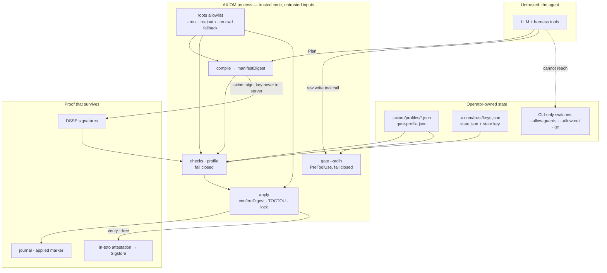

# Trust model

*Who is trusted with what: the roots allowlist, the digest a human confirms, fail-closed policy, signed manifests with anti-rollback, and attestations that outlive the agent.*

AXIOM assumes the agent is **capable but not trusted**: it may be wrong, it may be prompt-injected,
and the harness it runs in may fail open. The design therefore moves every decision that matters
out of the agent's hands and into artefacts a human, a policy or a CI job can inspect — and makes
"could not decide" mean "no".

## Boundaries, from the outside in

### 1. Roots: an explicit allowlist, no fallback

The server (`axiom mcp --root A --root B`) and every CLI verb act only on directories named up
front. Each is `realpath`ed at startup and must be a directory; the set is frozen. A tool's `root`
argument is `realpath`ed too and must equal an allowlisted root or lie inside one (case-insensitive
on Windows). There is no `cwd` fallback, no environment variable, no `.git` walk-up, and the MCP
client's `roots/list` is not consulted (it is untrusted, and deprecated in the 2026-07-28 spec).

What this buys: an agent cannot make AXIOM write outside the repositories an operator chose, no
matter what path it puts in a Plan — `..`, absolute paths, drive letters, backslashes are rejected
by the `RelPath` schema before any I/O, and symlinked or junctioned ancestors by the containment
walk (`ERR_SYMLINK_IN_PATH`, `ERR_CONTAINMENT`).

The **one** place `cwd` is accepted is the PreToolUse hook, where the harness itself spawns the
process in the project directory and puts that directory in the payload — it is the harness's
declared root, not an accident ([hooks.md](../getting-started/hooks.md#root-discovery)).

### 2. The digest a human confirms

`axiom_apply` (and `axiom apply --confirm`) refuses unless `confirmDigest === manifestDigest`.
The digest is stable across machines (invariant 1) and identifies exactly one set of bytes at
exactly one set of paths (invariant 2), so an approval prompt that shows it — codai's harness
does, and a `destructiveHint: true` annotation lets any MCP client ask — is approving something
concrete. Between the dry-run a reviewer looked at and the apply, nothing can be swapped: the
bundle is re-canonicalised and re-hashed, every blob is re-hashed, and every pre-image is
re-hashed at commit ([pipeline.md](pipeline.md#the-two-phase-commit)).

### 3. Policy that fails closed

Checks are the operator's rules over the whole change set. Two properties make them a boundary
rather than advice:

- **`error` is a verdict, and it blocks.** An unknown predicate, invalid params, a provider that
  could not run (no root for `repo.*`, guards not enabled, `cedar-wasm` absent, a guard that timed
  out or printed garbage), a drifted `preImage` — all yield `verdict: "error"`, which `apply`
  treats exactly like `fail`. There is no configuration that turns a non-answer into a pass.
- **The dangerous switches are not tools.** `guard.external` runs only when the *process* was
  started with `--allow-guards` **and** the profile sets `facts.allowGuards`; network fetching of
  `ref` sources is `axiom compile --allow-net` on the CLI only; `axiom gc` has no MCP tool. An
  agent talking to the server cannot enable any of them.

The PreToolUse gate applies the same rule to raw harness writes (D-18): malformed payload, a
write tool whose target it cannot determine, an unreadable profile — all deny with a reason.
`--fail-open` exists for editors that must never be blocked by the gate's own bugs, and is the
operator's choice, in the hook config.

Profiles live in the repository (`.axiom/profiles/<name>.json`, `.axiom/gate-profile.json`) and
are meant to be committed and reviewed like CI configuration ([profiles.md](../reference/profiles.md)).

### 4. Signed manifests and anti-rollback

When "the agent compiled it" is not enough provenance, a root can pin Ed25519 public keys in
`.axiom/trust/keys.json` and require, through `manifest.requireSigned`, that every bundle it
applies carries a detached DSSE envelope over `JCS(manifest)` from one of those keys. Because the
signature covers the canonical body, any byte change after signing is `signature.bad`; a key the
root does not know is `signature.unknownKey`; the trust store missing is `error`, not pass.

Two extensions close the replay holes:

- **Anti-rollback.** `Plan.counter` is inside the hash and therefore under the signature; with
  `antiRollback: true` the root remembers `lastCounter` in `state.json` (HMAC-authenticated with a
  per-root `state.key`) and refuses `counter ≤ lastCounter`, so an old but genuinely signed bundle
  cannot undo a newer one. The state advances only on `status: "applied"`.
- **Root binding.** A store with a `rootId` accepts only envelopes signed for that id, so a bundle
  signed for repo A is not a valid signed bundle for repo B.

Private keys never enter the server: signing is `axiom sign` with `AXIOM_SIGNING_KEY` or
`--key-file`, typically in a CI job with a protected secret. Full protocol, key ceremony and the
explicit non-goals (Ed25519 only, no Sigstore keyless, integrity not confidentiality):
[signing.md](../guides/signing.md).

### 5. Attestation: proof that outlives the agent

`axiom verify --tree <root>` asks whether a real tree matches a manifest — every artifact present
with its digest, every delete absent — and with `--attest` writes an in-toto Statement
(`predicateType: https://axiom.dev/attestation/apply/v1`, subject = the manifest digest plus one
entry per path, no clock). The GitHub Action uploads it through `actions/attest`, so months later
`gh attestation verify` can prove which workflow, on which commit, verified that tree against that
digest ([verify-tree.md](../guides/verify-tree.md)). This is a different proof from a DSSE
signature: signing says *who produced the manifest*; attestation says *a tree was checked against
it, here, then*.

## What the model does not cover

Be explicit about the edges, because a trust model that overstates itself is worse than none:

- **A writer that ignores `.axiom/lock`** — an editor, a `git checkout`, another tool — can still
  race. The TOCTOU check narrows the window to the instant before each rename and detects the
  change; it cannot prevent it without a snapshotting filesystem.
- **The shell scan in the gate is a heuristic.** It catches `>`, `tee`, `rm`, `sed -i`,
  `git reset --hard` and friends in a command string; it does not follow `cd`, aliases, scripts,
  `xargs`, or writes done from inside an interpreter. The guarantee is `Plan → check → apply`; the
  gate is the seatbelt for everything that bypasses it.
- **Harness timeouts fail open** in every harness AXIOM knows. That is the harness's decision and
  the reason the gate is a ~100 ms lazy chunk with no SDK — and why `npx` in a hook is banned
  ([install.md](../getting-started/install.md#npx--run-without-installing)).
- **Key compromise before revocation** is trusted; `trust remove` and `notBefore` are the tools.
- **An attacker who can read and write `.axiom/trust/`** can delete `state.json` and `state.key`
  and restart the counter; `minCounter` on the store bounds that. Protect the trust directory like
  CI configuration.
- **Confidentiality** is out of scope: manifests, blobs and journals are not encrypted.

The repository's own threat model, hardening list and disclosure process are in
[SECURITY.md](../../SECURITY.md).

---

**See also**

- [Invariants](invariants.md) — the rules behind each boundary
- [Signing](../guides/signing.md) — envelopes, trust store, anti-rollback, root binding
- [Verify tree](../guides/verify-tree.md) — attestation and how to check it later
- [Hooks](../getting-started/hooks.md) — the fail-closed gate contract
