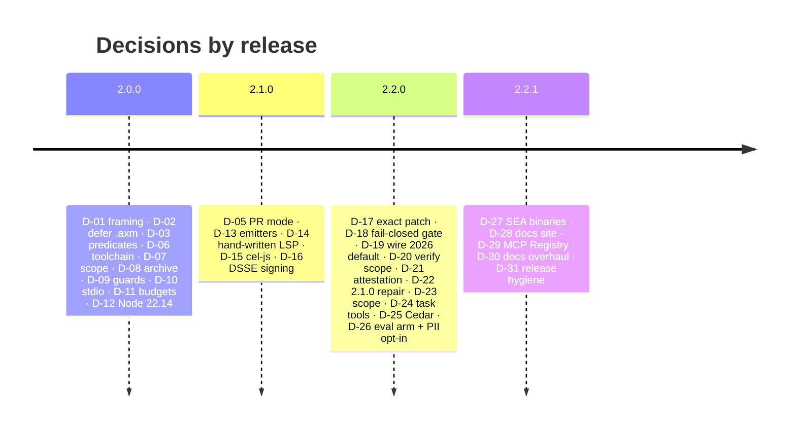

# Decisions index (D-01 … D-31)

*One line per owner decision, with its date and the release it shaped. The full option analysis and rationale for each lives in [PLAN.md §1](../../PLAN.md#1-decisions-d-xx--answers-from-the-owner-are-recorded-here); this table is the map.*

`PLAN.md` + `TRACKER.csv` are the canonical tracker; `check-tracker-sync` fails CI when a
decision or story id exists in only one. Dates are when the owner decided, not when the code
landed; "shipped in" is the release that carries the result.

| ID | Decision (one line) | Decided | Shipped in |
|---|---|---|---|
| D-01 | Product framing: AXIOM is a **transactional write gate** *and* a DSL-first rebuild — the gate ships first, `.axm` is a committed follow-up | 2026-09-18 | 2.0.0 / 2.1.0 |
| D-02 | `.axm` DSL held back from 2.0 so the `Plan` schema settles before a grammar freezes it; grammar compiles 1:1 to `Plan` | 2026-09-18 | 2.1.0 |
| D-03 | Checks are a typed predicate registry (JSON params) in 2.0; CEL via `@marcbachmann/cel-js` later — deterministic, offline, testable per predicate | 2026-09-18 | 2.0.0 (CEL 2.1.0) |
| D-04 | DSSE signing is not in 2.0; arrives later with the key held in CI; the unsigned in-toto Statement is still the record | 2026-09-18 | 2.1.0 |
| D-05 | Git PR mode is not in 2.0; when it lands it is `spawn` with an args array, commit message via `-F -`, no shell | 2026-09-18 | 2.1.0 |
| D-06 | Toolchain: TypeScript 7 (tsgo), tsdown, Biome, Vitest 5, Changesets 3, fast-check, scoped Stryker, pnpm catalog — all latest stable | 2026-09-18 | 2.0.0 |
| D-07 | Keep the `@codai/axiom-*` npm scope for continuity; deprecate every 1.x version | 2026-09-18 | 2.0.0 |
| D-08 | Root-level report litter is archived under `docs/archive/v1/` with `git mv`, never deleted ("curata, dar arhiveaza nu sterge") | 2026-09-18 | 2.0.0 |
| D-09 | Repo hygiene as brivio-style `scripts/check-*.mjs` + `run-guards.mjs`, `.github/instructions/` and skills | 2026-09-18 | 2.0.0 |
| D-10 | MCP transport is stdio only in 2.0; Streamable HTTP follows | 2026-09-18 | 2.0.0 (HTTP 2.1.0) |
| D-11 | Budgets enforced in CI: eager bin < 950 KB, cold start p50 < 250 ms, gate p95 < 120 ms in-process | 2026-09-18 | 2.0.0 |
| D-12 | Minimum Node is ≥ 22.14 (Vitest 5 / tsdown floor) | 2026-09-18 | 2.0.0 |
| D-13 | Template emitters are an optional plugin (`@codai/axiom-emitters-web`, Next 16 / Hono 4), injected as an interface; `plan` never depends on them | 2026-09-18 | 2.1.0 |
| D-14 | The `.axm` LSP is a hand-written `vscode-languageserver` reusing `parseAxm`, **not** Langium — one grammar in the repo, drift impossible by construction | 2026-09-18 | 2.1.0 |
| D-15 | `expr.cel` uses `@marcbachmann/cel-js` 8 behind a closed function allowlist, literal-only `matches()`, AST/size/time caps — it passes the offline/determinism bar | 2026-09-18 | 2.1.0 |
| D-16 | Signing = detached DSSE v1.0.2 over `JCS(ManifestBody)` with Ed25519, envelopes outside the canonical body, per-root trust store, integer `counter` for anti-rollback, state advanced only on `status: applied` | 2026-09-18 | 2.1.0 |
| D-17 | `patch` sources match **exactly** (fuzz 0) against a declared `preImage` digest; unified, V4A and SEARCH/REPLACE formats accepted | 2026-09-19 | 2.2.0 |
| D-18 | The gate is **fail-closed** for write-class tools, unknown write target → deny, `--fail-open` opt-in; shell commands are scanned for write primitives (a documented heuristic) | 2026-09-19 | 2.2.0 |
| D-19 | MCP wire 2026-07-28 is the **default** in 2.2.0 with `--wire 2025` fallback; SDK v2 sits behind `packages/mcp/src/adapter.ts` | 2026-09-19 | 2.2.0 |
| D-20 | `verify --tree` compares only the manifest's paths (or its declared `preImage` set), never a whole-root digest | 2026-09-19 | 2.2.0 |
| D-21 | Attestation = in-toto Statement `https://axiom.dev/attestation/apply/v1`, subject = manifest digest (+ per-path); GitHub Action uploads via `actions/attest` when `attest: true` (opt-in) | 2026-09-19 | 2.2.0 |
| D-22 | 2.1.0 repair: the seven missing packages were published interactively (no provenance); trusted publishing with `--allow-publish` on all nine before the 2.2.0 tag | 2026-09-19 / revised 09-20 | 2.1.0 → 2.2.0 |
| D-23 | 2.2.0 scope = ten hardening stories **plus** chunked plans, Cedar, Marketplace publish, codai default-on after an eval arm — the large release | 2026-09-19 | 2.2.0 |
| D-24 | Long checks and big plans are **tool-level**: `axiom_check_start`/`axiom_task_get`/`axiom_task_cancel` and `axiom_plan_begin`/`add`/`seal` (SDK v2 has no tasks runtime); guard cap 60 s → 15 min | 2026-09-20 | 2.2.0 |
| D-25 | Second policy language is **Cedar** via optional `@cedar-policy/cedar-wasm` (per-artifact `isAuthorized`), not OPA/Rego; missing dependency fails closed; Cedar's "erroring policy does not apply" is overridden to `error` | 2026-09-20 | 2.2.0 |
| D-26 | Eval arm for codai default-on = offline paired replay of real git history (983/983 byte-identical, +59 ms/write); `content.noSecrets` PII patterns become **opt-in** (`pii: true`); default ON with rejections fed back as `edit_error` | 2026-09-20 | 2.2.0 |
| D-27 | Standalone binaries via Node 26 `--build-sea`, built natively on five runners from one inlined CJS bundle; no code cache; cedar-wasm not embedded (fails closed) | 2026-09-21 | 2.2.1 |
| D-28 | Docs site = Astro 7 + Starlight in `apps/site`, `docs/` copied by a prebuild script (H1 → title, `.md` → route links), `astro-mermaid` client-side, deployed to GitHub Pages; serves `llms.txt`, `install.sh`, `install.ps1` | 2026-09-21 | 2.2.1 |
| D-29 | MCP Registry listing `io.github.dragoscv/axiom` via `server.json` (schema 2025-12-11) + `mcp-publisher login github-oidc` in `release.yml` after the npm publish is visible | 2026-09-21 | 2.2.1 |
| D-30 | Documentation scope = full overhaul of every current doc and community file; research docs are dated records — content kept, only chat preambles removed | 2026-09-21 | 2.2.1 |
| D-31 | Release-surface hygiene: `.github/release.yml` categories, moving `v2` tag for the action, Sigstore provenance + `SHA256SUMS` on binaries, Dependabot, CODEOWNERS, templates, Contributor Covenant 2.1, CITATION.cff, OpenSSF Scorecard, v1 changelog archived | 2026-09-21 | 2.2.1 |

## How to read them together

- **Identity and hashing** — D-01, D-03, D-15, D-16, D-17, D-25 all follow one rule: nothing that
  enters a digest or a verdict may depend on a clock, the network, or an engine that can behave
  differently on another machine ([invariants.md](../concepts/invariants.md)).
- **Fail closed** — D-18 (gate), D-25 (Cedar errors), D-16 (missing trust store), D-27 (missing
  cedar-wasm inside a SEA) each chose the blocking answer over the convenient one
  ([trust-model.md](../concepts/trust-model.md)).
- **Keep the agent away from the switches** — D-24 (tasks as tools an agent can only poll),
  D-21 (attestation opt-in in CI), the CLI-only `--allow-net`/`--allow-guards`/`gc` (D-03/D-13
  era) all keep operator decisions out of the tool surface.
- **Defer, then deliver** — D-02, D-04, D-05, D-10 deferred features out of 2.0 and every one
  shipped in 2.1 or 2.2 with the shape the deferral promised.

## Adding a decision

Open a `D-xx` row in `PLAN.md` §1 (id, topic, options, decision with date, rationale), mirror the
id in `TRACKER.csv`, and add one line here in the same commit. A decision that changes the wire,
the hash or the error enum is a **major** ([versioning.md](../reference/versioning.md)).

---

**See also**

- [PLAN.md](../../PLAN.md) — the full rows with options and rationale
- [v2 architecture](v2-architecture.md) — the design the early decisions produced
- [Research](../research/2026-09-19-v2.2-roadmap.md) — the roadmap research behind D-17…D-26
- [Invariants](../concepts/invariants.md) — the rules the decisions protect
