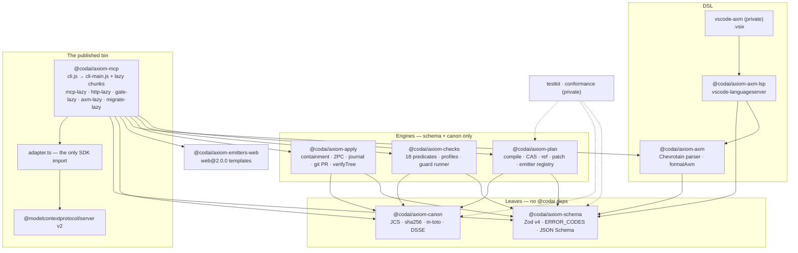

# AXIOM v2 — Architecture Design

*The design document AXIOM v2 was built from — package graph, data model, checks engine, apply engine, MCP surface, `.axm`, quality gates, roadmap.*

**Status:** as built, 2.2.x (2026-09-21). Written 2026-09-18 as a design; the sections below were
updated where the shipped code diverged (§1 build layout, §2.2 signature payload type, §3 expression
predicates, §5.1 SDK v2, §6 LSP). Every external claim marked **[V]** was verified on 2026-09-18
against npm registry / spec pages; v1 facts marked **[src]** were read from `E:\gh\axiom` source.
A compact index of every decision is in [decisions.md](decisions.md); the user-facing summaries are
[concepts/pipeline.md](../concepts/pipeline.md), [concepts/invariants.md](../concepts/invariants.md)
and [concepts/trust-model.md](../concepts/trust-model.md).



## 0. Diagnosis in one paragraph

v1 is a pipeline with the right shape (`.axm → IR → emit → manifest → check → apply`) and wrong internals at every joint **[src]**: `irHash = sha256(JSON.stringify(ir, Object.keys(ir).sort()))` — the replacer whitelist applies at all depths, so every nested object serialises as `{}` and any two IRs with keys `{agents,version}` hash identically; `applyPR` uses `spawn("git", args, { shell: true })` with user `branchName`/`commitMessage`; `check()` returns `cold_start_ms` as 50/100/120 constants; three manifest shapes disagree (`kind: file|report` vs `file|directory`, evidence `{checkName,kind,passed}` vs `{stage,result}`, `createdAt` `date-time` vs `deterministic-<hex>`); `resolveArtifactAbs` has no realpath/containment check; apply has no rollback; the `axiom-mcp` bin starts a non-MCP `node:http` server. Tests contradict each other on `filesWritten` prefix. Nothing here is salvageable as architecture; ~300 lines are salvageable as code (§8).

v2 is a **rewrite with a narrow spec**: a content-addressed `Manifest` as the single artefact of truth, an attestation layer lifted from `codai/packages/rules-core`, a predicate-based checks engine, a two-phase-commit apply engine, and an MCP server that is honest about trust boundaries.

---

## 1. Package layout

pnpm workspace, `pnpm-workspace.yaml` with `catalog:`. Scope `@codai/axiom-*` (keeps npm scope continuity with 1.x).

```
axiom/
  pnpm-workspace.yaml          # catalog: zod 4.6.5, typescript 7.0.2, vitest 5.0.1, tsdown 0.23.0, biome 2.5.14, fast-check 4.10.1
  package.json                 # private root: scripts dev/build/test/lint/typecheck/guards/release
  biome.json  tsconfig.base.json  .changeset/  .github/  scripts/check-*.mjs  scripts/run-guards.mjs
  packages/
    schema/        @codai/axiom-schema      Zod v4 schemas + inferred types + JSON Schema export. deps: zod
    canon/         @codai/axiom-canon       JCS (RFC 8785), sha256, DSSE PAE/sign/verify, in-toto Statement builder. deps: none (node:crypto)
    plan/          @codai/axiom-plan        Plan → Manifest compiler: emitter registry, template rendering, CAS store. deps: schema, canon
    checks/        @codai/axiom-checks      Predicate registry, fact providers, profiles, external guard runner. deps: schema, canon, picomatch
    apply/         @codai/axiom-apply       Containment, staging, 2PC, journal, dry-run/diff, git PR (spawn args). deps: schema, canon, diff
    mcp/           @codai/axiom-mcp         MCP server (stdio + streamable HTTP) + CLI + `gate` hook mode. THE ONLY PUBLISHED BIN. deps: all above + @modelcontextprotocol/sdk
    axm/           @codai/axiom-axm         Chevrotain lexer/parser .axm → Plan. deps: chevrotain 13.2
    axm-lsp/       @codai/axiom-axm-lsp     Hand-written LSP over `vscode-languageserver` reusing parseAxm (D-14, not Langium). deps: axm, vscode-languageserver
    vscode-axm/    private                  VS Code extension bundling axm-lsp (S-412: Marketplace)
    emitters-web/  @codai/axiom-emitters-web Optional Next.js/Hono templates as a separate plugin
    conformance/   private                  MCP conformance harness (spawns HTTP server, runs @modelcontextprotocol/conformance)
    testkit/       private                  golden fixtures, fast-check arbitraries, tmp-repo helpers
```

**Boundaries** (enforced by `scripts/check-package-deps.mjs`): `schema` and `canon` are leaves; `plan/checks/apply` never import each other; only `mcp` imports the SDK. No emitter is a dependency of the engine (fixes v1's engine↔emitters cycle **[src]**).

**Build (as built):** `tsdown` per package, ESM only, `platform: node`, `target: node22`.
`@codai/axiom-mcp` ships a thin `dist/cli.js` entry (reads `package.json`, answers `--version`,
dispatches `gate` straight to `dist/gate-lazy.js` without loading anything else) that lazy-imports
`dist/cli-main.js` (every engine + zod, eager, budgeted by `check-bundle-size` at 950 KB) and a set of
lazy chunks that are loaded only by the verb that needs them: `mcp-lazy.js` / `http-lazy.js` (the
MCP SDK v2 behind `adapter.ts`), `gate-lazy.js` (no SDK), `axm-lazy.js` (Chevrotain), `migrate-lazy.js`.
Externals are `node:*` and the optional `@cedar-policy/cedar-wasm`. The 2.2.1 standalone binaries
(D-27) are a separate single-file CJS `sea` entry built with `node --build-sea`.

**Cold-start budget (< 250 ms p50, < 950 KB eager):** the original design assumed SDK 1.30 (which hard-depends on express 5 **and** hono 4 **[V]**) and tree-shaking; what shipped is stricter — the SDK is not in the eager bundle at all. A size guard (`check-bundle-size.mjs`, limit 950 KB over `cli.js` + `cli-main.js` + their static-import closure) and a cold-start guard (`check-cold-start.mjs`, spawns the bin with `--version`, p50 < 250 ms on CI) fail the build. Zod v4 core is ~14 KB gz **[V zod.dev]**; JSON-Schema emission via `z.toJSONSchema()` **[V]** happens at build time into `packages/schema/schemas/*.json` (guard `check-schema-json-fresh`) so runtime needs no extra lib.

**TypeScript 7.0.2** is the Go-native `tsgo` and ships **no compiler API** **[V]**. Use it for `tsc --noEmit`; tsdown auto-selects the `tsgo` dts generator **[V]**. Nothing in the toolchain (Biome, Vitest, tsdown) needs the TS API, so no `@typescript/typescript6` alias is required. `engines: { node: ">=22.14" }` (Node 24 is Active LTS, 26 becomes LTS 2026-10-27 **[V]**).

---

## 2. Core data model

### 2.1 Principles
- **Manifest is the unit of trust.** Everything (`check`, `apply`, resources) keys off `manifestDigest`.
- **Canonical form is JCS (RFC 8785) [V]**, hashed with sha256; digests are `sha256:<64 hex>` strings everywhere.
- **Artifact content is never inside the canonical manifest**; the manifest holds digests only. Content travels via an inline side-channel, a CAS, or an external ref (§2.5). This is what fixes v1's "generate strips inline content that apply needs" **[src]**: the canonical hash is the same regardless of transport.

### 2.2 Zod v4 schemas (`packages/schema/src`)

```ts
// digest.ts
import { z } from "zod";
export const Sha256 = z.string().regex(/^[a-f0-9]{64}$/);
export const Digest = z.object({ sha256: Sha256 }).strict();          // in-toto DigestSet subset
export const DigestRef = z.templateLiteral(["sha256:", Sha256]);      // "sha256:<hex>"

// path.ts — relative POSIX path, already validated at schema level (apply re-validates on the real FS)
export const RelPath = z.string().min(1).max(1024)
  .refine(p => !p.startsWith("/") && !/^[a-zA-Z]:/.test(p) && !p.includes("\\"), "ERR_PATH_NOT_RELATIVE_POSIX")
  .refine(p => p.split("/").every(seg => seg !== "" && seg !== "." && seg !== ".."), "ERR_PATH_SEGMENT")
  .refine(p => p === p.normalize("NFC"), "ERR_PATH_NOT_NFC");

// plan.ts — INPUT (from agent or compiled from .axm)
export const PlanArtifactSource = z.discriminatedUnion("type", [
  z.object({ type: z.literal("inline"),   content: z.string().max(256 * 1024), encoding: z.enum(["utf8","base64"]).default("utf8") }),
  z.object({ type: z.literal("template"), emitter: z.string(), template: z.string(), params: z.record(z.string(), z.json()).default({}) }),
  z.object({ type: z.literal("cas"),      digest: DigestRef }),
  z.object({ type: z.literal("ref"),      uri: z.url({ protocol: /^(file|https)$/ }), digest: DigestRef }),
]);
export const PlanArtifact = z.object({
  path: RelPath, mode: z.enum(["0644","0755"]).default("0644"),
  op: z.enum(["create","overwrite","delete"]).default("create"),
  source: PlanArtifactSource.optional(),                      // required unless op === "delete"
}).refine(a => a.op === "delete" || !!a.source, "ERR_SOURCE_REQUIRED");
export const Plan = z.object({
  apiVersion: z.literal("axiom.dev/v2"), kind: z.literal("Plan"),
  name: z.string().regex(/^[a-z0-9][a-z0-9-]{0,63}$/), intent: z.string().max(2000),
  profile: z.string().default("default"),
  capabilities: z.array(z.enum(["fs","net","secret","ai","compute","git"])).default([]),
  artifacts: z.array(PlanArtifact).min(1).max(2000),
  checks: z.array(CheckRef).default([]),                      // §3
  metadata: z.record(z.string(), z.json()).default({}),
}).strict();

// manifest.ts — OUTPUT, canonical, content-addressed
export const ManifestArtifact = z.object({
  path: RelPath, op: z.enum(["create","overwrite","delete"]), mode: z.enum(["0644","0755"]),
  digest: Digest.optional(),   // absent for delete
  bytes: z.int().nonnegative().optional(),
  origin: z.enum(["inline","template","cas","ref"]).optional(),
}).strict();
export const ManifestBody = z.object({          // this is what is JCS-hashed
  apiVersion: z.literal("axiom.dev/v2"), kind: z.literal("Manifest"),
  name: Plan.shape.name, profile: z.string(),
  planDigest: DigestRef,                        // sha256(JCS(Plan with sources replaced by digests))
  artifacts: z.array(ManifestArtifact),         // sorted by path (byte order), unique
  checks: z.array(CheckRef),
  toolchain: z.object({ axiom: z.string(), emitters: z.record(z.string(), z.string()) }),
}).strict();

// attestation.ts — in-toto Statement v1 + SLSA v1 predicate  [V: in-toto/attestation spec/v1/statement.md; slsa.dev/spec/v1.2/provenance]
export const InTotoStatement = z.object({
  _type: z.literal("https://in-toto.io/Statement/v1"),
  subject: z.array(z.object({ name: z.string(), digest: Digest })).min(1),
  predicateType: z.literal("https://slsa.dev/provenance/v1"),
  predicate: z.object({
    buildDefinition: z.object({
      buildType: z.literal("https://axiom.dev/build/plan@v2"),
      externalParameters: z.object({ plan: Digest, profile: z.string() }),
      internalParameters: z.object({ toolchain: ManifestBody.shape.toolchain }),
      resolvedDependencies: z.array(z.object({ uri: z.string(), digest: Digest })),
    }),
    runDetails: z.object({
      builder: z.object({ id: z.literal("https://axiom.dev/builder/mcp@v2"), version: z.record(z.string(), z.string()) }),
      metadata: z.object({ invocationId: z.string(), startedOn: z.iso.datetime(), finishedOn: z.iso.datetime() }).optional(),
      byproducts: z.array(z.object({ name: z.string(), digest: Digest })).default([]),
    }),
  }),
}).strict();

// envelope.ts — DSSE  [V: secure-systems-lab/dsse envelope.md v1.0.2]
// As built (D-16): the *signed* envelope in `ManifestBundle.signatures[]` is over JCS(manifest) with
// payloadType "application/vnd.axiom.manifest+json" (or "…manifest-bound+json" when root-bound, S-409);
// the optional unsigned in-toto record in `bundle.envelope` keeps "application/vnd.in-toto+json".
export const DsseEnvelope = z.object({
  payloadType: z.enum(["application/vnd.axiom.manifest+json", "application/vnd.axiom.manifest-bound+json", "application/vnd.in-toto+json"]),
  payload: z.base64(), signatures: z.array(z.object({ keyid: z.string().optional(), sig: z.base64() })),
}).strict();

// bundle.ts — what actually moves between tools (NOT hashed as a whole)
export const ManifestBundle = z.object({
  manifest: ManifestBody, manifestDigest: DigestRef,
  attestation: InTotoStatement.optional(), envelope: DsseEnvelope.optional(),
  blobs: z.record(DigestRef, z.object({ encoding: z.enum(["utf8","base64"]), data: z.string() })).default({}),  // inline side-channel
}).strict();

// check-report.ts
export const Finding = z.object({
  id: z.string(), severity: z.enum(["error","warn","info"]), predicate: z.string(),
  message: z.string(), path: RelPath.optional(), facts: z.record(z.string(), z.json()).default({}),
}).strict();
export const CheckReport = z.object({
  apiVersion: z.literal("axiom.dev/v2"), kind: z.literal("CheckReport"),
  manifestDigest: DigestRef, profile: z.string(),
  verdict: z.enum(["pass","fail","error"]),           // error = a provider/guard could not run; never silently pass
  findings: z.array(Finding), factsDigest: DigestRef, // sha256(JCS(all facts)) → replayable
  durationMs: z.int().nonnegative(), providers: z.array(z.object({ name: z.string(), status: z.enum(["ok","skipped","error"]), ms: z.int() })),
}).strict();

// apply-result.ts
export const AppliedFile = z.object({ path: RelPath, op: ManifestArtifact.shape.op, digest: Digest.optional(),
  status: z.enum(["written","deleted","unchanged","skipped"]) }).strict();
export const ApplyResult = z.object({
  apiVersion: z.literal("axiom.dev/v2"), kind: z.literal("ApplyResult"),
  manifestDigest: DigestRef, mode: z.enum(["dry-run","fs","pr"]), status: z.enum(["applied","noop","rolled-back","failed"]),
  root: z.string(),                                     // absolute, realpath'd, as authorised
  files: z.array(AppliedFile), diff: z.string().optional(),  // unified diff in dry-run
  journal: z.string().optional(),                       // path of .axiom/journal/<digest>.json
  git: z.object({ branch: z.string(), commit: Sha256.length(40).optional(), compareUrl: z.url().optional() }).optional(),
  error: z.object({ code: z.string(), message: z.string(), path: RelPath.optional() }).optional(),
}).strict();
```

All error `code`s are a closed enum exported from `schema/src/errors.ts` (`ERR_PATH_*`, `ERR_CONTAINMENT`, `ERR_BLOB_MISSING`, `ERR_DIGEST_MISMATCH`, `ERR_LOCKED`, `ERR_ROOT_NOT_ALLOWED`, …) — one place, tests assert on codes, never on message text (v1's failure mode **[src]**).

### 2.3 Canonicalization and the root hash

- `canonicalize(value)` = JCS RFC 8785 **[V]**. **Decision:** lift `codai/packages/rules-core/src/canon.ts` (zero-dep, UTF-16 key sort, lone-surrogate rejection, test-vectors) into `@codai/axiom-canon` rather than depend on `canonicalize@5` **[V maintained]** — reason: 60 lines, already has vectors, and we need the `NOT_CANONICAL` byte-compare in verify. Alt: `canonicalize@5` (fine, one more dep).
- `manifestDigest = "sha256:" + hex(sha256(utf8(JCS(ManifestBody))))`.
- `planDigest` hashes the Plan after replacing every `source` by `{type, digest}` — so a Plan with inline content and the same Plan with CAS refs have the same `planDigest`.
- Artifact `digest.sha256 = sha256(bytes)` of the exact bytes written (no newline/BOM normalisation; emitters must produce final bytes).
- The Statement's `subject[0] = { name: "<plan.name>", digest: {sha256: manifestDigest hex} }`; artifacts are `byproducts`. Envelope payload = base64(JCS(Statement)), PAE per DSSE **[V]**. Signing is optional (Ed25519 via `node:crypto`, keyid = sha256 of SPKI); unsigned bundles are accepted with `attestation.signed=false` in facts, so a policy can require signatures.

### 2.4 Determinism rules
No timestamps in `ManifestBody` (they live in `runDetails.metadata`, outside the hash). Artifacts sorted by path bytes; `checks` sorted by `id`; `toolchain.emitters` keys sorted by JCS. Two `plan → manifest` runs on different OSes must produce the same `manifestDigest` — golden test.

### 2.5 Content transport

| Channel | When | Limit | Who validates |
|---|---|---|---|
| `blobs` inline in bundle | default for MCP; agent-authored files | per blob 256 KiB (utf8) / 192 KiB decoded (base64); bundle ≤ 4 MiB; ≤ 2000 artifacts | Zod at ingress; `apply` re-hashes every blob and rejects `ERR_DIGEST_MISMATCH` |
| CAS `<root>/.axiom/cas/sha256/<aa>/<hex>` | `plan.compile` writes there when `store: "cas"`; large generated trees | file ≤ 32 MiB; store GC by `axiom cas gc --keep 30d` | write is tmp+fsync+rename; read re-hashes |
| `ref` `file:`/`https:` + pinned digest | binaries, vendored assets | 64 MiB; https only with `net` capability and `--allow-net`; offline default → `ERR_REF_OFFLINE` | fetched to staging, hashed before use |

Resolution order in `apply`: `blobs` → CAS → ref. Missing → `ERR_BLOB_MISSING {path, digest}`, apply aborts before any write.

---

## 3. Checks engine

**Decision: typed predicate registry, data-driven by JSON, no expression language in v2.0.** Reason: every v1 policy is `metric op literal` or a named scan **[src]**; predicates are deterministic, offline, trivially testable, and the SDK's `outputSchema` can describe them. Expression languages arrived later behind the same `Predicate` interface: `expr.cel` (S-301, D-15, `@marcbachmann/cel-js` 8 with a closed function allowlist) and `expr.cedar` (S-411, D-25, optional `@cedar-policy/cedar-wasm`). Alternatives rejected at the time: **own CEL subset** — grammar cost + duplicate chevrotain (cel-js pins 11, langium 4.4 needs 13 **[V]**); **JSONLogic** — `json-logic-js` last published 2024-07 **[V]**, untyped, no path facts.

### 3.1 Types (`packages/checks/src`)
```ts
export interface FactContext {                       // everything a predicate may read; frozen
  manifest: ManifestBody; bundle: ManifestBundle;
  facts: {
    manifest: { artifactCount: number; totalBytes: number; paths: string[]; byExt: Record<string, number>; hasDeletes: boolean; signed: boolean };
    content: (path: RelPath) => Promise<Uint8Array | undefined>;    // from blobs/CAS only; never network
    repo?: RepoFacts;                                // present only when a root is authorised
    profile: ProfileFacts;
  };
}
export interface RepoFacts {                          // pluggable providers, all offline
  exists(path: RelPath): Promise<boolean>; read(path: RelPath, max?: number): Promise<Uint8Array | undefined>;
  glob(pattern: string): Promise<string[]>;           // picomatch over a lazily-built index, .gitignore-aware
  packageJson: Record<string, unknown> | undefined;   // root package.json parsed once
  gitHead?: string; gitDirty?: boolean;               // via spawn("git", [...]) with args array, optional
}
export interface Predicate<P = unknown> {
  id: `${string}.${string}`;                          // "path.deny", "content.noSecrets", "deps.max", "repo.requireCompanion", "guard.external"
  params: z.ZodType<P>; readonly requires: Array<"manifest"|"content"|"repo"|"guard">;
  run(ctx: FactContext, params: P): Promise<Finding[]>;
}
export const CheckRef = z.object({ id: z.string(), predicate: z.string(), params: z.json(), severity: z.enum(["error","warn","info"]).default("error") });
export const Profile = z.object({
  apiVersion: z.literal("axiom.dev/v2"), kind: z.literal("Profile"), name: z.string(), extends: z.string().optional(),
  checks: z.array(CheckRef), limits: z.object({ maxArtifacts: z.int(), maxTotalBytes: z.int(), maxBlobBytes: z.int() }).partial(),
  facts: z.object({ allowRepo: z.boolean().default(true), allowGuards: z.boolean().default(false) }).default({}),
});
```
Built-in predicates for v2.0: `path.allow/deny` (glob), `path.reservedNames`, `content.noSecrets` (v1 PII regexes reused **[src]**), `content.maxBytes`, `content.encodingUtf8`, `manifest.maxArtifacts`, `manifest.requireSigned`, `deps.max` / `deps.deny` (parses artifact `package.json`s), `repo.noOverwriteOf` (glob of protected files, e.g. `.github/**`, `*.lock`), `repo.requireCompanion` (the brivio `check-ripple` shape `{when, expect:[{name, match}]}` **[src]**), `guard.external`.

Verdict: `error` if any provider fails or a guard times out (fail-closed; never the v1 "constant passes"). Findings sorted by `(severity, id, path)`; `factsDigest` lets a report be re-derived.

### 3.2 External guard runners
```ts
// params for guard.external
{ command: string; args: string[]; cwd?: "root"|"staging"; timeoutMs: number /* ≤ 900000 (15 min, S-406; was 60000) */; env?: Record<string,string>; stdin?: "bundle"|"manifest"|"none" }
```
Contract (superset of brivio `run-guards.mjs` **[src]**): spawn via `execFile` (args array, `shell: false`, `windowsHide: true`), stdin receives the JCS bundle, **stdout must be a JSON `GuardOutput`** `{ ok: boolean, findings: Finding[] }` (Zod-validated; non-JSON stdout + exit 0 → `error` verdict, exit ≠ 0 without JSON → single `error` finding with captured stderr tail 4 KiB). Guards run only when the profile sets `facts.allowGuards: true` **and** the server was started with `--allow-guards`; commands must be relative to `<root>/scripts/` or an absolute path in `--guard-allowlist`. Guards run in a worker pool `min(4, cpus)`, slowest-first from the previous report. `RunChecksOptions.signal` (S-406) aborts the pool: every running guard tree is killed and reports `ERR_TASK_CANCELLED`.

**Long checks and big plans are tool-level (D-24, S-406).** MCP SDK v2 ships the `io.modelcontextprotocol/tasks` wire vocabulary without a runtime (`tasks/*` excluded from `setRequestHandler`; the 2026-07-28 `tools/call` codec rejects a `CreateTaskResult`), so AXIOM exposes `axiom_check_start` → `axiom_task_get` / `axiom_task_cancel` as ordinary tools backed by an in-process `TaskStore` shared by every instance a `serverFactory` builds (like `seenRoots`), and `axiom_plan_begin` → `axiom_plan_add`* → `axiom_plan_seal` backed by a `PlanSessionStore`; sealing feeds `compilePlan` exactly as `axiom_plan_compile` does, so the digest is one-shot-identical (fast-check property). Neither store touches disk; the server's stop path aborts every working task. If a future SDK adds a tasks runtime, the same store can back the wire methods behind `adapter.ts` without changing tool semantics. See [reference/mcp-tools.md § Tasks](../reference/mcp-tools.md#tasks-d-24).

---

## 4. Apply engine

### 4.1 Containment (`packages/apply/src/contain.ts`)
Order per artifact, all before any write:
1. Schema `RelPath` already excludes `\`, absolute, `.`, `..`, empty segments, non-NFC.
2. Windows reserved names on **all** platforms (`CON, PRN, AUX, NUL, COM1-9, LPT1-9`, with or without extension, trailing space/dot, `<>:"|?*` and C0) — cross-platform manifests must apply on Windows.
3. **Case-insensitive collision**: reject two artifacts whose `path.toLowerCase()` (after NFC) collide → `ERR_PATH_CASE_COLLISION`; on a case-insensitive FS (probe once: create `.axiom/tmp/CaseProbe` and stat `caseprobe`), also compare against existing on-disk names.
4. `rootReal = fs.realpath.native(root)` **[V stable]**; for each artifact, walk `dirname` segments from root: `lstat` each existing segment; if symlink or junction (`isSymbolicLink()`, or on Windows a reparse point) → `ERR_SYMLINK_IN_PATH`. Final `realpath.native(dirname(target))` must be `=== rootReal || startsWith(rootReal + sep)` → else `ERR_CONTAINMENT`. Comparison on Windows is done after `toLowerCase()` on both because NTFS is case-insensitive.
5. Target itself: if exists and is symlink/dir while op=create/overwrite → `ERR_TARGET_TYPE`; if exists and op=create → `ERR_EXISTS` (overwrite requires `op: "overwrite"`).
6. Never follow: staging writes use `O_CREAT|O_EXCL|O_NOFOLLOW` semantics (`fs.open(path, "wx")` then `lstat` re-check on Windows where `O_NOFOLLOW` is absent).

### 4.2 Staging, two-phase commit, journal
```
<root>/.axiom/
  lock                      # O_EXCL lockfile {pid, hostname, startedAt, manifestDigest}; stale if pid dead or > 1h
  staging/<digest>/         # full tree of new content, written tmp→fsync→rename, verified by re-hash
  journal/<digest>.json     # Journal (below) written+fsynced BEFORE phase 2
  backup/<digest>/          # pre-images of overwritten/deleted files (hardlink where possible, else copy)
  applied/<digest>.json     # ApplyResult, presence == idempotency marker
  cas/sha256/…
```
```ts
export const Journal = z.object({
  manifestDigest: DigestRef, phase: z.enum(["staged","committing","committed","rolling-back","rolled-back"]),
  steps: z.array(z.object({ path: RelPath, op: z.enum(["create","overwrite","delete"]), backup: z.string().optional(), done: z.boolean() })),
  startedAt: z.iso.datetime(), pid: z.int(),
});
```
Phase 1 (prepare): acquire lock → containment for all → resolve+hash all blobs → write staging tree → run pre-apply check (`profile.checks`, must be `pass`) → write journal `staged`. Any failure: delete staging, release lock, no user file touched.
Phase 2 (commit): journal `committing`; for each step in path order: backup pre-image (hardlink→copy fallback) → `rename(staging, target)` (same volume guaranteed because staging is under root) → mark `done`, append-fsync journal every 32 steps. Deletes: rename target into `backup/`. Then `committed`, write `applied/<digest>.json`, delete staging, keep `backup/` for `--keep-backups` (default 3 manifests), release lock.
Rollback: on any phase-2 error, or on `axiom rollback <digest>`, or on startup if a journal is `committing` (crash recovery): replay `steps` in reverse where `done`, restoring backups or unlinking created files, then `rolled-back`. `rename` on Windows fails if target is open → retried 5× with backoff 50 ms, then rollback (`ERR_EBUSY`).

**Idempotency:** before phase 1, if `applied/<digest>.json` exists and every artifact's on-disk digest still matches → `status: "noop"`, nothing touched, lock held < 10 ms. If the marker exists but files drifted → proceed (it is a re-apply) and note `facts.drifted` in the result.

**Dry-run / diff:** phase 1 only, plus a unified diff (`diff` npm pkg, pure JS) per text artifact against on-disk content, binary as `Binary files differ`; staging is deleted at the end. `diff` returned in `ApplyResult.diff`, capped 1 MiB.

**Concurrency:** `.axiom/lock` per root (single writer). Different roots are independent. Lock acquisition timeout 30 s → `ERR_LOCKED {holder}`.

### 4.3 Git PR mode — **no shell**
**Decision: `child_process.spawn("git", args, { shell: false, windowsHide: true, cwd: rootReal, env: scrubbed })`, own 120-line wrapper.** Reason: the injection was `shell: true` **[src]**, not git itself; system git honours user credentials/hooks/signing; zero dependency weight. Alternatives: **simple-git 3.36** (also spawns without shell **[V]**, but +300 KB and plugin surface we do not need); **isomorphic-git 1.42** (active **[V]**, pure JS, but no hooks/signing/credential helpers, and 1 MB alone blows the bundle budget).
Rules: `branchName` validated by `git check-ref-format --branch <name>` (as an arg) and regex `^[A-Za-z0-9._/-]{1,120}$` with no `..`, no leading `-`; `commitMessage` passed via `-F -` on stdin (never as an argv token that could start with `-`); every arg list is `["--no-pager", "-c", "core.hooksPath=/dev/null"?]` — no, hooks are **kept** (user policy) but `GIT_TERMINAL_PROMPT=0`, `GIT_ASKPASS=echo` set so nothing blocks; env whitelist `PATH, HOME, USERPROFILE, GIT_*` minus `GIT_DIR/GIT_WORK_TREE`. Sequence: require clean index for touched paths (`git status --porcelain -- <paths>`) → `git switch -c <branch>` (or `--detach` if exists → error `ERR_BRANCH_EXISTS`) → fs apply (§4.2) → `git add -- <paths>` explicit only → `git commit --quiet -F -` → `git rev-parse HEAD`. Branch default is `axiom/<name>/<digest[0:12]>` (deterministic; v1 used `Date.now()` **[src]**). Push and PR creation are **not** done by axiom (no network); result returns `compareUrl` derived from `git remote get-url origin` if it parses as GitHub/GitLab.

### 4.4 Windows specifics
Long paths: prefix `\\?\` via `path.toNamespacedPath` for every fs call when `len > 240`. `fs.realpath.native` for 8.3-name and drive-case normalisation (`c:` vs `C:`). Junctions detected via `lstat().isSymbolicLink()` (Node reports junctions as symlinks). `fsync` of directories is a no-op on Windows — accepted. File mode `0755` is recorded but not applied on Windows (`facts.modeApplied=false`). Reserved-name check is unconditional (§4.1-2).

---

## 5. MCP surface

### 5.1 Tools (MCP SDK v2 — `@modelcontextprotocol/server` 2.0.0 behind `adapter.ts`; every tool has `annotations`, `inputSchema`, `outputSchema`, handler returns `structuredContent`)

The table below is the v2.0 design set. As built (2.2.x) there are **17 tools** — the ten here plus
`axiom_check_start` / `axiom_task_get` / `axiom_task_cancel` and `axiom_plan_begin` / `axiom_plan_add` /
`axiom_plan_seal` (D-24) and `axiom_repo_snapshot` (S-304); the authoritative registry is
`packages/mcp/spec/tools.json` and the user-facing table is [reference/mcp-tools.md](../reference/mcp-tools.md).

| tool | annotations (RO/D/I/OW) | input | output |
|---|---|---|---|
| `axiom_plan_validate` | true/false/true/false | `{ plan: Plan }` | `{ ok, planDigest, errors: ZodIssue[] }` |
| `axiom_plan_compile` | true/false/true/false | `{ plan: Plan, store: "inline"\|"cas", root?: string }` | `ManifestBundle` (+ writes CAS under root if `store:"cas"`) |
| `axiom_manifest_verify` | true/false/true/false | `{ bundle: ManifestBundle, publicKeys?: string[] }` | `{ ok, manifestDigest, canonical: boolean, signed: boolean, errors }` |
| `axiom_check` | true/false/true/false* | `{ bundle, profile?: string, root?: string }` | `CheckReport` (*openWorld true only if guards enabled) |
| `axiom_apply_dry_run` | true/false/true/false | `{ bundle, root, profile? }` | `ApplyResult{mode:"dry-run", diff}` |
| `axiom_apply` | false/**true**/true/false | `{ bundle, root, profile?, mode:"fs"\|"pr", branch?, commitMessage?, confirmDigest: DigestRef }` | `ApplyResult` |
| `axiom_rollback` | false/true/true/false | `{ root, manifestDigest }` | `ApplyResult{status:"rolled-back"}` |
| `axiom_manifest_diff` | true/false/true/false | `{ a: ManifestBundle\|DigestRef, b: … }` | `{ added, removed, changed: [{path, from, to}] }` |
| `axiom_roots_list` | true/false/true/false | `{}` | `{ roots: [{path, writable, hasGit}] }` |
| `axiom_axm_parse` (v2.1) | true/false/true/false | `{ source: string }` | `{ plan, diagnostics }` |

`axiom_apply` requires `confirmDigest === bundle.manifestDigest` — the agent must echo the digest it saw in dry-run, which blocks "apply whatever I just generated" mistakes. `destructiveHint: true` maps to codai `RiskClass = SENSITIVE`; readOnly → `READ`; else `ACT`, emitted in a `spec/tools.json` (codai agent-core shape **[src]**) generated at build from the registry, with a parity test.

### 5.2 Resources
`axiom://manifest/<sha256hex>` → `ManifestBundle` (JSON, from CAS/`applied/`), `axiom://report/<sha>` → last `CheckReport`, `axiom://applied/<sha>` → `ApplyResult`, `axiom://profile/<name>` → Profile JSON, `axiom://schema/<Plan|Manifest|CheckReport|ApplyResult>` → JSON Schema (from `z.toJSONSchema`). Custom URI schemes are allowed by spec **[V]**. Resource templates registered via `ResourceTemplate`.

### 5.3 Trust: roots allowlist
`axiom-mcp --root E:\gh\brivio --root E:\gh\metu [--allow-guards] [--allow-net] [--http 127.0.0.1:3411]`. At startup each root is `realpath.native`'d, must exist and be a directory; the set is frozen. Every tool `root` argument is resolved → `realpath.native` → must equal an allowlisted root **or** be inside one (then the effective root is the *allowlisted ancestor*, and artifact paths are re-prefixed — so an agent cannot pick `E:\gh\brivio\..\` anything). No `root` and one allowlisted root → default to it; no `root` and multiple → `ERR_ROOT_REQUIRED`. No env-var fallback, no cwd walk-up (v1's `AXIOM_REPO_ROOT`/`.git` search **[src]** is gone). `roots/list` from the client is **not** trusted (Roots deprecated in 2026-07-28 anyway **[V]**).

### 5.4 Transports & logging
stdio default; `--http` lazily imports `StreamableHTTPServerTransport` **[V]** behind `node:http` (no express/hono at runtime), bound to loopback unless `--http-host`, bearer token from `AXIOM_HTTP_TOKEN` required on non-loopback. **stdout carries only JSON-RPC [V spec]**; all logs → stderr, JSON lines `{level,ts,msg,…}`, default level `warn`, `--log-level` to lower. MCP `notifications/message` logging is deprecated in 2026-07-28 **[V]** → not used. The `postinstall` that writes `~/.mcp/servers/axiom.json` **[src]** is removed (no install-time side effects).

### 5.5 CLI (same bin, `axiom <verb>`)
`axiom mcp [--root…] [--http]` · `axiom compile plan.json|plan.axm -o bundle.json [--store cas]` · `axiom check bundle.json --root . --profile edge [--json]` · `axiom apply bundle.json --root . [--dry-run|--pr --branch x]` · `axiom rollback <digest> --root .` · `axiom verify bundle.json [--key pub.pem]` · `axiom sign bundle.json --key priv.pem` · `axiom diff a.json b.json` · `axiom cas gc --root . --keep 30d` · `axiom schema <kind>` · `axiom gate --stdin`.

### 5.6 Hook mode `axiom gate --stdin`
Reads one JSON object from stdin; accepts both Claude Code (`{session_id, tool_name, tool_input, cwd}` **[V]**) and Copilot CLI camelCase (`{sessionId, toolName, toolArgs}` **[V]**) — read both casings (the observed fail-open bug **[src guard-tooluse.ps1]**). Behaviour: if `tool_name ∈ {Write, Edit, MultiEdit, create_file, replace_string_in_file, apply_patch, …}` extract target path(s), run the **path predicates only** (`path.deny`, `repo.noOverwriteOf`, `content.noSecrets` on the new content if present) from `<cwd>/.axiom/gate-profile.json` or `~/.axiom/gate-profile.json`. Exit `0` allow; exit `2` + one-line reason on stderr = block **[V both harnesses]**; additionally print `{"hookSpecificOutput":{"permissionDecision":"deny","permissionDecisionReason":…}}` on stdout for the JSON-aware path **[V]**. Budget: < 120 ms (no repo index, no guards); measured by `check-gate-latency.mjs`. Timeouts fail open in both harnesses **[V]**, so the gate must be fast, not thorough.

---

## 6. `.axm` front-end

**Decision: defer to v2.1.** Reason: the agent-facing input is the JSON `Plan`; `.axm` v1 is parsed by a regex parser that cannot parse its own spec example and supports one agent per file **[src]** — nobody depends on its exact syntax. Shipping v2.0 without it removes chevrotain (~250 KB) from the critical bundle and lets the Plan schema settle before a grammar freezes it. Alternative: ship in v2.0 as a separate optional package — same effort, but couples grammar changes to Plan changes during the phase where Plan will move most.

v2.1 grammar (EBNF), compiled 1:1 to `Plan`:
```ebnf
File        = Header, { Statement } ;
Header      = "axiom", Version ;                      Version = '"2"' ;
Statement   = PlanDecl ;
PlanDecl    = "plan", Ident, "{", { PlanItem } "}" ;
PlanItem    = "intent", String
            | "profile", Ident
            | "capabilities", "[", [ Cap { "," Cap } ], "]"
            | "artifact", String, ArtifactBody
            | "check", Ident, "using", QualIdent, [ Json ]
            | "meta", Json ;
Cap         = "fs" | "net" | "secret" | "ai" | "compute" | "git" ;
ArtifactBody= "{", { "mode", ("0644"|"0755") | "op", ("create"|"overwrite"|"delete") | Source }, "}" ;
Source      = "inline", HereDoc | "template", QualIdent, String, [ Json ] | "cas", Digest | "ref", String, Digest ;
HereDoc     = "<<", Ident, NEWLINE, { ANY }, NEWLINE, Ident ;
QualIdent   = Ident, { ".", Ident } ;          Digest = '"sha256:' 64*HEXDIG '"' ;
Json        = ? RFC 8259 value ? ;             Comment = "//" … EOL | "/*" … "*/" ;
```
`@codai/axiom-axm`: Chevrotain 13.2 **[V]** lexer + CST parser + visitor → `Plan`, diagnostics with `{line,col}`. `@codai/axiom-axm-lsp`: **as built (D-14, 2026-09-18)** a hand-written `vscode-languageserver` 10 server that reuses `parseAxm` for diagnostics, completions and hover — *not* Langium: every Langium service is derived from a `.langium` grammar AST, so adopting it would have meant a second grammar that drifts from `packages/axm` (see `packages/axm-lsp/README.md`). The VS Code extension (`packages/vscode-axm`) bundles the server and replaces the 5-line `vscode-bridge` **[src]**. `expr.cel` uses `@marcbachmann/cel-js` 8 (zero deps), so the chevrotain-major concern below is moot.

---

## 7. Quality gates

- **Biome 2.5.14 [V]**: `biome.json` — formatter (2-space, LF, 100 cols), linter `recommended` + `style/noNonNullAssertion: error`, `suspicious/noExplicitAny: error`, `correctness/noUndeclaredDependencies: error`, `nursery/noProcessEnv` (only `mcp/src/cli.ts` allowed to read env). No ESLint, no Prettier.
- **Vitest 5.0.1 [V]** root `vitest.workspace.ts`; per package `*.test.ts` unit; `packages/testkit/golden/` fixtures `plan.json → bundle.json → report.json` with digests pinned (cross-OS determinism run on ubuntu/windows/macos and compared by digest); **fast-check 4.10.1 [V]** properties: `RelPath` arbitrary ↔ containment never escapes a tmp root; JCS(parse(JCS(x))) == JCS(x); apply(bundle) then apply(bundle) == noop; rollback restores byte-identical tree after a fault injected at any step index.
- **Mutation testing: yes, scoped.** `@stryker-mutator/core` 10 + `@stryker-mutator/vitest-runner` 10 **[V]** on `canon`, `apply/contain.ts`, `checks/predicates/*` only (security-relevant, pure). Threshold `break: 85`. Weekly job + on PRs touching those paths; not on every PR (cost).
- **Conformance:** `@modelcontextprotocol/conformance` 0.1.16 tests servers over an HTTP URL only **[V]**, so `packages/conformance` starts `axiom mcp --http 127.0.0.1:0 --root <tmp>` and runs `npx @modelcontextprotocol/conformance server --url … --expected-failures baseline.yml`; the stdio path is covered by an in-process `Client` + `StdioClientTransport` smoke test (`initialize`, `tools/list`, every tool with a bad input → structured error).
- **CI matrix** (GitHub Actions): `os: [ubuntu-24.04, windows-2025, macos-15] × node: [22, 24]`; jobs: `lint → typecheck (tsgo) → test → build → guards → conformance (ubuntu only) → cold-start+size`. Actions pinned to SHAs (brivio `check-action-pins` guard reused **[src]**).
- **Release:** `@changesets/cli` 3.0.3 **[V]**, `changeset-bot`, fixed group for all `@codai/axiom-*`. Publish via **npm trusted publishing** (OIDC, `permissions: id-token: write`, npm ≥ 11.5.1; provenance automatic — no `--provenance` flag needed **[V]**); `npm stage publish` is the default for configs created after 2026-09-03 **[V]** → workflow runs `npm stage publish` then `npm publish --tag latest` after a manual approval environment.
- **Repo guards** `scripts/check-*.mjs` + `scripts/run-guards.mjs` (brivio contract **[src]**: exit code, `OK    `/`FAIL  ` prefix, worker pool) plus `--json` and 60 s per-guard timeout — **18 as built**: `check-package-deps` (boundary graph §1), `check-bundle-size`, `check-cold-start`, `check-gate-latency`, `check-error-codes` (every thrown code is in `errors.ts` and asserted by a test), `check-tool-parity` (tools.json ↔ registry ↔ `packages/mcp/README.md` + `docs/mcp_api.md`), `check-schema-json-fresh` (`z.toJSONSchema` output committed and current), `check-no-stdout` (grep `console.log` outside `cli.ts`), `check-no-shell-spawn` (`shell:\s*true` banned), `check-vacuous-assertions` (ported), `check-golden-digests`, `check-action-pins`, `check-changeset-present`, `check-sdk-adapter` (only `mcp/src/adapter.ts` imports `@modelcontextprotocol/*`; `dist/cli-main.js` carries no SDK code), `check-no-v1-imports` (nothing imports `packages/_v1`), `check-tracker-sync` (`PLAN.md` ↔ `TRACKER.csv` ids), `check-stale-markers` (no "planned for vX.Y" once X.Y shipped), `check-release-complete` (every package of a tagged version is on the registry — runs after publish).
- **`.github/instructions/`**: `schema.instructions.md` (applyTo `packages/schema/**` — additive-only, strict objects, error codes closed enum), `apply.instructions.md` (`packages/apply/**` — no fs call without containment, no `shell`, journal before mutate), `mcp.instructions.md` (`packages/mcp/**` — annotations mandatory, stderr only, roots), `tests.instructions.md`. **Skills** (`.github/skills/*/SKILL.md`, metu `name`/`description` + numbered steps **[src]**): `add-predicate`, `add-mcp-tool`, `add-golden-fixture`, `release-axiom`, `debug-apply-journal`. Root `.copilot-ripple.json`: `publicApi: "packages/mcp/src/tools/"` → expect `docs/reference/mcp-tools.md`, `spec/tools.json`, `packages/conformance/baseline.yml`.

---

## 8. Migration from v1

**Reused verbatim (moved, Zod 3→4 where relevant):** `packages/policies/src/index.ts` tokenizer is *not* reused (no expression language in v2.0) but its **PII regexes** (CNP, email, RO phone, card, secret keys) → `checks/src/predicates/content-no-secrets.ts` with its 14 node:test cases ported to vitest; `axiom-engine/src/util.ts` `sha256`, `toPosixPath`; `axiom-engine/src/lib/fs-axiom.ts` `writeAndVerify` (:330-393) minus its `console.error` lines → `apply/src/write.ts`; `resolveArtifactAbs` rules 1–4 as `RelPath` refinements; Windows reserved-name table; `core/src/ir.ts` field vocabulary informs `Plan`. From codai: `rules-core/src/canon.ts`, `envelope.ts`, `test-vectors/*.json` → `axiom-canon`.

**Rewritten:** parser (→ v2.1 Chevrotain), `generate.ts` (→ `plan/compile.ts`), `check.ts` (→ predicates), `apply.ts` (→ 2PC), `mcp-stdio.ts` (→ `registerTool` with schemas), `manifest.ts` + both JSON schemas (→ `schema` package, single source). **Deleted:** `server.ts` (HTTP non-MCP), `postinstall.ts`, `reverse-ir.ts` (out of scope; re-add as `axiom_repo_snapshot` in v2.2 if wanted), `axpatch.ts` (replaced by `axiom_manifest_diff`), all four emitters (Next 14 placeholders), `webapp-pii`, `vscode-bridge`, `profiles/*.json` (dead `constraints`), the 25 root report `.md` files, `out-edge/`, `out-budget/`, `test-results/`, `tmp_artifacts/`, stray `test-*.cjs/mjs`.

**27 tests →** keep-as-spec (rewrite against the v2 contract, same intent): `determinism-edge`, `concurrency-uniqueness`, `long-paths-windows`, `error-paths`, `parser-roundtrip` (v2.1), `check-aggregate-and`, `check-evaluator-and-logic`, `path-normalization*`, `golden` (new fixtures), `policies/evaluator` (PII part). Rewrite from scratch (contract changed; assert on codes): all 13 `apply-*`, `generate-then-apply-stateless`, `check-evaluator`. Delete: `debug-posix`, `path-validation-fastcheck` (broken import, not property-based — replaced by real fast-check suite), `apply-phantom-smoke`/`apply-physical-smoke` (subsumed by journal/rollback properties).

**v1 manifest compat: no.** v1 `irHash` is meaningless (hashes `{}`), `createdAt` is fake, content-in-manifest breaks canonicalisation. Offer `axiom migrate v1 manifest.json` that lifts `artifacts[].{path,contentUtf8|contentBase64}` into a v2 `Plan` with inline sources — a convenience, not compatibility. **npm:** `npm deprecate @codai/axiom-mcp@"<2.0.0" "v1 is superseded by 2.x: manifest hash was not content-bound, apply had no rollback; see MIGRATION.md"`; `@codai/axiom-core`, `-engine`, `-policies`, `emitter-*` deprecated with pointer to `@codai/axiom-mcp`.

---

## 9. Roadmap

> [!NOTE]
> This is the roadmap **as planned on 2026-09-18**, kept for the record. What actually shipped
> per release — including the changes of plan (hand-written LSP instead of Langium, D-14; 17
> tools instead of 8; CEL and signing landing in 2.1.0) — is in [PLAN.md §3](../../PLAN.md) and
> [decisions.md](decisions.md).

| Phase | Scope | Acceptance criteria | Effort |
|---|---|---|---|
| **v2.0.0** (minimal shippable) | `schema`, `canon`, `plan` (inline + CAS, no template emitters), `checks` (built-in predicates, no guards), `apply` (fs + dry-run + journal/rollback + idempotency; **no PR mode**), `mcp` (stdio, 8 tools, resources, roots), CLI verbs except `gate`, guards, CI matrix, changesets, trusted publishing | Golden digests identical on 3 OSes; fast-check properties green (containment 10k cases, apply-twice noop, rollback after injected fault); Stryker ≥ 85 % on canon/contain/predicates; stdio smoke passes; bin cold-start p50 < 250 ms, bundle < 950 KB on CI; 0 Biome errors; `npm stage publish` from CI with provenance visible on npmjs.com; v1 deprecated | **9 agent-days** (schema+canon 1, plan 1, checks 1.5, apply 3, mcp+cli 1.5, gates/CI/release 1) |
| **v2.1.0** | PR mode (spawn, no shell), `guard.external`, `axiom gate --stdin` + Copilot/Claude hook docs, `.axm` v2 (`axiom-axm`), Langium LSP + VS Code ext, streamable HTTP + conformance job, `emitters-web` optional package with `template` sources | Injection test: branch/message from a fuzz corpus never reaches a shell (asserted by `check-no-shell-spawn` + spawn-arg snapshot test); gate p95 < 120 ms on 1000 payloads; conformance baseline has 0 unexpected failures; `.axm` parses the full syntax spec + examples with position-bearing diagnostics; LSP completions for predicate ids | **8 agent-days** (pr 1, guards+gate 1.5, axm 2, lsp 2, http+conformance 1, emitters 0.5) |
| **v2.2.0** | Expression predicates via `@marcbachmann/cel-js` (evaluated first; fall back to own CEL subset only if it fails the offline/determinism bar), `ref` sources with `--allow-net`, signed-manifest enforcement (`manifest.requireSigned` + key pinning + anti-rollback `acceptManifest` from rules-core), `axiom_repo_snapshot`, CAS GC, migration tool | CEL expressions over `facts.*` pass a 200-case vector suite and are pure (no clock/random); signed bundle rejected on any byte change (`NOT_CANONICAL`, `BAD_SIGNATURE`); rollback-version attack rejected; `axiom migrate v1` round-trips the v1 fixtures | **6 agent-days** |

**Total ≈ 23 agent-days.** Risks: MCP SDK v2 (`@modelcontextprotocol/server`, spec 2026-07-28, stateless, Standard Schema) **[V]** will land during this window — isolate the SDK behind `mcp/src/adapter.ts` so the swap is one file; the roots/logging/sampling deprecations already push us toward the v2 model. *(Done in 2.2.0 / S-405: SDK v2.0.0 landed 2026-07-27; `adapter.ts` is the only SDK importer (`check-sdk-adapter`), `serveStdio` / `createMcpHandler` serve both eras, `--wire` selects; the SDK lives in `mcp-lazy` / `http-lazy` so the eager bundle dropped from 947 KB to 453 KB.)*

---

**Verification status of this document:** all version numbers, spec URLs (`https://in-toto.io/Statement/v1`, `https://slsa.dev/provenance/v1`, DSSE v1.0.2, RFC 8785), SDK capabilities, hook protocols and npm publishing behaviour were checked live on 2026-09-18; v1 code facts were read from source with line references available in the research notes. Two claims in the original prompt were **refuted**: the latest MCP protocol is `2026-07-28` (not 2025-xx), and the `cel-js` note is confirmed stale (chevrotain 11 pin, last publish 2025-07).

---

**See also**

- [Decisions](decisions.md) — D-01 … D-31 index
- [Pipeline](../concepts/pipeline.md) · [Invariants](../concepts/invariants.md) · [Trust model](../concepts/trust-model.md) — the user-facing distillation
- [Red-team critique](../research/2026-09-18-red-team-critique.md) — the critique this design answered
- [PLAN.md](../../PLAN.md) — canonical tracker
