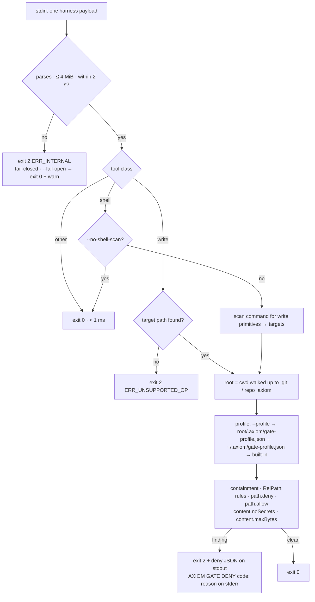

# Hook mode — `axiom gate --stdin`

*The fail-closed PreToolUse hook: what it checks, the exit-code contract, wiring for Claude Code / Copilot CLI / VS Code, the profile file and the latency budget.*

`axiom gate` turns AXIOM's path and content rules into a **PreToolUse hook**: the harness calls it
before every tool call, the gate reads the payload from stdin and either lets the call through
(exit `0`) or blocks it (exit `2` + reason). It is the cheap, always-on complement to the full
`Plan → check → apply` transaction: no manifest, no repo index, no guards, no git — just
"is this agent about to write somewhere it must not, or write something it must not".

Spec: [`design/v2-architecture.md`](../design/v2-architecture.md) §5.6. Implementation:
`packages/mcp/src/gate.ts`. Per-harness config snippets side by side:
[integration/harnesses.md](../integration/harnesses.md).



## What it checks

For every write target extracted from the tool call:

1. **Containment** — the target, after resolving against the root, must stay inside the root
   (`..\..\x`, absolute paths elsewhere → `ERR_CONTAINMENT`). Backslashes are treated as separators
   on every OS. Symlinks/junctions in the path are refused (`ERR_SYMLINK_IN_PATH`, via
   `@codai/axiom-apply`'s `resolveContained`).
2. **`RelPath` rules** from `@codai/axiom-schema` — `CON`/`NUL`/`COM1…`
   (`ERR_PATH_RESERVED_NAME`), NTFS alternate data streams `file.txt:stream` and `<>:"|?*`
   (`ERR_PATH_INVALID_CHAR`), empty / `.` / trailing-dot segments (`ERR_PATH_SEGMENT`), non-NFC.
3. **`path.deny`** — picomatch globs from the profile (`dot: true`).
4. **`path.allow`** — when the profile has an `allow` list, every target must match one glob.
5. **`content.noSecrets`** — when the payload carries the new content (Claude `Write.content`,
   `Edit.new_string`, `MultiEdit.edits[].new_string`; Copilot `create_file.content`,
   `replace_string_in_file.newString`, `multi_replace_string_in_file.replacements[].newString`,
   `apply_patch` `+` lines), scan it with the same secret/PII patterns as the full check
   (AWS keys, GitHub tokens, private keys, JWTs, credential assignments, CNP, cards…).
6. **`content.maxBytes`** — when `maxBytes` is set in the profile.

The predicates are the real `@codai/axiom-checks` implementations, run against a hand-built
single-bundle `FactContext` (no digests, no JCS — the four predicates never read them). Tool calls
that are neither writes nor shell commands (`Read`, `grep_search`, `list_dir`, `create_directory`, …)
are allowed immediately without touching the filesystem.

### Tool classes (Gate v2, D-18)

| class | how recognised | what happens |
|---|---|---|
| **write** | name contains `write`, `edit`, `create_file`, `create`, `replace_string`, `insert_edit`, `apply_patch`, `notebook` (and is not `read`/`list`/`search`/`grep`/`glob`/`view`/`directory`) | targets extracted from the recognised path keys / V4A headers and checked. **A write tool whose target cannot be determined is denied** (`ERR_UNSUPPORTED_OP`, "no recognised path key") — an unrecognised write is exactly what the gate exists to stop. `--fail-open` allows it with a warning instead. |
| **shell** | name contains `bash`, `shell`, `terminal`, `run_in_terminal`, `execute_command`, `run_command`, `powershell`, `cmd` | the command string (`command`, `cmd`, `script`, `commandLine`) is scanned for **write primitives**; every path they would write or delete becomes a target. No command string → allow. `--no-shell-scan` allows every shell call. |
| **other** | everything else | allow, < 1 ms |

**Shell scan** (a documented heuristic, not a shell parser — the Plan→apply path is the
guarantee, the gate is the seatbelt): redirections `>`, `>>`, `&>`, `N>` (not `/dev/*`, not
`2>&1`); `tee`, `rm`, `rmdir`, `unlink`, `mv`/`cp`/`ln`/`install` (destination = last operand),
`touch`, `truncate`, `mkdir`, `chmod`, `dd of=`, `sed -i` (files after the script);
`git checkout|restore|reset|rm|mv|stash` operands, `git clean` and `git reset --hard` (the whole
tree → denied whenever the profile has a `deny` list); PowerShell `Remove-Item`, `Set-Content`,
`Add-Content`, `Out-File`, `Move-Item`, `Copy-Item`, `New-Item` (`-Path`/`-LiteralPath`/
`-Destination`), `del`/`erase`/`move`/`copy`. Segments are split on `;`, `&&`, `||`, `|`;
`VAR=x`, `sudo`, `exec`, `nohup`, `time` prefixes are skipped; `$(…)`, `` `…` `` and `$VAR`
operands are opaque and produce no target. Operands that are not paths (URLs, globs, options)
are skipped rather than denied; an operand that *escapes the root* is still `ERR_CONTAINMENT`
(`cd` is not tracked, so `cd src && echo x >> ../.env` lands there too).

### Root discovery

The payload `cwd` is where the agent runs, not necessarily the repository root: VS Code and
Copilot start sub-agents in `apps/web`, and then `.git/**` or `.env` in the profile would never
match. Gate v2 walks up from `cwd` to the nearest ancestor holding `.git` (directory or worktree
file) or a *repository* `.axiom/` (one with `journal|cas|applied|profiles|trust|lock|backup` —
not `~/.axiom/`, which only carries a gate profile), never reaching the home directory or above.
Relative targets stay relative to `cwd`; the profile is loaded from the discovered root.
`--no-root-discovery` restores the 2.1 behaviour (`cwd` is the root).

## Exit-code and output contract

| outcome | exit | stdout | stderr |
|---|---|---|---|
| allow / non-write tool / payload without a tool name | `0` | nothing | nothing (`--log-level debug` explains) |
| deny | `2` | one JSON object, see below | `AXIOM GATE DENY <code>: <reason> (<relpath>)` |
| write tool with no recognised target | `2` | deny JSON | `AXIOM GATE DENY ERR_UNSUPPORTED_OP: … no recognised path key …` |
| malformed JSON, empty stdin, stdin > 4 MiB, stdin timeout (2 s), profile unreadable, any internal error | `2` — **fail closed** (D-18) | deny JSON | `AXIOM GATE DENY ERR_INTERNAL: <why> (fail-closed; pass --fail-open to allow)` |
| same, with `--fail-open` | `0` | nothing | `AXIOM GATE WARN: <why> — failing open (--fail-open)` |
| bad arguments / missing `--stdin` | `2` | nothing | `AXIOM GATE ERROR: …` + usage |

The deny document is **one** object that every consumer can read:

```json
{
  "hookSpecificOutput": { "hookEventName": "PreToolUse", "permissionDecision": "deny", "permissionDecisionReason": "AXIOM GATE DENY path.deny: … (.env)" },
  "permissionDecision": "deny",
  "permissionDecisionReason": "AXIOM GATE DENY path.deny: … (.env)",
  "axiom": { "verdict": "deny", "code": "path.deny", "path": ".env", "toolClass": "write", "standard": "owasp-acs/0.1" }
}
```

Claude Code reads `hookSpecificOutput` (the top-level `decision`/`reason` shape is deprecated
there); Copilot CLI and VS Code read the flat `permissionDecision` pair and merge it into their
own deny; `axiom.verdict` uses the OWASP Agent Control Standard v0.1 Guardian vocabulary
(`allow | deny | modify | ask | defer` — the gate emits only `allow`/`deny`) so logs and policy
tooling can consume it without knowing AXIOM. Unknown keys are ignored by every harness.

**Why fail closed?** (D-18) A gate that answers "allow" when it could not evaluate the call is not
a gate. Copilot CLI already treats a hook crash as a deny, so on that harness fail-closed costs
nothing; on Claude Code it turns an internal error into a visible block with a reason instead of a
silent pass. Harness *timeouts* still fail open — that is the harness's decision, and the reason
`npx` is banned in hooks (below). Use `--fail-open` where an editor must never be blocked by the
gate's own bugs; `--strict` (2.1) is accepted and ignored.

The exit code is what both harnesses act on; the stdout JSON is additionally read by Claude Code
and Copilot. The stderr line is what the model sees as the reason.

### Verified harness facts (2026-09-18)

- **Claude Code** (`code.claude.com/docs/en/hooks`, via Context7): stdin is
  `{session_id, transcript_path, cwd, permission_mode, hook_event_name: "PreToolUse", tool_name, tool_input, tool_use_id}`.
  Exit `2` blocks the tool call and feeds stderr to Claude; JSON on stdout with
  `hookSpecificOutput.permissionDecision: "deny"` + `permissionDecisionReason` is honoured even
  with exit `2` (since v2.1.214 a schema-invalid JSON with exit 2 still blocks). A **timed-out
  `command` hook does not block** — the call proceeds through the normal permission flow.
  `matcher` is a regex over tool names (`"Write|Edit|MultiEdit"`).
- **Copilot CLI** (`docs.github.com` → "GitHub Copilot hooks reference", web-verified): stdin is
  `{timestamp, cwd, toolName, toolArgs}` where **`toolArgs` is a JSON *string***; Copilot SDK
  callbacks see the same `toolName`/`toolArgs` in camelCase. For `preToolUse`, exit `2` (and any
  crash / non-zero exit) is a **deny**; stdout JSON `{permissionDecision, permissionDecisionReason}`
  is merged into the deny. **Command-hook timeouts always fail open**. Hook files are
  `.github/hooks/*.json` (repo) or `~/.copilot/hooks/*.json` (user), `{"version":1,"hooks":{"preToolUse":[…]}}`,
  entries `{"type":"command","bash":…,"powershell":…}` or `{"type":"command","exec":…,"args":[…]}`,
  `timeoutSec`. There is **no matcher** — the hook fires on every tool call and must filter on
  `toolName` itself (the gate does: non-write tools return in well under a millisecond).
- **VS Code agent hooks** (`code.visualstudio.com/docs/copilot/customization/hooks`, Preview):
  VS Code loads `.github/hooks/*.json` from the workspace **and** `.claude/settings.json`, plus user
  `~/.copilot/hooks` and `~/.claude/settings.json`. Event is `PreToolUse` with
  `{"type":"command","command":"…","timeoutSec":N}`. Observed 2026-08-31 in the house guard
  (`~/.copilot/hooks/guard-tooluse.ps1`): VS Code sends **`tool_name` / `tool_input`** (snake_case),
  while the CLI sends camelCase — reading only one casing silently failed open 790 times. The gate
  reads both.

## Wiring

**Install globally first** — `npm install -g @codai/axiom-mcp` (or `pnpm add -g`) — and call the
`axiom` bin. Do **not** put `npx -y @codai/axiom-mcp` in a hook: measured 2026-09-19 on Windows,
`npx` resolution alone is **p50 7.8 s / max 15 s even with a warm cache**, versus **p50 157 ms**
for the global bin and 124 ms for `node dist/cli.js`. Every harness kills a hook at its timeout
(5 s here) and then **fails open**, so an `npx` gate is a gate that never runs.

### Copilot CLI / VS Code — `~/.copilot/hooks/axiom-gate.json` (user) or `.github/hooks/axiom-gate.json` (repo)

```json
{
  "version": 1,
  "hooks": {
    "preToolUse": [
      {
        "type": "command",
        "exec": "axiom",
        "args": ["gate", "--stdin"],
        "timeoutSec": 5
      }
    ]
  }
}
```

Or, mirroring the shell form used by the other house hooks (same bin, resolved through the shell):

```json
{
  "type": "command",
  "bash": "axiom gate --stdin",
  "powershell": "axiom gate --stdin",
  "timeoutSec": 5
}
```

### Claude Code — `.claude/settings.json` (project) or `~/.claude/settings.json`

```json
{
  "hooks": {
    "PreToolUse": [
      {
        "matcher": "Write|Edit|MultiEdit|NotebookEdit",
        "hooks": [
          { "type": "command", "command": "axiom gate --stdin", "timeout": 5 }
        ]
      }
    ]
  }
}
```

`timeout` is in seconds. The matcher keeps the hook off `Read`/`Bash`; without it the gate still
answers `allow` for non-write tools in < 1 ms, so either is fine.

### Flags

| flag | meaning |
|---|---|
| `--stdin` | required; read one JSON payload from stdin |
| `--root <dir>` | root when the payload has no `cwd` (Copilot's `cwd` is always present; Claude's too) |
| `--profile <file>` | explicit profile; missing or invalid file is an internal error (deny, or allow with `--fail-open`) |
| `--fail-open` | internal errors, malformed payloads and undetermined write targets are allowed with a warning (2.1 behaviour) |
| `--no-shell-scan` | do not scan shell commands for write primitives |
| `--no-root-discovery` | treat the payload `cwd` as the root (do not walk up to `.git`/`.axiom`) |
| `--strict` | accepted for 2.1 hook configs; a no-op (fail-closed is the default) |
| `--log-level error\|warn\|info\|debug` | stderr verbosity (default `warn`; `debug` prints root/profile/class/targets) |

Root resolution order: payload `cwd` → root discovery (above) → `--root` → `process.cwd()`. **This
is the one place in AXIOM where the process cwd is acceptable**: both harnesses spawn the hook in
the project directory and put the same directory in the payload, so it is the harness's declared
root, not an accident of where the MCP server happened to be launched (the §(f) red-team pitfall).

## Profile file

Search order: `--profile <file>` → `<root>/.axiom/gate-profile.json` → `~/.axiom/gate-profile.json`
→ built-in default. First hit wins; files are not merged.

```json
{
  "deny": [".git/**", ".axiom/**", "**/*.lock", "pnpm-lock.yaml", ".env", ".env.*", "**/node_modules/**"],
  "allow": ["src/**", "docs/**"],
  "noSecrets": true,
  "pii": false,
  "maxBytes": 262144
}
```

| field | type | default | effect |
|---|---|---|---|
| `deny` | `string[]` | `[]` (built-in profile: the list above) | picomatch globs, `dot: true`; any match → `path.deny` |
| `allow` | `string[]?` | — | when present every target must match one glob → else `path.allow` |
| `noSecrets` | `boolean` | `true` | run `content.noSecrets` on supplied content → `content.noSecrets.<pattern>` |
| `pii` | `boolean` | `false` | also scan for personal data (`cnp`, `email`, `phoneRo`, `card`) — opt-in since S-414, see [checks.md](../guides/checks.md#contentnosecrets) |
| `maxBytes` | `number?` | — | run `content.maxBytes` on supplied content → `content.maxBytes` |

The object is strict (unknown keys are a schema error → deny `ERR_INTERNAL`, or warn + allow with `--fail-open`).
Deny codes in the stderr line are either an `ERR_*` from the closed `ERROR_CODES` enum
(containment / path rules) or the predicate finding id (`path.deny`, `content.noSecrets.awsKey`, …).

## Latency budget

Target: **< 120 ms in-process** per payload (§5.6), **p95 ≤ 250 ms end-to-end** including node
startup (`scripts/check-gate-latency.mjs`, 15 runs, allowed payload, skipped when `dist` is absent).

Measured 2026-09-18 on the reference Windows box (Node 26.1): in-process p50 1.8 ms / p95 5.5 ms /
max 54 ms over 1000 mixed payloads; end-to-end p50 150–194 ms / p95 191–342 ms over 30 spawns
(node startup dominates; `--version` cold start on the same box is ~100 ms).

Re-measured 2026-09-20 after Gate v2 (shell scan + root discovery + fail-closed), same box:
`node scripts/check-gate-latency.mjs` end-to-end **p50 89 ms / p95 104 ms / max 104 ms** over
15 spawns (allowed Write); `dist/gate-lazy.js` 283 KB, still without the MCP SDK. The shell scan
is regex over the command string and root discovery is at most a handful of `lstat`s, so neither
shows up above node startup.

Why the budget matters: both harnesses fail **open** on a hook timeout, so a slow gate is not a
strict gate — it is a gate that is silently skipped whenever the machine is busy. That is why the
hook runs no repo index, no guards and no git, and why `gate` is its own lazy chunk
(`dist/gate-lazy.js`, ~300 KB, no MCP SDK) reached straight from the thin `cli.js` entry — loading
the server code would add the SDK + zod + all engines (~950 KB) to every tool call.

## Limitations

- The gate sees what the harness sends. A write tool whose path is not in a recognised key
  (`file_path`, `filePath`, `path`, `notebook_path`, `target_file`, `uri`, …) is **denied**
  (`ERR_UNSUPPORTED_OP`) — add the key to `PATH_KEYS`/`WRITE_TOOL_HINTS` in `gate.ts`, or run with
  `--fail-open`, rather than widening the profile. A tool whose *name* does not look like a write
  or a shell at all is still allowed.
- `Edit`/`replace_string_in_file` carry only the replacement text, so `noSecrets` scans the new
  string, not the resulting file.
- The shell scan is a heuristic over the command text: it does not follow `cd`, aliases,
  functions, scripts it invokes, `xargs`, `find -delete`, `python -c "open(…,'w')"`, or paths
  produced by substitution. Pair it with a command guard (the house `guard-tooluse.ps1`) where
  shell writes matter, and rely on `Plan → check → apply` for the guarantee.
- Root discovery stops at `.git`/repo-`.axiom`; a repository without either uses `cwd` as root, so
  `.git/**`-style globs cannot match anything there anyway.

---

**See also**

- [Harnesses](../integration/harnesses.md) — Claude Code / Copilot CLI / VS Code / Codex config matrix
- [Install](install.md) — why hooks need the global bin, not `npx`
- [Checks](../guides/checks.md) — the full predicates the gate borrows four of
- [Trust model](../concepts/trust-model.md) — the gate as seatbelt, `Plan → apply` as the guarantee
