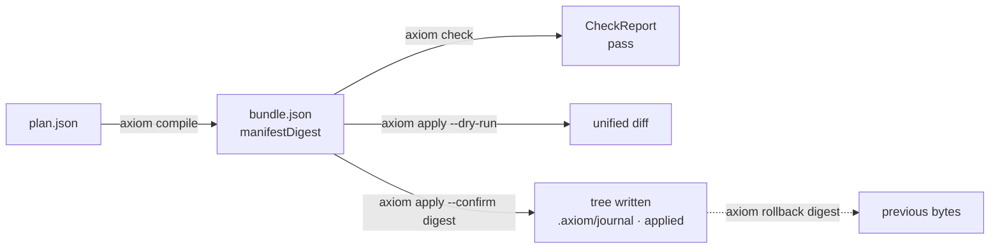

# Quickstart

*Sixty seconds from nothing to a journaled, reversible apply: point a client at a repo, write a Plan, compile → check → apply, then look at what `.axiom/` recorded.*

You need Node ≥ 22.14 and the global bin (`npm i -g @codai/axiom-mcp`, see [install.md](install.md)).
Everything below also works with `npx -y @codai/axiom-mcp <verb>` in place of `axiom`.



## 1. Point an MCP client at a repo

`.vscode/mcp.json` (Claude Desktop, Copilot CLI and Codex use the same shape — see
[harnesses.md](../integration/harnesses.md)):

```json
{
  "servers": {
    "axiom": {
      "type": "stdio",
      "command": "npx",
      "args": ["-y", "@codai/axiom-mcp", "mcp", "--root", "${workspaceFolder}"]
    }
  }
}
```

`--root` is an explicit allowlist and may repeat. There is no `cwd` or environment fallback: a
tool call naming a root outside the list is `ERR_ROOT_NOT_ALLOWED`; with several roots and none
named, `ERR_ROOT_REQUIRED`.

You can skip this step entirely and use the CLI, which is what the rest of the page does — the
MCP tools call the same engines.

## 2. Write a Plan

Make a scratch directory, `git init` it (optional, but it makes the gate profile's `.git/**`
rule meaningful), and save `plan.json`:

```json
{
  "apiVersion": "axiom.dev/v2",
  "kind": "Plan",
  "name": "hello",
  "intent": "Add a greeting module and document it.",
  "artifacts": [
    { "path": "src/hello.ts",
      "source": { "type": "inline", "content": "export const hi = () => 'hi';\n" } },
    { "path": "README.md", "op": "overwrite",
      "source": { "type": "inline", "content": "# hello\n" } }
  ],
  "checks": [{ "id": "no-secrets", "predicate": "content.noSecrets", "params": {} }]
}
```

A Plan is intent plus a list of artifacts, each with a target path, an `op` (`create` default,
`overwrite`, `delete`) and a `source`. `inline` is the simplest; `cas`, `ref`, `patch` and
`template` are in [plan-format.md](../reference/plan-format.md). The same Plan as `.axm`:

```axm
axiom "2"

plan hello {
  intent "Add a greeting module and document it."
  artifact "src/hello.ts" {
    inline <<TS
export const hi = () => 'hi';
TS
  }
  artifact "README.md" {
    op overwrite
    inline <<MD
# hello
MD
  }
  check no-secrets using content.noSecrets {}
}
```

`axiom compile plan.axm` accepts it directly ([axm-syntax.md](../reference/axm-syntax.md)).

## 3. Compile → check → apply

```sh
axiom compile plan.json --root . -o bundle.json
# → { "manifestDigest": "sha256:…", "artifacts": 2 }
```

Compile produced a **ManifestBundle**: the canonical manifest (paths, ops, sha256 digests, no
content), its digest, and the content as side-channel `blobs`. Because you passed `--root`, the
manifest also carries `preImage[]` — what compile saw on disk for each path — and a copy was
stored under `.axiom/manifests/<hex>.json`.

```sh
axiom check bundle.json --root .
# → CheckReport { "verdict": "pass", "preImage": "verified", "findings": [] }   exit 0
```

`check` ran the `default` profile plus your Plan's own `no-secrets` over the whole set. Verdict is
`pass | fail | error`; anything that could not be evaluated is `error`, and `apply` refuses both
`fail` and `error`.

```sh
axiom apply bundle.json --root . --dry-run
# → ApplyResult { "mode": "dry-run", "status": "applied", "diff": "--- /dev/null\n+++ b/src/hello.ts …" }
```

Dry-run does phase 1 of the two-phase commit — containment, blob hashing, staging, pre-checks —
prints a unified diff and removes the staging tree. Nothing in your working tree changed. The
`manifestDigest` in that output is what you confirm next:

```sh
axiom apply bundle.json --root . --confirm sha256:<the digest you just saw>
# → ApplyResult { "mode": "fs", "status": "applied", "files": [ …written… ], "journal": ".axiom/journal/<hex>.json" }
```

`--confirm` must equal the bundle's digest (`ERR_CONFIRM_DIGEST_MISMATCH` otherwise) — a caller
must have *seen* what it is applying. Right before each file is renamed into place its current
bytes are hashed again; if anything changed since staging the transaction rolls back
(`ERR_PREIMAGE_CHANGED`). Run the same command again and you get `status: noop`.

```sh
axiom rollback sha256:<digest> --root .
# → { "status": "rolled-back", "steps": [ … ] }
```

Rollback reverse-replays that apply's journal from the backups, touching only the paths it
recorded. `README.md` is back to its previous bytes and `src/hello.ts` is gone.

> [!TIP]
> Over MCP the same four steps are `axiom_plan_compile` → `axiom_check` → `axiom_apply_dry_run`
> → `axiom_apply { confirmDigest }`, with `axiom_rollback` to undo. Every tool returns the full
> result as `structuredContent` and a one-line text summary; failures are `isError` results with
> a `code` from the closed enum, never a thrown exception.

## 4. What `.axiom/` now contains

```
.axiom/
  manifests/<hex>.json     the bundle compile stored (root given)
  applied/<hex>.json       ApplyResult of the committed apply — presence = idempotency marker
  journal/<hex>.json       present only mid-apply, after a crash, or after a rollback
  backup/<hex>/            pre-images of overwritten/deleted files (last 3 manifests)
  reports/<hex>.json       CheckReports written by the MCP server / CLI
  cas/sha256/<aa>/<hex>    only with --store cas or fetched ref sources
  lock                     only while an apply or gc holds the root
  tmp/                     case-sensitivity probe scratch
```

Add `.axiom/` to `.gitignore` but track `.axiom/profiles/*.json` and `.axiom/gate-profile.json`
when you create them — the `default` profile already refuses any manifest that overwrites
`.axiom/**`. Full layout and lifecycle: [apply.md](../guides/apply.md#axiom-layout),
[cas.md](../concepts/cas.md).

## Where next

- Make the gate say what your repo needs: [checks.md](../guides/checks.md) and [profiles.md](../reference/profiles.md) — e.g. "touching a schema must touch a migration" (`repo.requireCompanion`).
- Put the seatbelt on every raw write your harness makes: [hooks.md](hooks.md).
- Prove a tree in CI: [verify-tree.md](../guides/verify-tree.md); sign manifests: [signing.md](../guides/signing.md).
- Understand why it is shaped this way: [pipeline.md](../concepts/pipeline.md), [trust-model.md](../concepts/trust-model.md).

---

**See also**

- [Install](install.md) — channels and per-OS notes
- [CLI reference](../reference/cli.md) — every verb and flag used above
- [Pipeline](../concepts/pipeline.md) — the two-phase commit in detail
- [Harnesses](../integration/harnesses.md) — the `mcp.json` for your client
