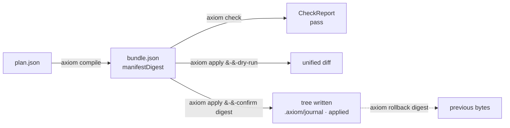

# Quickstart

*Sixty seconds from nothing to a journaled, reversible apply: install, `axiom init`, `axiom doctor`, write a Plan, compile → check → apply, then look at what `.axiom/` recorded.*

You need Node ≥ 22.14 ([install.md](install.md) lists the other channels):

```sh
npm i -g @codai/axiom-mcp      # the global bin — required for hooks
cd /path/to/repo
axiom init                     # MCP entry + PreToolUse hook + profiles + .gitignore
axiom doctor                   # every check ok/warn/fail; exit 2 when one fails
```

Every verb below except hooks also works with `npx -y @codai/axiom-mcp <verb>` in place of `axiom`.


```mermaid
flowchart LR
  P[plan.json] -->|axiom compile| B[bundle.json<br/>manifestDigest]
  B -->|axiom check| R[CheckReport<br/>pass]
  B -->|"axiom apply &#8209;&#8209;dry-run"| D[unified diff]
  B -->|"axiom apply &#8209;&#8209;confirm digest"| T["tree written<br/>.axiom/journal · applied"]
  T -.->|axiom rollback digest| P0[previous bytes]
```

## 1. Wire the repo — `axiom init` + `axiom doctor`

`axiom init [--root <dir>] [--harness auto|copilot|claude|codex|vscode] [--profile-name <name>] [--force] [--json]`
writes everything a harness needs in one idempotent step. `--root` defaults to the current
directory. With `--harness auto` (the default) it picks one harness per marker directory present
— `.github` → copilot, `.claude` → claude, `.codex` → codex, `.vscode` → vscode — and falls back
to copilot + vscode when none exists.

| File | Written for | How |
|---|---|---|
| `.vscode/mcp.json` | every harness | merged: adds `servers.axiom` (`npx -y @codai/axiom-mcp@2 mcp --root ${workspaceFolder}`), keeps every other server |
| `.github/hooks/axiom-gate.json` | copilot, vscode | whole file: `preToolUse` → `exec: "axiom"`, `args: ["gate", "--stdin"]`, `timeoutSec: 5` ([hooks.md](hooks.md#wiring)) |
| `.claude/settings.json` | claude | merged: appends one `hooks.PreToolUse` entry (`matcher: "Write\|Edit\|MultiEdit\|NotebookEdit"`, `axiom gate --stdin`, `timeout: 5`), keeps the rest |
| — | codex | nothing: Codex has no PreToolUse hook API; `init` prints a note pointing at [harnesses.md § Codex](../integration/harnesses.md#codex) |
| `.axiom/profiles/<name>.json` | always | whole file: a repo profile `extends: "default"` with `repo.noOverwriteOf` (`.git/**`, `.axiom/**`, `.github/**`, lockfiles, `.env*`), `content.noSecrets`, `path.deny` (`node_modules`, `.next`, `dist`, `.turbo`) |
| `.axiom/gate-profile.json` | always | whole file: the gate's deny list, `noSecrets: true`, `pii: false`, `maxBytes: 262144` ([hooks.md § Profile file](hooks.md#profile-file)) |
| `.gitignore` | always | appends the missing lines of `.axiom/*`, `!.axiom/profiles/`, `!.axiom/gate-profile.json` (keeps the file's line endings) |

`<name>` is `--profile-name`, else the repo directory name lower-cased with every run of
characters outside `[a-z0-9._-]` turned into `-`, leading non-alphanumerics and trailing `-`/`.`
stripped, cut to 64 characters (`repo` if nothing is left). A name equal to a builtin
(`default`, `strict`, `permissive`) gets `-repo` appended, because a profile extending itself is
a cycle; an explicit `--profile-name` that is invalid or a builtin is `ERR_INVALID_PROFILE`.

Each file is reported with one action:

| Action | Meaning |
|---|---|
| `created` | the file did not exist |
| `merged` | our entry was added to an existing JSON file (`mcp.json`, `.claude/settings.json`) |
| `updated` | `--force` replaced our entry / our file, or `.gitignore` gained missing lines |
| `skipped` | nothing to do, with a reason: `up to date`, `exists` (differs; re-run with `--force`), `already configured`, `already present`, `not plain JSON; add the entry by hand` (JSONC with comments is never rewritten), `top level is not an object` |

Running `init` twice changes nothing. Every write goes through the same containment check as
`apply` (a symlink or junction in the path is refused) and is atomic. `init` also notes when the
root has no `.git` and reminds you that hooks call the global bin.

`axiom doctor [--root <dir>] [--json]` then reads the result back. Each check is `ok`, `warn` or
`fail` with a fix hint; the exit code is `0` unless a check **failed** (then `2`) — warnings
never fail it.

| Check | Fails / warns when |
|---|---|
| `root` | fail: not a directory |
| `bin` | warn: no global `axiom` on `PATH`, or its version differs from this CLI |
| `hook.copilot` · `hook.claude` · `hook` | fail: hook file is not valid JSON · warn: no `axiom gate --stdin` entry (an `npx` entry does not count), or no hook config at all |
| `mcp.vscode` | warn: `.vscode/mcp.json` unreadable or without `servers.axiom` |
| `lock` | warn: a stale `.axiom/lock` (the next apply reclaims it) |
| `journal` | fail: interrupted or corrupt journals (hint: `axiom rollback <digest>`) |
| `chain` | fail: the journal hash chain is broken (`ERR_JOURNAL_CHAIN`, hint: `axiom verify --journal`) |
| `profile.<name>` · `profile` · `gate.profile` | fail: a profile does not load, or `gate-profile.json` is invalid (the gate then denies every write) · warn: no repo profile |
| `gitignore` | warn: `.axiom/` is not ignored |
| `gate.latency` | fail: `gate --stdin` p95 over 5 runs is above **4000 ms** (80 % of the 5 s hook timeout, after which every harness fails open) · warn: a benign `Write` was denied |

## 2. Or point an MCP client at a repo by hand

This is the entry `init` merges into `.vscode/mcp.json` (Claude Desktop, Copilot CLI and Codex
use their own file and shape — see [harnesses.md](../integration/harnesses.md)):

```json
{
  "servers": {
    "axiom": {
      "type": "stdio",
      "command": "npx",
      "args": ["-y", "@codai/axiom-mcp@2", "mcp", "--root", "${workspaceFolder}"]
    }
  }
}
```

`--root` is an explicit allowlist and may repeat. There is no `cwd` or environment fallback: a
tool call naming a root outside the list is `ERR_ROOT_NOT_ALLOWED`; with several roots and none
named, `ERR_ROOT_REQUIRED`.

You can skip the MCP client entirely and use the CLI, which is what the rest of the page does —
the MCP tools call the same engines.

## 3. Write a Plan

Make a scratch directory, `git init` it (optional, but it makes the gate profile's `.git/**`
rule meaningful), and save `plan.json`:

```json
{
  "apiVersion": "axiom.dev/v2",
  "kind": "Plan",
  "name": "hello",
  "intent": "Add a greeting module and document it.",
  "artifacts": [
    { "path": "src/hello.ts",
      "source": { "type": "inline", "content": "export const hi = () => 'hi';\n" } },
    { "path": "README.md", "op": "overwrite",
      "source": { "type": "inline", "content": "# hello\n" } }
  ],
  "checks": [{ "id": "no-secrets", "predicate": "content.noSecrets", "params": {} }]
}
```

A Plan is intent plus a list of artifacts, each with a target path, an `op` (`create` default,
`overwrite`, `delete`) and a `source`. `inline` is the simplest; `cas`, `ref`, `patch` and
`template` are in [plan-format.md](../reference/plan-format.md). The same Plan as `.axm`:

```axm
axiom "2"

plan hello {
  intent "Add a greeting module and document it."
  artifact "src/hello.ts" {
    inline <<TS
export const hi = () => 'hi';
TS
  }
  artifact "README.md" {
    op overwrite
    inline <<MD
# hello
MD
  }
  check no-secrets using content.noSecrets {}
}
```

`axiom compile plan.axm` accepts it directly ([axm-syntax.md](../reference/axm-syntax.md)), and so
does `axiom compile plan.yaml` (or `.yml`): the same object as YAML 1.2 `core` schema — exactly one
document, a mapping at the root, no custom tags or `<<` merge keys, no duplicate keys, at most 100
alias expansions; a top-level `$schema` key (editor hint) is dropped. Any YAML problem is
`ERR_INVALID_PLAN` with `details.line`/`column`.

## 4. Compile → check → apply

```sh
axiom compile plan.json --root . -o bundle.json
# → { "manifestDigest": "sha256:…", "artifacts": 2 }
```

Compile produced a **ManifestBundle**: the canonical manifest (paths, ops, sha256 digests, no
content), its digest, and the content as side-channel `blobs`. Because you passed `--root`, the
manifest also carries `preImage[]` — what compile saw on disk for each path — and a copy was
stored under `.axiom/manifests/<hex>.json`.

```sh
axiom check bundle.json --root .
# → CheckReport { "verdict": "pass", "preImage": "verified", "findings": [] }   exit 0
```

`check` ran the `default` profile plus your Plan's own `no-secrets` over the whole set. Verdict is
`pass | fail | error`; anything that could not be evaluated is `error`, and `apply` refuses both
`fail` and `error`.

```sh
axiom apply bundle.json --root . --dry-run
# → ApplyResult { "mode": "dry-run", "status": "applied", "diff": "--- /dev/null\n+++ b/src/hello.ts …" }
```

Dry-run does phase 1 of the two-phase commit — containment, blob hashing, staging, pre-checks —
prints a unified diff and removes the staging tree. Nothing in your working tree changed. The
`manifestDigest` in that output is what you confirm next:

```sh
axiom apply bundle.json --root . --confirm sha256:<the digest you just saw>
# → ApplyResult { "mode": "fs", "status": "applied", "files": [ …written… ], "journal": ".axiom/journal/<hex>.json" }
```

`--confirm` must equal the bundle's digest (`ERR_CONFIRM_DIGEST_MISMATCH` otherwise) — a caller
must have *seen* what it is applying. Right before each file is renamed into place its current
bytes are hashed again; if anything changed since staging the transaction rolls back
(`ERR_PREIMAGE_CHANGED`). Run the same command again and you get `status: noop`.

```sh
axiom rollback sha256:<digest> --root .
# → { "status": "rolled-back", "steps": [ … ] }
```

Rollback reverse-replays that apply's journal from the backups, touching only the paths it
recorded. `README.md` is back to its previous bytes and `src/hello.ts` is gone.

> [!TIP]
> Over MCP the same four steps are `axiom_plan_compile` → `axiom_check` → `axiom_apply_dry_run`
> → `axiom_apply { confirmDigest }`, with `axiom_rollback` to undo. Every tool returns the full
> result as `structuredContent` and a one-line text summary; failures are `isError` results with
> a `code` from the closed enum, never a thrown exception.

## 5. What `.axiom/` now contains

```
.axiom/
  manifests/<hex>.json     the bundle compile stored (root given)
  applied/<hex>.json       ApplyResult of the committed apply — presence = idempotency marker
  journal/<hex>.json       the apply's journal (steps, phase)
  journal/chain.jsonl      hash-chained log of every finished apply (axiom log · verify --journal)
  backup/<hex>/            pre-images of overwritten/deleted files (last 3 manifests)
  reports/<hex>.json       CheckReports written by the MCP server / CLI
  cas/sha256/<aa>/<hex>    only with --store cas or fetched ref sources
  lock                     only while an apply or gc holds the root
  queue/ · intents/        waiters for the lock and in-flight path claims (axiom status)
  profiles/<name>.json     the repo profile axiom init wrote (tracked in git)
  gate-profile.json        the hook's profile (tracked in git)
  tmp/                     case-sensitivity probe scratch
```

`axiom init` already added `.axiom/*` to `.gitignore` with exceptions for `.axiom/profiles/` and
`.axiom/gate-profile.json`, so the two policy files are committed and the state is not — the
`default` profile refuses any manifest that overwrites `.axiom/**`. `axiom status` shows the lock,
queue and intents; `axiom log` lists the chain newest first. Full layout and lifecycle:
[apply.md](../guides/apply.md#axiom-layout), [cas.md](../concepts/cas.md).

## Where next

- Make the gate say what your repo needs: [checks.md](../guides/checks.md) and [profiles.md](../reference/profiles.md) — e.g. "touching a schema must touch a migration" (`repo.requireCompanion`).
- Put the seatbelt on every raw write your harness makes: [hooks.md](hooks.md).
- Prove a tree in CI: [verify-tree.md](../guides/verify-tree.md); sign manifests: [signing.md](../guides/signing.md).
- Understand why it is shaped this way: [pipeline.md](../concepts/pipeline.md), [trust-model.md](../concepts/trust-model.md).

---

**See also**

- [Install](install.md) — channels and per-OS notes
- [CLI reference](../reference/cli.md) — every verb and flag used above
- [Pipeline](../concepts/pipeline.md) — the two-phase commit in detail
- [Harnesses](../integration/harnesses.md) — the `mcp.json` for your client
