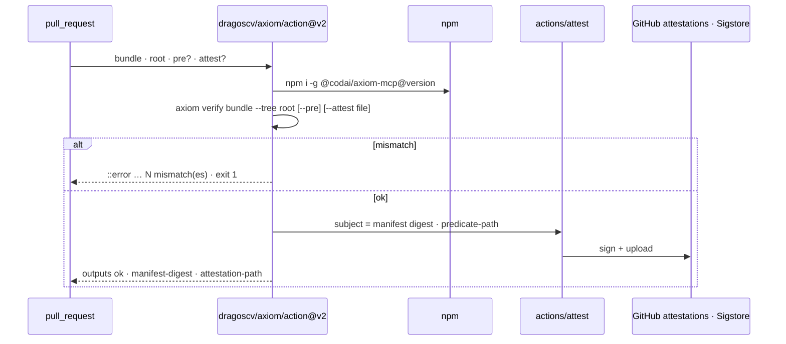

# GitHub Action — `dragoscv/axiom/action`

*Fail a pull request whose tree does not match an AXIOM manifest, and optionally upload an in-toto attestation. Inputs, outputs, permissions, the `@v2` moving tag.*

The composite action in [`action/action.yml`](../../action/action.yml) installs `@codai/axiom-mcp`
on the runner, runs `axiom verify <bundle> --tree <root>` and, with `attest: true`, hands the
resulting predicate to `actions/attest` so `gh attestation verify` can later prove which tree a
manifest was verified against. It runs on ubuntu, macos and windows runners (`shell: bash`).



## Usage

```yaml
# .github/workflows/axiom-verify.yml
name: axiom verify
on: pull_request
permissions:
  contents: read
  id-token: write        # only for attest: true
  attestations: write    # only for attest: true
jobs:
  verify:
    runs-on: ubuntu-latest
    steps:
      - uses: actions/checkout@v5
      - uses: dragoscv/axiom/action@v2
        id: axiom
        with:
          bundle: .axiom/manifests/<hex>.json   # the bundle the agent applied
          root: .
          # pre: true                            # verify the pre-image set instead
          # attest: true                         # upload an attestation on success
      - run: echo "verified ${{ steps.axiom.outputs.manifest-digest }}"
```

Where does the bundle come from? Whatever compiled it stored a copy under
`<root>/.axiom/manifests/<hex>.json` when a root was given; commit that file (or upload it as an
artifact from the job that ran the agent) so the PR carries the manifest it claims to implement.

## Inputs

| Input | Required | Default | Meaning |
|---|---|---|---|
| `bundle` | yes | — | path to the `ManifestBundle` JSON (output of `axiom compile`) |
| `root` | no | `.` | tree to verify against |
| `pre` | no | `false` | verify the manifest's declared **pre-image** set (`ManifestBody.preImage`) instead of the post-apply artifacts — "is this the tree it was compiled against?" |
| `attest` | no | `false` | write an in-toto Statement and upload it via `actions/attest` (needs `id-token: write`, `attestations: write`) |
| `attestation-path` | no | `axiom-attestation.intoto.json` | where the Statement is written when `attest` is true; the bare predicate goes beside it |
| `version` | no | `2` | `@codai/axiom-mcp` npm dist-tag or exact version to `npm i -g` |
| `local-cli` | no | `""` | path to a built `cli.js` to use instead of npm — dogfooding inside the AXIOM repo's own CI; consumers leave it empty |

## Outputs

| Output | Meaning |
|---|---|
| `ok` | `true` when every path matched |
| `manifest-digest` | the `manifestDigest` that was verified (`sha256:…`) |
| `mismatches` | number of paths that did not match |
| `attestation-path` | path of the written Statement (empty unless `attest: true` and `ok`) |

The full `verify --tree` JSON (`{ ok, manifestDigest, canonical, root, tree, paths, mismatches[] }`)
is printed to the job log. A mismatch fails the step with an `::error` annotation naming the digest
and the count; exit code is the CLI's (`1` mismatch, `2` structural).

## Scope of the check (D-20)

Only the manifest's own paths are compared: every `create`/`overwrite` artifact must be present
with its declared digest, every `delete` must be absent. Files the manifest never mentioned are
ignored, so the check survives unrelated commits on the branch. A whole-root digest was rejected
for exactly that reason. With `pre: true` the expected set is `preImage[]` instead.

## Attestation (D-21)

With `attest: true` and a match, the action calls `actions/attest` with

- `subject-name` = the plan name, `subject-digest` = the **manifest digest** — not the sha256 of
  any file on disk;
- `predicate-type` = `https://axiom.dev/attestation/apply/v1`;
- `predicate-path` = the sibling `.predicate.json` (`{ manifest, plan, profile, tree, paths[],
  preImage?[], verifier, source }`, no clock; `source` carries `GITHUB_REPOSITORY/REF/SHA/RUN_ID`).

Verify it later by subject digest — the digest is in `.axiom/applied/<hex>.json`, any
`CheckReport`, or the action's output:

```sh
gh api repos/<owner>/<repo>/attestations/sha256:<manifest hex> \
  --jq '.attestations[].bundle.dsseEnvelope.payload' | base64 -d \
  | jq '.predicateType, .subject, .predicate.tree, .predicate.source'
```

For a full Sigstore verification with `gh attestation verify`, give it a file whose sha256 *is*
the manifest digest — the JCS bytes of `bundle.manifest` — as shown in
[verify-tree.md](../guides/verify-tree.md#attestation-d-21).

> [!NOTE]
> This attestation says *a tree was checked against this manifest, by this workflow, on this
> commit*. It is a different proof from a DSSE signature on the bundle
> ([signing.md](../guides/signing.md)), which says *who produced the manifest*. Use both when you
> need both.

## Versioning of the action — `@v2`

`@v2` is a **moving tag** that `release.yml` force-updates to every `v2.*` release (D-31, from
v2.2.1). It always points at a commit whose `action.yml` installs the matching
`@codai/axiom-mcp@2` line. For a reproducible pin use a full tag (`@v2.2.1`) or a commit SHA, and
pin `version:` to an exact npm version as well:

```yaml
- uses: dragoscv/axiom/action@<sha>   # v2.2.1
  with:
    bundle: .axiom/manifests/<hex>.json
    version: 2.2.1
```

The inner `actions/attest` step is itself pinned to a SHA (`# v4`) and checked by the repository's
`check-action-pins` guard.

## Failure modes

| Symptom | Cause | Fix |
|---|---|---|
| `bundle failed structural verification; tree not checked` | the bundle is not self-consistent (digest ≠ recomputed, blob mismatch) | re-run `axiom compile`; a hand-edited bundle can never pass |
| `mismatches: [{ path, expected, actual }]` with `actual` a sha | someone edited the file after the apply | intended — that is the check |
| `actual: "ERR_SYMLINK_IN_PATH"` / `"non-file:dir"` | a symlink, directory or containment escape where a file is expected | inspect the path; a manifest never creates those |
| `--pre is asked of a manifest that carries no preImage` | the bundle was compiled without a root | compile with `--root` (the MCP tool does when given `root`) |
| attest step skipped | `ok` was not `true`, or `attest` not `"true"` | the attestation is only ever uploaded for a matching tree |
| `Resource not accessible by integration` on attest | missing `id-token: write` / `attestations: write` | add the permissions block |

## Dogfooding in this repository

`ci.yml` job `verify-action` runs the action with `local-cli` against a scratch tree on every
push: it must pass on the applied tree, fail with exactly one mismatch after a hand edit, and
upload an attestation on `main`. The first live attestation
(`dragoscv/axiom` run 35476782913, 2026-09-20) was fetched and decoded with the command above.

---

**See also**

- [Verify tree](../guides/verify-tree.md) — the CLI verb behind the action, scope and attestation details
- [Signing](../guides/signing.md) — the other proof: DSSE over the manifest
- [Install](../getting-started/install.md#github-action) — the action among the other channels
- [Trust model](../concepts/trust-model.md#5-attestation-proof-that-outlives-the-agent) — why attestation is the last boundary
