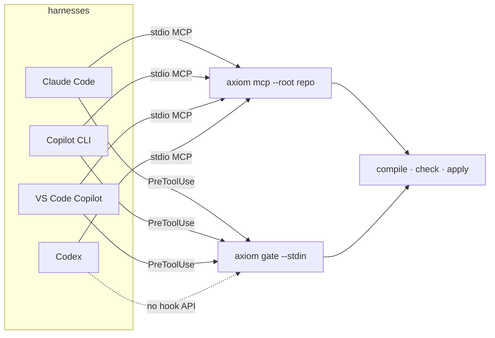

# Harnesses: Claude Code, Copilot CLI, VS Code, Codex

*One matrix for wiring AXIOM into each coding-agent harness — the MCP server config and the PreToolUse hook — with the per-harness facts that decide the shape.*

Every harness gets the same two things: an **MCP server** entry so the agent can run
`Plan → compile → check → dry-run → apply`, and a **PreToolUse hook** so the harness's own write
tools are gated. The MCP entry is nearly identical everywhere; the hook differs in file location,
payload casing, matcher support and timeout behaviour. [hooks.md](../getting-started/hooks.md)
is the deep reference for the gate; this page is the copy-paste matrix.



## Prerequisites

- `npm i -g @codai/axiom-mcp` — the global `axiom` bin is **required** for hooks (measured
  `npx` p50 7.8 s vs 157 ms; every harness fails **open** on hook timeout, so an `npx` gate never
  runs). The MCP server may use `npx -y` because it starts once.
- A repository root. Every server entry passes it explicitly with `--root`; there is no `cwd`
  fallback. Repeat `--root` for several repositories.
- Optional: `.axiom/gate-profile.json` and `.axiom/profiles/<name>.json` in the repo
  ([profiles.md](../reference/profiles.md)).

## Matrix

| | Claude Code | Copilot CLI | VS Code (Copilot agent) | Codex |
|---|---|---|---|---|
| MCP config file | `.mcp.json` (project) / `~/.claude.json` | `~/.copilot/mcp-config.json` or `copilot mcp add` | `.vscode/mcp.json` | `~/.codex/config.toml` |
| MCP entry shape | `mcpServers.axiom { command, args }` | `mcpServers.axiom { type: "local", command, args, tools }` | `servers.axiom { type: "stdio", command, args }` | `[mcp_servers.axiom] command, args` |
| Hook file | `.claude/settings.json` (project) / `~/.claude/settings.json` | `.github/hooks/*.json` (repo) / `~/.copilot/hooks/*.json` | `.github/hooks/*.json` **and** `.claude/settings.json` (both loaded) | none — no hook API |
| Hook event | `PreToolUse` with regex `matcher` | `preToolUse`, **no matcher** (fires on every tool; the gate filters in < 1 ms) | `PreToolUse`, `{ type: "command", command, timeoutSec }` | — |
| Payload | `{ session_id, cwd, hook_event_name, tool_name, tool_input, tool_use_id }` | `{ timestamp, cwd, toolName, toolArgs }` — **`toolArgs` is a JSON string** | `tool_name` / `tool_input` (snake_case, unlike the CLI) | — |
| Deny signal read | exit `2` + stdout `hookSpecificOutput.permissionDecision` | exit `2` (any non-zero / crash = deny) + flat `permissionDecision` | same as CLI | — |
| Hook timeout → | proceeds through normal permission flow (**fail open**) | **fail open** | **fail open** | — |
| Per-tool auto-approve | `permissions.allow: ["mcp__axiom__axiom_apply"]` | `--allow-tool 'axiom(axiom_apply)'` | `chat.tools.global.autoApprove` / UI | `[mcp_servers.axiom.tools.axiom_apply] approval_mode` |
| Tool that forces a prompt | `_meta["anthropic/requiresUserInteraction"]` honoured; `destructiveHint` | `destructiveHint` | `destructiveHint` → confirm dialog | approval policy |

The gate emits **one** deny document that every column reads
(`hookSpecificOutput{…}` + flat `permissionDecision` + `axiom{ verdict, code, path, toolClass }`),
and reads both payload casings, so a single hook config serves whichever harness loads it.

## Claude Code

**MCP** — `.mcp.json` in the project (or `claude mcp add axiom -- npx -y @codai/axiom-mcp mcp --root /abs/repo`):

```json
{
  "mcpServers": {
    "axiom": {
      "command": "npx",
      "args": ["-y", "@codai/axiom-mcp", "mcp", "--root", "/abs/path/to/repo"]
    }
  }
}
```

**Hook** — `.claude/settings.json` (project) or `~/.claude/settings.json`:

```json
{
  "hooks": {
    "PreToolUse": [
      {
        "matcher": "Write|Edit|MultiEdit|NotebookEdit",
        "hooks": [
          { "type": "command", "command": "axiom gate --stdin", "timeout": 5 }
        ]
      }
    ]
  }
}
```

`timeout` is in seconds. The matcher keeps the hook off `Read`; drop `Bash` in on purpose if you
want the shell scan (`"matcher": "Write|Edit|MultiEdit|NotebookEdit|Bash"`). Claude reads
`hookSpecificOutput` (the top-level `decision`/`reason` shape is deprecated); since v2.1.214 an
exit `2` with schema-invalid JSON still blocks. A timed-out hook does **not** block.

**Auto-approve the read-only tools, keep the prompt on apply:**

```json
{ "permissions": { "allow": [
  "mcp__axiom__axiom_plan_compile", "mcp__axiom__axiom_check",
  "mcp__axiom__axiom_apply_dry_run", "mcp__axiom__axiom_manifest_verify" ] } }
```

## Copilot CLI

**MCP** — `~/.copilot/mcp-config.json` (or `copilot mcp add`):

```json
{
  "mcpServers": {
    "axiom": {
      "type": "local",
      "command": "npx",
      "args": ["-y", "@codai/axiom-mcp", "mcp", "--root", "/abs/path/to/repo"],
      "tools": ["*"]
    }
  }
}
```

**Hook** — `.github/hooks/axiom-gate.json` (repo) or `~/.copilot/hooks/axiom-gate.json` (user):

```json
{
  "version": 1,
  "hooks": {
    "preToolUse": [
      { "type": "command", "exec": "axiom", "args": ["gate", "--stdin"], "timeoutSec": 5 }
    ]
  }
}
```

Or the shell form used by other house hooks:
`{ "type": "command", "bash": "axiom gate --stdin", "powershell": "axiom gate --stdin", "timeoutSec": 5 }`.
There is **no matcher** — the hook fires on every tool call and must be cheap for non-writes (the
gate returns in well under a millisecond for `grep_search`, `list_dir`, …). `toolArgs` arrives as
a JSON *string*; the gate parses it. Any non-zero exit or crash is a deny, so fail-closed costs
nothing here; a **timeout** still fails open.

**Per-tool approval:** `copilot --allow-tool 'axiom(axiom_plan_compile)' --allow-tool 'axiom(axiom_check)'`
and leave `axiom_apply` to prompt. The Copilot SDK sees the same `toolName`/`toolArgs` in its
callbacks.

## VS Code (Copilot agent mode)

**MCP** — `.vscode/mcp.json`:

```json
{
  "servers": {
    "axiom": {
      "type": "stdio",
      "command": "npx",
      "args": ["-y", "@codai/axiom-mcp", "mcp", "--root", "${workspaceFolder}"]
    }
  }
}
```

**Hook** — VS Code loads `.github/hooks/*.json` from the workspace **and** `.claude/settings.json`,
plus the user-level `~/.copilot/hooks` and `~/.claude/settings.json`, so either of the two files
above works unchanged. Event `PreToolUse`, entry `{ "type": "command", "command": "axiom gate --stdin", "timeoutSec": 5 }`.
Observed 2026-08-31: VS Code sends **`tool_name` / `tool_input`** (snake_case) while the CLI sends
camelCase — a hook that read only one casing silently failed open 790 times; the gate reads both.
Sub-agents start in sub-directories (`apps/web`); the gate walks up to the repository root so
`.git/**` and `.env` rules still match.

The `.axm` extension, HTTP transport and a full workspace layout: [vscode.md](vscode.md).

## Codex

**MCP** — `~/.codex/config.toml`:

```toml
[mcp_servers.axiom]
command = "npx"
args = ["-y", "@codai/axiom-mcp", "mcp", "--root", "/abs/path/to/repo"]

[mcp_servers.axiom.tools.axiom_apply]
approval_mode = "always"        # keep the human on the destructive tool
```

**Hook** — Codex has no PreToolUse hook API. Two ways to still get the seatbelt:

- Route writes through the MCP tools and turn the raw `apply_patch` tool off in the profile you
  run Codex with, so the only path to disk is `axiom_apply`.
- Feed Codex's V4A `apply_patch` text to AXIOM as a `patch` source
  (`{ type: "patch", format: "v4a", preImage, body }`): compile checks the pre-image, applies
  exactly-once matching, and the result goes through checks and the two-phase apply like any
  other artifact ([plan-format.md § Patch sources](../reference/plan-format.md#patch-sources)).

## Claude Desktop and other stdio clients

`claude_desktop_config.json` uses the Claude Code shape (`mcpServers.axiom { command, args }`).
Any client that resolves MCP Registry names can use `io.github.dragoscv/axiom`; it still needs
`--root`. Streamable HTTP clients point at `http://127.0.0.1:3411/mcp` after
`axiom mcp --root /abs/repo --http 127.0.0.1:3411` (bearer token required off loopback —
[mcp-tools.md § Transports](../reference/mcp-tools.md#transports)).

## Teaching the agent to prefer the gate

A hook stops bad writes; it does not make an agent *choose* the transactional path. The consumers
in this repository do that with a short instruction file the harness loads:

- codai: the SWE harness calls the engines in-process by default ([codai.md](codai.md)).
- metu: a `.github/skills/axiom-plan-apply/SKILL.md` — "never raw multi-file writes when AXIOM is
  available; Plan → `axiom_plan_compile` → `axiom_check` → `axiom_apply_dry_run` →
  `axiom_apply { confirmDigest }`" — plus a footer in every feature skill ([metu.md](metu.md)).
- brivio: the same, with `guard.external` running the repo's own guards ([brivio.md](brivio.md)).

## Checking that it is live

```sh
# the hook: a denied write should exit 2
echo '{"cwd":"/abs/repo","tool_name":"Write","tool_input":{"file_path":".env","content":"X=1"}}' | axiom gate --stdin; echo $?
# the server: list roots over MCP (any client), or from the CLI
axiom mcp --root /abs/repo --log-level info   # logs "mcp stdio ready" with the roots
```

"Configured" is not "fires": after wiring a hook, ask the agent to write `.env` once and watch for
`AXIOM GATE DENY path.deny` in its transcript.

---

**See also**

- [Hooks](../getting-started/hooks.md) — the gate contract, flags, profile file, latency budget
- [MCP tools](../reference/mcp-tools.md) — what the server entry exposes
- [VS Code](vscode.md) — extension, HTTP transport, workspace layout
- [Install](../getting-started/install.md) — global bin vs `npx`
