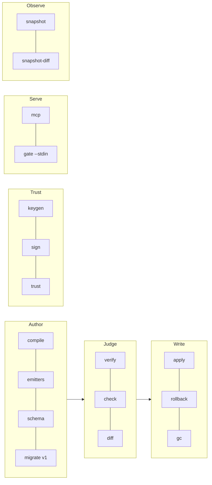

# CLI reference

*Every `axiom` verb and flag, the exit-code contract, and a worked example per verb. The USAGE string in `packages/mcp/src/cli-main.ts` is authoritative; this page mirrors it.*

The `axiom` bin (`@codai/axiom-mcp`) is one executable with many verbs. Every verb except `mcp`
prints **JSON to stdout** (`check` without `--json` prints a text summary) and returns one of three
exit codes; `mcp` speaks JSON-RPC on stdout and logs JSON lines on stderr. A `.axm` Plan with
errors prints its diagnostics as JSON and exits 2.

| Exit | Meaning |
|---|---|
| `0` | ok — verdict `pass`, apply `applied`/`noop`, tree matches, migrated cleanly |
| `1` | verdict `fail`/`error`, apply `failed`/`rolled-back`, tree mismatch, signature failure, migrated **with warnings** |
| `2` | usage error, structural failure, `.axm` diagnostics, any `ERR_*` raised outside a result object |

Failures that are not result objects come out as `{ "error": { "code": "ERR_…", "message", "details"? } }`
with a code from [error-codes.md](error-codes.md). `axiom --version` prints the version;
`axiom --help` prints the USAGE string.



## Shared flags

| Flag | Verbs | Meaning |
|---|---|---|
| `--root <dir>` | most | the repository root; realpathed, must be a directory. Required where shown; the CLI never falls back to `cwd` |
| `--profile <name>` | `check`, `apply`, `migrate` | a built-in (`default`, `strict`, `permissive`) or `<root>/.axiom/profiles/<name>.json` ([profiles.md](profiles.md)). `apply` defaults to the manifest's own `profile` |
| `--allow-guards` | `mcp`, `check`, `apply` | enable `guard.external` (the profile must **also** set `facts.allowGuards: true`) |
| `--guard-allowlist <abs>` | `mcp`, `check`, `apply` | repeatable; absolute guard commands must appear here exactly. Relative ones must live under `<root>/scripts/` |
| `--log-level error\|warn\|info\|debug` | `mcp`, `gate` | stderr verbosity, default `warn` |
| `-o, --out <file>` | `compile`, `sign`, `migrate`, `snapshot` | write the result to a file and print a short summary instead |

## `mcp`

```
axiom mcp [--root <abs>]... [--allow-guards] [--guard-allowlist <abs>]... [--log-level L]
          [--http <host:port>] [--http-token-env <NAME>] [--wire 2026|2025|2026-only]
```

Start the MCP server — stdio by default, Streamable HTTP with `--http`. `--root` may repeat; with
none, every root-taking tool fails `ERR_ROOT_REQUIRED` (a warning is logged). `--http 0` binds a
random loopback port and logs the URL at `info`. A non-loopback host **requires** a bearer token in
the env var named by `--http-token-env` (default `AXIOM_HTTP_TOKEN`, ≥ 16 chars) or the server
refuses to start. `--wire` selects the protocol era: `2026` (default) and `2025` both serve
2026-07-28 and 2025-era clients from the same entry; `2026-only` refuses `initialize` openings.
Tools, resources and transport rules: [mcp-tools.md](mcp-tools.md).

```sh
axiom mcp --root /abs/repo
axiom mcp --root /abs/repo --http 127.0.0.1:3411 --log-level info
AXIOM_HTTP_TOKEN=$(openssl rand -hex 32) axiom mcp --root /abs/repo --http 0.0.0.0:3411
```

## `compile`

```
axiom compile <plan.json|plan.axm> [-o <out.json>] [--store inline|cas] [--root <dir>]
                                   [--allow-net [--net-allow <host>[,host]]] [--allow-file]
```

Plan → `ManifestBundle`. `.axm` input is parsed first (diagnostics → exit 2). With `--root` (or
implicitly when `--store cas`, `--allow-net` or `--allow-file` is given) the manifest carries
`preImage[]` and a copy is stored under `<root>/.axiom/manifests/<hex>.json`. `--store cas` writes
blobs to the CAS instead of inlining them. `ref` sources are offline by default: `--allow-net`
fetches `https:` URIs (no redirects, 30 s, 32 MiB cap), `--net-allow` restricts hosts
(`*.example.com` wildcards; the flag requires `--allow-net`), `--allow-file` admits `file:` URIs.
Template emitters available: `axiom emitters`.

Output with `-o`: `{ manifestDigest, artifacts, out }`; without: the whole bundle.

```sh
axiom compile plan.json --root . -o bundle.json
axiom compile plan.axm -o bundle.json
axiom compile plan.json --root . --store cas --allow-net --net-allow cdn.example.com,*.github.com
```

## `verify`

```
axiom verify <bundle.json> [--root <dir>]
axiom verify <bundle.json> --tree <dir> [--pre] [--attest <out.json>]
```

Structural verification: canonical form, `manifestDigest`, every blob's hash. With `--root`,
additionally verify detached DSSE signatures against `<root>/.axiom/trust/keys.json`
(`signatures: { trustFile, keyids[], findings[], ok, code? }`; no trust store → `signatures: null`).
With `--tree`, compare the tree under `<dir>` with the manifest's artifacts (or, with `--pre`, its
declared `preImage[]` set) and list `mismatches[]`; `--attest` writes an in-toto Statement to
`<out.json>` and the bare predicate beside it on success. `--attest` requires `--tree`. Never
takes the lock, never writes under `.axiom/`. Details: [verify-tree.md](../guides/verify-tree.md).

```sh
axiom verify bundle.json
axiom verify bundle.json --root .                           # + signatures
axiom verify bundle.json --tree . --attest axiom.intoto.json
axiom verify bundle.json --tree . --pre                     # is this the tree it was compiled against?
```

## `check`

```
axiom check <bundle.json> --root <dir> [--profile <name>] [--json] [--allow-guards] [--guard-allowlist <abs>]...
```

Run the profile's predicates plus the manifest's own `checks[]` over the bundle against the root;
verify `preImage[]` against the tree. `--profile` defaults to the manifest's own `profile`. With
`--json` the full `CheckReport` is printed; without it a human summary
(`PASS sha256:… (default, 34 ms)` followed by one line per finding) — the only verb whose default
output is not JSON. The report is stored under `<root>/.axiom/reports/` either way. Exit `0` only
on `verdict: pass`. Predicates: [checks.md](../guides/checks.md).

```sh
axiom check bundle.json --root . --profile strict
axiom check bundle.json --root . --profile brivio --allow-guards
```

## `apply`

```
axiom apply <bundle.json> --root <dir> [--dry-run] [--profile <name>] [--confirm <digest>]
                                       [--pr [--branch <name>] [--message <text>]]
                                       [--allow-guards] [--guard-allowlist <abs>]...
```

Two-phase commit. Without `--dry-run`, `--confirm` **must** equal `bundle.manifestDigest`
(`ERR_CONFIRM_DIGEST_MISMATCH`, exit 2). Pre-apply checks run on the staged tree with the given
profile (default: the manifest's `profile`) and abort on any non-`pass` verdict
(`ERR_CHECKS_FAILED`). `--dry-run` does phase 1 only and returns a unified diff. `--pr` wraps the
apply in `git switch -c <branch>` + `git commit` of exactly the touched paths; `--branch` defaults
to `axiom/<name>/<digest12>`, `--message` to `axiom: apply <name> (<digest12>)` with trailers; no
push. On `status: applied` with a profile that carries `manifest.requireSigned { antiRollback }`,
the trust state advances. Exit `1` on `failed`/`rolled-back`. Guarantees: [apply.md](../guides/apply.md).

```sh
axiom apply bundle.json --root . --dry-run
axiom apply bundle.json --root . --confirm sha256:…
axiom apply bundle.json --root . --confirm sha256:… --pr --branch feat/hello
```

## `rollback`

```
axiom rollback <digest> --root <dir>
```

Reverse-replay the journal of an applied manifest from `.axiom/backup/<hex>/`, scoped to the paths
it recorded. Also finishes a journal left in `committing` / `rolling-back` by a crash. Prints
`{ manifestDigest, status, phase, steps[], root }`.

```sh
axiom rollback sha256:… --root .
```

## `gc`

```
axiom gc --root <dir> [--dry-run] [--older-than <n>(ms|s|m|h|d)] [--keep all-manifests|journal]
```

CAS garbage collection — **CLI only**, no MCP tool. Removes blobs no live manifest references.
`--keep all-manifests` (default) pins every stored manifest's digests; `--keep journal` pins only
manifests named by a journal or an `applied/` record. `--older-than` skips young candidates
(`skippedYoung`). Takes `.axiom/lock` like apply (`ERR_LOCKED` on a live holder). Report:
`{ root, keep, dryRun, scanned, live, missing, removed[], skippedYoung, freedBytes }`. Details: [cas.md](../concepts/cas.md).

```sh
axiom gc --root . --dry-run
axiom gc --root . --older-than 30d --keep journal
```

## `diff`

```
axiom diff <a.json> <b.json>
```

Structural diff of two bundles: `{ added[], removed[], changed[] }` by artifact path. Same as
`axiom_manifest_diff`.

## `schema`

```
axiom schema <Plan|Manifest|ManifestBundle|CheckReport|ApplyResult|Profile|Journal|RepoSnapshot>
```

Print the JSON Schema (draft 2020-12, generated from the Zod source) for one wire type. Also served
as `axiom://schema/<Kind>`.

## `emitters`

```
axiom emitters [--json]
```

List the template emitters compiled into this bin — `{ emitter, version, template, description }`
rows; currently `web@2.0.0` ([emitters.md](../guides/emitters.md)). Without `--json` the same list,
pretty-printed.

## `keygen`

```
axiom keygen [--out <dir>] [--name <label>]
```

Generate an Ed25519 signing key. The private key goes to `<dir>/axiom-signing-<id>.key` with mode
`0600`; stdout gets `{ publicEntry: { keyid, alg, publicKey, name }, privateKeyFile }`. The private
key is never printed.

## `sign`

```
axiom sign <bundle.json> [--key-file <path>] [-o <out.json>] [--root-id <id>]
```

Append a detached DSSE envelope over `JCS(manifest)` to `bundle.signatures[]`. The private key comes
from `--key-file` or, failing that, `$AXIOM_SIGNING_KEY` (base64 PKCS#8, base64 raw seed, or PEM).
`--root-id <id>` produces a root-bound envelope (`application/vnd.axiom.manifest-bound+json`) that
only a trust store with that `rootId` accepts. `manifestDigest` is unchanged. Protocol: [signing.md](../guides/signing.md).

```sh
axiom sign bundle.json --key-file ./secrets/axiom-signing-<id>.key -o signed.json
AXIOM_SIGNING_KEY=… axiom sign bundle.json --root-id github:owner/repo
```

## `trust`

```
axiom trust add <pubkey.json> --root <dir>
axiom trust remove <keyid> --root <dir>
axiom trust list --root <dir>
axiom trust root-id [<id> | --clear] --root <dir>
```

Manage `<root>/.axiom/trust/keys.json`. `add` re-derives the `keyid` from `publicKey` and refuses
mismatches; `remove` revokes; `list` prints the store; `root-id` shows, sets or clears the store's
`rootId` (require root-bound signatures carrying that id).

## `gate`

```
axiom gate --stdin [--root <dir>] [--profile <file>] [--fail-open] [--no-shell-scan]
                   [--no-root-discovery] [--log-level L]
```

PreToolUse hook. Reads one harness payload from stdin, exits `0` (allow) or `2` (deny, JSON reason
on stdout, one line on stderr). Fail-closed: malformed input or an undeterminable write target is a
deny unless `--fail-open`. `--root` is used only when the payload has no `cwd`; `--profile` points
at a gate-profile file (default search: `<root>/.axiom/gate-profile.json` → `~/.axiom/gate-profile.json`
→ built-in). `--strict` is accepted as a 2.1 no-op. Contract, wiring, profile schema and latency:
[hooks.md](../getting-started/hooks.md).

```sh
echo '{"cwd":"/repo","tool_name":"Write","tool_input":{"file_path":".env","content":"X=1"}}' | axiom gate --stdin; echo $?   # 2
```

## `migrate v1`

```
axiom migrate v1 <manifest.json> [-o <plan.json>] [--profile <name>] [--cas <root>] [--content <dir>] [--name <kebab>] [--overwrite]
```

Lift an AXIOM 1.0.x manifest into a v2 Plan. `--content` names the directory holding sidecar bytes
for hash-only artifacts (default: the manifest's directory); `--cas <root>` stores resolved bytes
in that root's CAS and emits `cas` sources; `--overwrite` sets `op: overwrite` on every artifact;
`--name` overrides `migrated-v1-<profile>`. Exit `1` = migrated **and written**, with warnings.
Field mapping and drops: [migrate.md](../guides/migrate.md).

```sh
axiom migrate v1 out-budget.manifest.json -o plan.json && axiom compile plan.json -o bundle.json
```

## `snapshot`

```
axiom snapshot --root <dir> [-o <out.json>] [--include <glob>]... [--exclude <glob>]...
               [--max-files <n>] [--max-bytes <n>] [--no-gitignore] [--no-digest]
```

Deterministic inventory of a root (`RepoSnapshot`, `snapshotDigest = sha256(JCS(body))`).
`--include`/`--exclude` use a tiny glob dialect (`**`, `*`, `?`); `--max-files` default 20 000
(cap 50 000), `--max-bytes` default 64 MiB; `--no-gitignore` ignores the root `.gitignore`;
`--no-digest` records sizes only. `.git/` and `.axiom/` are always skipped. With `-o` stdout is a
one-line summary. Details: [snapshot.md](../guides/snapshot.md).

## `snapshot-diff`

```
axiom snapshot-diff <a.json> <b.json>
```

`{ added[], removed[], changed: [{ path, from, to }] }` between two snapshots, keyed by path.

## Environment variables the CLI reads

| Variable | Verb | Purpose |
|---|---|---|
| `AXIOM_SIGNING_KEY` | `sign` | private key when `--key-file` is absent |
| `AXIOM_HTTP_TOKEN` (or the name given to `--http-token-env`) | `mcp --http` | bearer token; required for non-loopback binds |
| `GITHUB_REPOSITORY`, `GITHUB_REF`, `GITHUB_SHA`, `GITHUB_RUN_ID` | `verify --tree --attest` | copied into `predicate.source` when present |

Nothing else is read: there is no root, profile or allowlist environment fallback.

---

**See also**

- [MCP tools](mcp-tools.md) — the same engines over MCP, and what is deliberately CLI-only
- [Quickstart](../getting-started/quickstart.md) — the verbs in the order you first use them
- [Error codes](error-codes.md) — what a `{ error: { code } }` on stdout means
- [`packages/mcp/README.md`](../../packages/mcp/README.md) — the package's own summary
