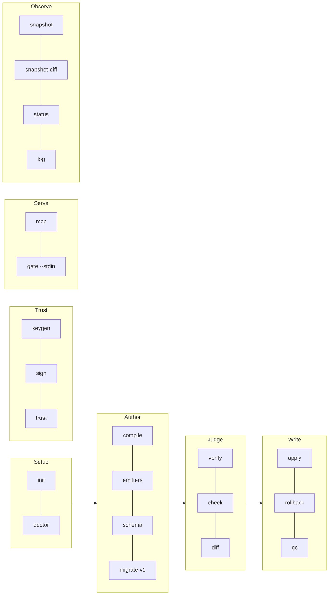

# CLI reference

*Every `axiom` verb and flag, the exit-code contract, and a worked example per verb. The USAGE string in `packages/mcp/src/cli-main.ts` is authoritative; this page mirrors it.*

The `axiom` bin (`@codai/axiom-mcp`) is one executable with 21 verbs: `mcp`, `init`, `doctor`,
`status`, `log`, `compile`, `verify`, `check`, `apply`, `rollback`, `gc`, `diff`, `schema`,
`emitters`, `keygen`, `sign`, `trust`, `gate`, `migrate`, `snapshot`, `snapshot-diff`. Every verb
except `mcp` prints **JSON to stdout** (`check`, `init`, `doctor`, `status` and `log` without
`--json` print a text summary) and returns one of three exit codes; `mcp` speaks JSON-RPC on
stdout and logs JSON lines on stderr. A `.axm` Plan with errors prints its diagnostics as JSON
and exits 2.

| Exit | Meaning |
|---|---|
| `0` | ok — verdict `pass`, apply `applied`/`noop`, tree matches, journal chain intact, migrated cleanly, `doctor` with no failed check (warnings included) |
| `1` | verdict `fail`/`error`, apply `failed`/`rolled-back`, tree mismatch, signature failure, journal chain broken (`verify --journal`, `ERR_JOURNAL_CHAIN`), keyless signing unavailable (`sign --keyless`, `ERR_KEYLESS_UNAVAILABLE`), migrated **with warnings** |
| `2` | usage error, structural failure, `.axm` diagnostics, any `ERR_*` raised outside a result object; `doctor` with at least one failed check |

Failures that are not result objects come out as `{ "error": { "code": "ERR_…", "message", "details"? } }`
with a code from [error-codes.md](error-codes.md). `axiom --version` prints the version;
`axiom --help` prints the USAGE string.


```mermaid
flowchart LR
  subgraph setup [Setup]
    I1[init] --- I2[doctor]
  end
  subgraph author [Author]
    A1[compile] --- A2[emitters] --- A3[schema] --- A4[migrate v1]
  end
  subgraph judge [Judge]
    J1[verify] --- J2[check] --- J3[diff]
  end
  subgraph write [Write]
    W1[apply] --- W2[rollback] --- W3[gc]
  end
  subgraph trust [Trust]
    T1[keygen] --- T2[sign] --- T3[trust]
  end
  subgraph serve [Serve]
    S1[mcp] --- S2[gate --stdin]
  end
  subgraph observe [Observe]
    O1[snapshot] --- O2[snapshot-diff] --- O3[status] --- O4[log]
  end
  setup --> author --> judge --> write
```

## Shared flags

| Flag | Verbs | Meaning |
|---|---|---|
| `--root <dir>` | most | the repository root; realpathed, must be a directory. Required where shown. Only the local setup/read verbs `init`, `doctor`, `status` and `log` default to the current directory; every other verb has no `cwd` fallback |
| `--profile <name>` | `check`, `apply`, `migrate` | a built-in (`default`, `strict`, `permissive`) or `<root>/.axiom/profiles/<name>.json` ([profiles.md](profiles.md)). `apply` defaults to the manifest's own `profile` |
| `--allow-guards` | `mcp`, `check`, `apply` | enable `guard.external` (the profile must **also** set `facts.allowGuards: true`) |
| `--guard-allowlist <abs>` | `mcp`, `check`, `apply` | repeatable; absolute guard commands must appear here exactly. Relative ones must live under `<root>/scripts/` |
| `--log-level error\|warn\|info\|debug` | `mcp`, `gate` | stderr verbosity, default `warn` |
| `--json` | `check`, `init`, `doctor`, `status`, `log`, `emitters` | print the full result object instead of the text summary |
| `-o, --out <file>` | `compile`, `sign`, `migrate`, `snapshot` | write the result to a file and print a short summary instead |

## `mcp`

```
axiom mcp [--root <abs>]... [--allow-guards] [--guard-allowlist <abs>]... [--log-level L]
          [--http <host:port>] [--http-token-env <NAME>] [--wire 2026|2025|2026-only]
```

Start the MCP server — stdio by default, Streamable HTTP with `--http`. `--root` may repeat; with
none, every root-taking tool fails `ERR_ROOT_REQUIRED` (a warning is logged). `--http 0` binds a
random loopback port and logs the URL at `info`. A non-loopback host **requires** a bearer token in
the env var named by `--http-token-env` (default `AXIOM_HTTP_TOKEN`, ≥ 16 chars) or the server
refuses to start. `--wire` selects the protocol era: `2026` (default) and `2025` both serve
2026-07-28 and 2025-era clients from the same entry; `2026-only` refuses `initialize` openings.
Tools, resources and transport rules: [mcp-tools.md](mcp-tools.md).

```sh
axiom mcp --root /abs/repo
axiom mcp --root /abs/repo --http 127.0.0.1:3411 --log-level info
AXIOM_HTTP_TOKEN=$(openssl rand -hex 32) axiom mcp --root /abs/repo --http 0.0.0.0:3411
```

## `init`

```
axiom init [--root <dir>] [--harness auto|copilot|claude|codex|vscode] [--profile-name <name>] [--force] [--json]
```

Wire a repository for AXIOM in one idempotent step. `--root` defaults to the current directory.
`--harness auto` (default) picks one harness per marker directory present (`.github` → copilot,
`.claude` → claude, `.codex` → codex, `.vscode` → vscode; none → copilot + vscode). Files written,
all under the root, each through the containment check (a symlink/junction segment →
`ERR_SYMLINK_IN_PATH`) and an atomic write:

| File | When | Content |
|---|---|---|
| `.vscode/mcp.json` | always | merges `servers.axiom` (`npx -y @codai/axiom-mcp@2 mcp --root ${workspaceFolder}`) |
| `.github/hooks/axiom-gate.json` | copilot or vscode | `preToolUse` hook `axiom gate --stdin`, `timeoutSec: 5` |
| `.claude/settings.json` | claude | merges a `hooks.PreToolUse` entry (`Write\|Edit\|MultiEdit\|NotebookEdit` → `axiom gate --stdin`, timeout 5) |
| `.axiom/profiles/<name>.json` | always | repo profile extending `default` (`repo.noOverwriteOf`, `content.noSecrets`, `path.deny`) |
| `.axiom/gate-profile.json` | always | gate profile (deny list, `noSecrets`, `maxBytes: 262144`) |
| `.gitignore` | always | appends the missing lines of `.axiom/*`, `!.axiom/profiles/`, `!.axiom/gate-profile.json` |

`--profile-name` overrides the name derived from the directory name (must match
`^[a-z0-9][a-z0-9._-]{0,63}$` and not be a builtin, else `ERR_INVALID_PROFILE`). An existing file
is never overwritten without `--force`; a JSON file that is not plain JSON (JSONC, broken) is
skipped, never rewritten. codex has no PreToolUse hook API, so it only gets a note. Output
(`--json`): `{ root, harnesses[], profile, files: [{ path, action: created|merged|updated|skipped, reason? }], notes[] }`.
Hooks call the global bin — install it with `npm install -g @codai/axiom-mcp`, never `npx` in a hook.

```sh
axiom init
axiom init --root . --harness claude --profile-name web --json
```

## `doctor`

```
axiom doctor [--root <dir>] [--json]
```

Is this machine + root wired correctly? Read-only apart from spawning the gate (which never
writes). Each check is `ok | warn | fail` with a message and, when not `ok`, a `fix:` hint.
Checks: `root`, `bin` (global `axiom` on `PATH`, version vs this CLI), `hook.copilot` /
`hook.claude` / `hook` (a PreToolUse entry running `axiom gate --stdin`; `npx` entries do not
count), `mcp.vscode`, `lock` (free, live holder, or stale), `journal` (interrupted or corrupt
journals → fail), `chain` (journal hash chain; broken → fail), `profile.<name>` for every
`.axiom/profiles/*.json`, `gate.profile`, `gitignore` (`.axiom/` covered), `gate.latency` (p95 of
5 `gate --stdin` runs; above 4000 ms — 80 % of the 5 s hook timeout — → fail). **Exit `0` when no
check failed (warnings never fail), `2` when any did.** Output (`--json`):
`{ root, ok, checks: [{ id, status, message, hint? }] }`.

```sh
axiom doctor
axiom doctor --root . --json
```

## `status`

```
axiom status [--root <dir>] [--json]
```

Read-only snapshot of one root's write state; never takes the lock, never writes. `--root`
defaults to the current directory. Same document as the `axiom_status` MCP tool:

```
{ root,
  lock: { held, holder?: { pid, host?, digest?, since?, stale }, queue: [{ pid, since }],
          intents: [{ digest, paths[], pid, since }] },
  interrupted: [{ manifestDigest, phase, startedAt, pid, files, done }],   // staged / committing / rolling-back
  corrupt: [<journal file>],
  lastApplied?: { seq, manifestDigest, state, at, prev, files, code? },
  chain: { ok, entries, head, firstBad?: { seq, reason }, missingJournals } }
```

`queue` lists the FIFO wait tickets under `.axiom/queue/`, `intents` the in-flight applies
registered under `.axiom/intents/` (see `apply`). Exit `0`.

## `log`

```
axiom log [--root <dir>] [--limit <n>] [--json]
```

The journal chain (`.axiom/journal/chain.jsonl`), newest first; `--limit` (`-n`, 1–100 000,
default 20). Text: one line per entry, `#<seq> <at> <state> <manifestDigest> [<name>] (<n> files) [<code>]`.
`--json`: `{ root, entries: [{ seq, manifestDigest, state: committed|rolled-back|failed, at, prev, files, code?, name?, fileList?: [{ path, op }], journalPresent }] }` —
`name` comes from the stored manifest, `fileList` from the journal when it still exists.
Best-effort: stops at the first bad chain line (use `verify --journal` for integrity).

## `compile`

```
axiom compile <plan.json|plan.yaml|plan.axm> [-o <out.json>] [--store inline|cas] [--root <dir>]
                                             [--allow-net [--net-allow <host>[,host]]] [--allow-file]
```

Plan → `ManifestBundle`. `.axm` input is parsed first (diagnostics → exit 2). `.yaml` / `.yml`
input is parsed as a single hardened YAML document ([plan-format.md](plan-format.md#yaml-plans));
a YAML error is `ERR_INVALID_PLAN` with `details: { format: "yaml", line?, column? }` (exit 2). With `--root` (or
implicitly when `--store cas`, `--allow-net` or `--allow-file` is given) the manifest carries
`preImage[]` and a copy is stored under `<root>/.axiom/manifests/<hex>.json`. `--store cas` writes
blobs to the CAS instead of inlining them. `ref` sources are offline by default: `--allow-net`
fetches `https:` URIs (no redirects, 30 s, 32 MiB cap), `--net-allow` restricts hosts
(`*.example.com` wildcards; the flag requires `--allow-net`), `--allow-file` admits `file:` URIs.
Template emitters available: `axiom emitters`.

Output with `-o`: `{ manifestDigest, artifacts, out }`; without: the whole bundle.

```sh
axiom compile plan.json --root . -o bundle.json
axiom compile plan.axm -o bundle.json
axiom compile plan.yaml -o bundle.json
axiom compile plan.json --root . --store cas --allow-net --net-allow cdn.example.com,*.github.com
```

## `verify`

```
axiom verify <bundle.json> [--root <dir>]
axiom verify <bundle.json> --tree <dir> [--pre] [--attest <out.json>]
axiom verify --journal --root <dir>
```

Structural verification: canonical form, `manifestDigest`, every blob's hash. With `--root`,
additionally verify detached DSSE signatures against `<root>/.axiom/trust/keys.json`
(`signatures: { trustFile, keyids[], findings[], ok, code? }`; no trust store → `signatures: null`).
With `--tree`, compare the tree under `<dir>` with the manifest's artifacts (or, with `--pre`, its
declared `preImage[]` set) and list `mismatches[]`; `--attest` writes an in-toto Statement to
`<out.json>` and the bare predicate beside it on success. `--attest` requires `--tree`. Never
takes the lock, never writes under `.axiom/`. Details: [verify-tree.md](../guides/verify-tree.md).

`--journal` verifies the root's journal hash chain `.axiom/journal/chain.jsonl` instead of a
bundle (it takes no positional and no `--tree`/`--attest`; `--root` is required). One line per
journal that reached a terminal state, keys in fixed order `seq, manifestDigest, state, at, prev,
files, [code]`; `prev` is `sha256:` of the previous line's exact bytes (64 zeros for seq 1).
Output: `{ ok, entries, head, firstBad?: { seq, reason: prev-mismatch|seq-gap|parse }, missing[] }`
— `head` is the digest of the last good line (pin it externally to detect tail truncation),
`missing` lists entries whose journal file was pruned (legal, not a fault). **Exit `0` intact,
`1` broken** (the output then also carries `code: "ERR_JOURNAL_CHAIN"`), `2` usage/root error.

```sh
axiom verify bundle.json
axiom verify bundle.json --root .                           # + signatures
axiom verify bundle.json --tree . --attest axiom.intoto.json
axiom verify bundle.json --tree . --pre                     # is this the tree it was compiled against?
axiom verify --journal --root .                             # journal hash chain
```

## `check`

```
axiom check <bundle.json> --root <dir> [--profile <name>] [--json] [--allow-guards] [--guard-allowlist <abs>]...
```

Run the profile's predicates plus the manifest's own `checks[]` over the bundle against the root;
verify `preImage[]` against the tree. `--profile` defaults to the manifest's own `profile`. With
`--json` the full `CheckReport` is printed; without it a human summary
(`PASS sha256:… (default, 34 ms)` followed by one line per finding) — the only verb whose default
output is not JSON. The report is stored under `<root>/.axiom/reports/` either way. Exit `0` only
on `verdict: pass`. Predicates: [checks.md](../guides/checks.md).

```sh
axiom check bundle.json --root . --profile strict
axiom check bundle.json --root . --profile brivio --allow-guards
```

## `apply`

```
axiom apply <bundle.json> --root <dir> [--dry-run] [--profile <name>] [--confirm <digest>]
                                       [--pr [--branch <name>] [--message <text>]]
                                       [--lock-timeout <ms>] [--keep-backups <n>]
                                       [--allow-guards] [--guard-allowlist <abs>]...
```

Two-phase commit. Without `--dry-run`, `--confirm` **must** equal `bundle.manifestDigest`
(`ERR_CONFIRM_DIGEST_MISMATCH`, exit 2). Pre-apply checks run on the staged tree with the given
profile (default: the manifest's `profile`) and abort on any non-`pass` verdict
(`ERR_CHECKS_FAILED`). `--dry-run` does phase 1 only and returns a unified diff.

Concurrency: before queueing, a non-dry-run apply registers an **intent** (its artifact paths)
under `.axiom/intents/`; a live intent of a *different* digest touching an overlapping path (same
path or a directory prefix) fails at once with `ERR_CONFLICT`, `error.details: { otherDigest, paths }`.
It then waits in a FIFO queue (`.axiom/queue/`) for `.axiom/lock`; `--lock-timeout <ms>`
(0–600 000, default 30 000) bounds the wait, after which it fails `ERR_LOCKED` with
`error.details: { holder: { pid, host, digest, since }, waitedMs, queuePosition, lock }`
(`queuePosition` 1-based). `--keep-backups <n>` (0–1000, default 3) keeps the pre-image backup
sets of the `n` most recent applies under `.axiom/backup/`, ordered by journal chain `seq`.

`--pr` never touches the shared tree's HEAD, index or files: the apply runs in an axiom-owned
linked worktree at `.axiom/wt/<hex12>` on a new branch started from `HEAD`, commits exactly the
touched paths there, then removes the worktree (and deletes the branch unless the commit landed);
the touched paths must be clean in the shared tree (`ERR_GIT_DIRTY`). `--branch` defaults to
`axiom/<name>/<digest12>`, `--message` to `axiom: apply <name> (<digest12>)` with trailers; no
push. If `HEAD` already holds the manifest's result the status is `noop`. On `status: applied`
with a profile that carries `manifest.requireSigned { antiRollback }`, the trust state advances.
Exit `1` on `failed`/`rolled-back`. Guarantees: [apply.md](../guides/apply.md).

```sh
axiom apply bundle.json --root . --dry-run
axiom apply bundle.json --root . --confirm sha256:…
axiom apply bundle.json --root . --confirm sha256:… --lock-timeout 120000 --keep-backups 10
axiom apply bundle.json --root . --confirm sha256:… --pr --branch feat/hello
```

## `rollback`

```
axiom rollback <digest> --root <dir>
```

Reverse-replay the journal of an applied manifest from `.axiom/backup/<hex>/`, scoped to the paths
it recorded. Also finishes a journal left in `committing` / `rolling-back` by a crash. Prints
`{ manifestDigest, status, phase, steps[], root }`.

```sh
axiom rollback sha256:… --root .
```

## `gc`

```
axiom gc --root <dir> [--dry-run] [--older-than <n>(ms|s|m|h|d)] [--keep all-manifests|journal]
```

CAS garbage collection — **CLI only**, no MCP tool. Removes blobs no live manifest references.
`--keep all-manifests` (default) pins every stored manifest's digests; `--keep journal` pins only
manifests named by a journal or an `applied/` record. `--older-than` skips young candidates
(`skippedYoung`). Takes `.axiom/lock` like apply (`ERR_LOCKED` on a live holder). Report:
`{ root, keep, dryRun, scanned, live, missing, removed[], skippedYoung, freedBytes }`. Details: [cas.md](../concepts/cas.md).

```sh
axiom gc --root . --dry-run
axiom gc --root . --older-than 30d --keep journal
```

## `diff`

```
axiom diff <a.json> <b.json>
```

Structural diff of two bundles: `{ added[], removed[], changed[] }` by artifact path. Same as
`axiom_manifest_diff`.

## `schema`

```
axiom schema <Plan|Manifest|ManifestBundle|CheckReport|ApplyResult|Profile|Journal|RepoSnapshot>
```

Print the JSON Schema (draft 2020-12, generated from the Zod source) for one wire type. Also served
as `axiom://schema/<Kind>`.

## `emitters`

```
axiom emitters [--json]
```

List the template emitters compiled into this bin — `{ emitter, version, template, description }`
rows; currently `web@2.0.0` ([emitters.md](../guides/emitters.md)). Without `--json` the same list,
pretty-printed.

## `keygen`

```
axiom keygen [--out <dir>] [--name <label>]
```

Generate an Ed25519 signing key. The private key goes to `<dir>/axiom-signing-<id>.key` with mode
`0600`; stdout gets `{ publicEntry: { keyid, alg, publicKey, name }, privateKeyFile }`. The private
key is never printed.

## `sign`

```
axiom sign <bundle.json> [--key-file <path>] [-o <out.json>] [--root-id <id>]
axiom sign <bundle.json> --keyless [--bound --root <dir> | --root-id <id>] [-o <out.json>]
```

Append a detached DSSE envelope over `JCS(manifest)` to `bundle.signatures[]`. The private key comes
from `--key-file` or, failing that, `$AXIOM_SIGNING_KEY` (base64 PKCS#8, base64 raw seed, or PEM).
`--root-id <id>` produces a root-bound envelope (`application/vnd.axiom.manifest-bound+json`) that
only a trust store with that `rootId` accepts. `manifestDigest` is unchanged. Protocol: [signing.md](../guides/signing.md).

`--keyless` signs the same payload bytes with Sigstore instead (Fulcio certificate from an OIDC
identity + Rekor entry) and appends the Sigstore bundle to `bundle.keylessSignatures[]`
(outside `manifestDigest`). It needs an ambient OIDC token (`SIGSTORE_ID_TOKEN`, or GitHub Actions
`ACTIONS_ID_TOKEN_REQUEST_URL` + `ACTIONS_ID_TOKEN_REQUEST_TOKEN` with `id-token: write`), network
access and the optional `sigstore` dependency; `--key-file` is rejected. Root binding: `--root-id <id>`,
or `--bound --root <dir>` to take the id from that root's trust store (no `rootId` there → usage
error); `--root` without `--bound` is a usage error. Output:
`{ manifestDigest, keyless: true, keylessSignatures, rootId?, bound?, out }`. When signing cannot
run, stdout is `{ code: "ERR_KEYLESS_UNAVAILABLE", message, details: { reason } }` with
`reason` `NO_OIDC | SIGN_FAILED | MODULE_MISSING | MODULE_LOAD_FAILED`, and the exit code is `1`.
Verification: `manifest.requireSigned` with a `keyless` policy ([checks.md](../guides/checks.md)).

```sh
axiom sign bundle.json --key-file ./secrets/axiom-signing-<id>.key -o signed.json
AXIOM_SIGNING_KEY=… axiom sign bundle.json --root-id github:owner/repo
axiom sign bundle.json --keyless --bound --root . -o signed.json   # in CI with id-token: write
```

## `trust`

```
axiom trust add <pubkey.json> --root <dir>
axiom trust remove <keyid> --root <dir>
axiom trust list --root <dir>
axiom trust root-id [<id> | --clear] --root <dir>
```

Manage `<root>/.axiom/trust/keys.json`. `add` re-derives the `keyid` from `publicKey` and refuses
mismatches; `remove` revokes; `list` prints the store; `root-id` shows, sets or clears the store's
`rootId` (require root-bound signatures carrying that id).

## `gate`

```
axiom gate --stdin [--root <dir>] [--profile <file>] [--fail-open] [--no-shell-scan]
                   [--no-root-discovery] [--log-level L]
```

PreToolUse hook. Reads one harness payload from stdin, exits `0` (allow) or `2` (deny, JSON reason
on stdout, one line on stderr). Fail-closed: malformed input or an undeterminable write target is a
deny unless `--fail-open`. `--root` is used only when the payload has no `cwd`; `--profile` points
at a gate-profile file (default search: `<root>/.axiom/gate-profile.json` → `~/.axiom/gate-profile.json`
→ built-in). `--strict` is accepted as a 2.1 no-op. Contract, wiring, profile schema and latency:
[hooks.md](../getting-started/hooks.md).

```sh
echo '{"cwd":"/repo","tool_name":"Write","tool_input":{"file_path":".env","content":"X=1"}}' | axiom gate --stdin; echo $?   # 2
```

## `migrate v1`

```
axiom migrate v1 <manifest.json> [-o <plan.json>] [--profile <name>] [--cas <root>] [--content <dir>] [--name <kebab>] [--overwrite]
```

Lift an AXIOM 1.0.x manifest into a v2 Plan. `--content` names the directory holding sidecar bytes
for hash-only artifacts (default: the manifest's directory); `--cas <root>` stores resolved bytes
in that root's CAS and emits `cas` sources; `--overwrite` sets `op: overwrite` on every artifact;
`--name` overrides `migrated-v1-<profile>`. Exit `1` = migrated **and written**, with warnings.
Field mapping and drops: [migrate.md](../guides/migrate.md).

```sh
axiom migrate v1 out-budget.manifest.json -o plan.json && axiom compile plan.json -o bundle.json
```

## `snapshot`

```
axiom snapshot --root <dir> [-o <out.json>] [--include <glob>]... [--exclude <glob>]...
               [--max-files <n>] [--max-bytes <n>] [--no-gitignore] [--no-digest]
```

Deterministic inventory of a root (`RepoSnapshot`, `snapshotDigest = sha256(JCS(body))`).
`--include`/`--exclude` use a tiny glob dialect (`**`, `*`, `?`); `--max-files` default 20 000
(cap 50 000), `--max-bytes` default 64 MiB; `--no-gitignore` ignores the root `.gitignore`;
`--no-digest` records sizes only. `.git/` and `.axiom/` are always skipped. With `-o` stdout is a
one-line summary. Details: [snapshot.md](../guides/snapshot.md).

## `snapshot-diff`

```
axiom snapshot-diff <a.json> <b.json>
```

`{ added[], removed[], changed: [{ path, from, to }] }` between two snapshots, keyed by path.

## Environment variables the CLI reads

| Variable | Verb | Purpose |
|---|---|---|
| `AXIOM_SIGNING_KEY` | `sign` | private key when `--key-file` is absent |
| `SIGSTORE_ID_TOKEN`, `ACTIONS_ID_TOKEN_REQUEST_URL` + `ACTIONS_ID_TOKEN_REQUEST_TOKEN` | `sign --keyless` | OIDC token source for Sigstore; absent → `ERR_KEYLESS_UNAVAILABLE` (`reason: NO_OIDC`) |
| `AXIOM_HTTP_TOKEN` (or the name given to `--http-token-env`) | `mcp --http` | bearer token; required for non-loopback binds |
| `GITHUB_REPOSITORY`, `GITHUB_REF`, `GITHUB_SHA`, `GITHUB_RUN_ID` | `verify --tree --attest` | copied into `predicate.source` when present |

Nothing else is read: there is no root, profile or allowlist environment fallback.

---

**See also**

- [MCP tools](mcp-tools.md) — the same engines over MCP, and what is deliberately CLI-only
- [Quickstart](../getting-started/quickstart.md) — the verbs in the order you first use them
- [Error codes](error-codes.md) — what a `{ error: { code } }` on stdout means
- [`packages/mcp/README.md`](../../packages/mcp/README.md) — the package's own summary
