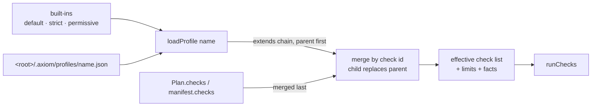

# Profiles

*The `Profile` schema, the three built-ins side by side, how `extends` merges, where custom profiles are discovered, the `pii` knob, and the separate gate profile.*

A profile is the operator's statement of what a change set must satisfy: a named list of typed
predicates plus limits and provider switches. `check` and `apply` run the resolved profile's
checks **and** the manifest's own `checks[]`; anything other than `verdict: pass` blocks apply.
Predicate semantics and every `params` shape live in [checks.md](../guides/checks.md); this page
is the profile object itself.



## Schema

`packages/schema/src/profile.ts` → `ProfileSchema`, served as `axiom://schema/Profile` and
`axiom schema Profile`. Every object is `.strict()`.

| Field | Type | Constraint |
|---|---|---|
| `apiVersion` | literal | `"axiom.dev/v2"` |
| `kind` | literal | `"Profile"` |
| `name` | string | `^[a-z0-9][a-z0-9._-]{0,63}$`; for a file profile it must equal the file stem |
| `extends` | profile name | optional; resolved parent-first; cycle or missing parent → `ERR_INVALID_PROFILE` |
| `checks` | `CheckRef[]` | `{ id, predicate, params, severity? }` — see [plan-format.md](plan-format.md#checkref) |
| `limits` | `{ maxArtifacts?, maxTotalBytes?, maxBlobBytes? }` | positive ints; merged shallowly, child over parent |
| `facts` | `{ allowRepo: bool = true, allowGuards: bool = false }` | `allowRepo: false` skips every `repo.*` predicate and hides `repo` from `expr.cel`/`expr.cedar`; `allowGuards: true` is one of the **two** switches `guard.external` needs (the other is the process flag `--allow-guards`) |

Violations of the schema, a bad name, or an unreadable file are `ERR_INVALID_PROFILE` with
`details.issues`.

## Built-in profiles

Defined in `packages/checks/src/profile.ts` (`BUILTIN_PROFILE_INPUTS`), served as
`axiom://profile/default`, `…/strict`, `…/permissive`. Side by side:

| Check id | Predicate | `default` | `strict` (extends `default`) | `permissive` |
|---|---|---|---|---|
| `path.reservedNames` | `path.reservedNames` | `{}` | inherited | `{}` |
| `content.noSecrets` | `content.noSecrets` | `{}` (secrets only, `pii: false`) | inherited | — |
| `manifest.maxArtifacts` | `manifest.maxArtifacts` | `{ "max": 2000 }` | inherited | — |
| `manifest.maxTotalBytes` | `manifest.maxTotalBytes` | `{ "max": 67108864 }` (64 MiB) | inherited | — |
| `repo.noOverwriteOf` | `repo.noOverwriteOf` | `{ "globs": [".git/**", ".axiom/**", "**/*.lock", "pnpm-lock.yaml", ".env*"] }` | inherited | — |
| `manifest.noDeletes` | `manifest.noDeletes` | — | `{}` | — |
| `deps.max` | `deps.max` | — | `{ "max": 50 }` | — |
| `path.deny` | `path.deny` | — | `{ "globs": ["**/node_modules/**"] }` | — |
| **`limits`** | | `{ maxArtifacts: 2000, maxTotalBytes: 67108864 }` | inherited | none |
| **`facts`** | | `{ allowRepo: true, allowGuards: false }` | same | same |

`default` is what `check`/`apply` use when a Plan names no profile. It protects the repository's
own control files from an agent overwrite (`.git`, `.axiom`, lockfiles, `.env*`), scans for
credentials, and caps set size; it does **not** restrict where an agent may write — that is a
repository decision, expressed in a custom profile with `path.allow`/`path.deny`.
`permissive` runs only the path-sanity check and exists for scratch repos and tests.

> [!NOTE]
> Adding an `error`-severity check to `default` is a **breaking** change for everyone applying
> through it ([versioning.md](versioning.md)). New default checks arrive as `warn`/`info`.

## The `pii` knob

`content.noSecrets` always scans for secrets (`credentialAssignment`, `awsKey`, `githubToken`,
`privateKey`, `jwt`, `slackToken`). Personal-data patterns (`cnp`, `email`, `phoneRo`, `card`) are
**opt-in** with `"pii": true` since S-414 (2026-09-20): replaying 30 OSS repositories through the
old all-on default rejected 110 of 3240 real files on maintainer e-mails alone. Turn it on where
personal data in a source tree is a policy question — brivio and metu do:

```json
{ "id": "content.noSecrets", "predicate": "content.noSecrets", "params": { "pii": true } }
```

Because checks merge by `id`, that one line in a child profile *re-parameterises* the default
check rather than adding a second scan. The gate profile has the same knob (below). Precision
rules and the corpus numbers: [checks.md § content.noSecrets](../guides/checks.md#contentnosecrets).

## `extends` and merging

`loadProfile(name, { searchDirs })` resolves:

1. **Lookup** — each search directory in order for `<name>.json`, then the built-ins. First hit
   wins; files are not merged with a same-named built-in.
2. **Parents first** — the `extends` chain is loaded recursively; a cycle or a missing parent is
   `ERR_INVALID_PROFILE`.
3. **Checks merge by `id`** — a child entry **replaces** the parent's entry with the same id
   (change params, severity or even the predicate), and appends otherwise. There is no
   "remove"; to silence an inherited check, override it with the same id and `"severity": "info"`.
4. **`limits` and `facts` merge shallowly**, child over parent.
5. **The Plan's own `checks[]`** are merged last with the same rule — a Plan can tighten or
   re-parameterise, and the result is what `CheckReport.profile` names.

```json
{
  "apiVersion": "axiom.dev/v2", "kind": "Profile", "name": "web",
  "extends": "strict",
  "checks": [
    { "id": "path.allow", "predicate": "path.allow",
      "params": { "globs": ["apps/web/**", "packages/ui/**", "docs/**"] } },
    { "id": "content.noSecrets", "predicate": "content.noSecrets",
      "params": { "pii": true, "allowPaths": ["**/*.test.ts"] } },
    { "id": "ripple.schema", "predicate": "repo.requireCompanion",
      "params": { "rules": [ { "when": "packages/db/src/schema/*.ts",
        "expect": [ { "name": "migration", "match": "packages/db/drizzle/*.sql", "mustChange": true } ] } ] } }
  ]
}
```

## Discovery — `<root>/.axiom/profiles/<name>.json`

The CLI (`--profile <name>`) and the MCP server (`profile` argument) search exactly one
directory, `<root>/.axiom/profiles/`, then the built-ins. The file name is the profile name;
`name` inside must match. Commit these files — they are the repository's policy, reviewed like
CI configuration — and keep the rest of `.axiom/` ignored:

```gitignore
.axiom/*
!.axiom/profiles/
!.axiom/gate-profile.json
```

A Plan selects its profile with `"profile": "web"`; the CLI/MCP `--profile`/`profile` overrides
it; `apply` defaults to the manifest's `profile`. The `default` profile's `repo.noOverwriteOf`
already refuses a manifest that rewrites `.axiom/**`, so an agent cannot edit the policy it is
being judged by through the gate.

## Guards need two switches

`guard.external` (your own `scripts/check-*.mjs` as a predicate) is disabled twice by default:
the profile must set `facts.allowGuards: true` **and** the process must be started with
`--allow-guards` (plus `--guard-allowlist <abs>` for absolute commands). Neither switch is
reachable from an MCP tool; a profile that asks for guards on a process without the flag yields
`verdict: error` (`ERR_FACT_DISABLED`) — fail closed, never skipped. Long suites belong in
`axiom_check_start` tasks ([mcp-tools.md § Tasks](mcp-tools.md#tasks-d-24)). Worked example:
[integration/brivio.md](../integration/brivio.md).

## The gate profile (a different object)

The PreToolUse hook does not run a full `Profile`; it has its own small, strict schema
(`GateProfileSchema`), looked up as `--profile <file>` → `<root>/.axiom/gate-profile.json` →
`~/.axiom/gate-profile.json` → built-in. It is deliberately flat because the gate has ~100 ms and
sees one write at a time:

| Field | Type | Default | Effect |
|---|---|---|---|
| `deny` | `string[]` | built-in: `[".git/**", ".axiom/**", "**/*.lock", "pnpm-lock.yaml", ".env", ".env.*", "**/node_modules/**"]` | any match → deny `path.deny` |
| `allow` | `string[]?` | — | when present every target must match one glob → else `path.allow` |
| `noSecrets` | `boolean` | `true` | `content.noSecrets` on supplied content |
| `pii` | `boolean` | `false` | also the PII patterns |
| `maxBytes` | `int?` | — | `content.maxBytes` on supplied content |

Unknown keys are a schema error → deny `ERR_INTERNAL` (or warn + allow with `--fail-open`).
Contract, wiring and shell scanning: [hooks.md](../getting-started/hooks.md#profile-file).

## Resources and introspection

- `axiom://profile/<name>` — the built-in profiles as JSON.
- `axiom schema Profile` / `axiom://schema/Profile` — the JSON Schema.
- `CheckReport.profile` — the resolved name the report was judged with; `factsDigest` lets it be
  replayed.

---

**See also**

- [Checks](../guides/checks.md) — every predicate and its params
- [Plan format](plan-format.md#profile) — `Profile` among the other wire types
- [Hooks](../getting-started/hooks.md) — the gate profile in context
- [Trust model](../concepts/trust-model.md) — why profiles are operator-owned and fail closed
