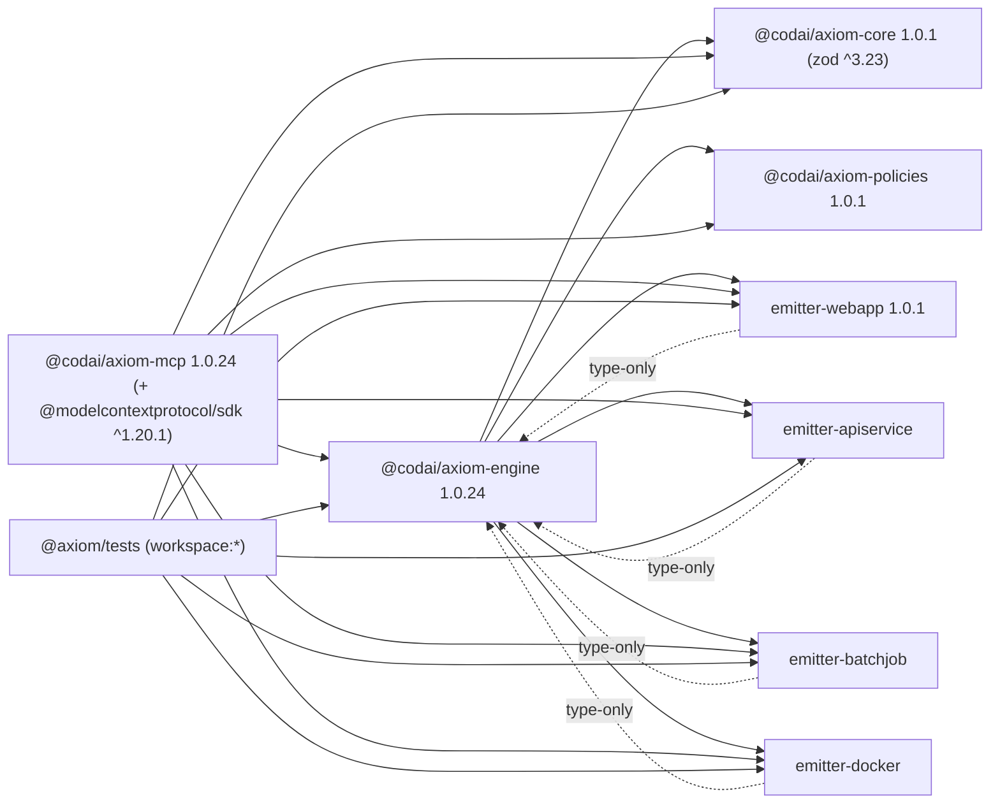

# Research: AXIOM repo full inventory (e:\gh\axiom)

*Dated record (2026-09-18) — see [Design & research](../README.md#design--research). Links below point at the v1 tree, now frozen under `packages/_v1/`.*

Note: Explore mode has no terminal, so `rg --files` was replaced by the workspace glob search (352 files, node_modules/dist excluded). Everything below is from reading source; nothing was run. Claims marked VERIFIED are file contents I read; "EXPECTED" is inference.

---

## A. FILE INVENTORY

### (a) Source code worth keeping (17 files)
| File | Role |
|---|---|
| [packages/axiom-core/src/ir.ts](packages/axiom-core/src/ir.ts) | Zod IR schema (43 lines) — the only real contract |
| [packages/axiom-core/src/parser.ts](packages/axiom-core/src/parser.ts) | Regex `.axm` parser, single agent |
| [packages/axiom-core/src/validator.ts](packages/axiom-core/src/validator.ts) | 3 capability-vs-check rules |
| [packages/axiom-core/src/index.ts](packages/axiom-core/src/index.ts) | barrel |
| [packages/axiom-engine/src/generate.ts](packages/axiom-engine/src/generate.ts) | IR → artifacts + manifest |
| [packages/axiom-engine/src/check.ts](packages/axiom-engine/src/check.ts) | metrics + policy eval |
| [packages/axiom-engine/src/apply.ts](packages/axiom-engine/src/apply.ts) | manifest → disk / git branch |
| [packages/axiom-engine/src/lib/fs-axiom.ts](packages/axiom-engine/src/lib/fs-axiom.ts) | path resolution + atomic write (uncommitted, 1.0.23+) |
| [packages/axiom-engine/src/reverse-ir.ts](packages/axiom-engine/src/reverse-ir.ts) | out/ → IR heuristics |
| [packages/axiom-engine/src/axpatch.ts](packages/axiom-engine/src/axpatch.ts) | JSON-Patch-ish diff/apply |
| [packages/axiom-engine/src/artifactStore.ts](packages/axiom-engine/src/artifactStore.ts) | `.axiom/cache/v1/<sha>` store |
| [packages/axiom-engine/src/manifest.ts](packages/axiom-engine/src/manifest.ts), [emitter.ts](packages/axiom-engine/src/emitter.ts), [util.ts](packages/axiom-engine/src/util.ts), [index.ts](packages/axiom-engine/src/index.ts) | types + helpers |
| [packages/policies/src/index.ts](packages/policies/src/index.ts) | tokenizer + mini-DSL evaluator |
| [packages/axiom-mcp/src/mcp-stdio.ts](packages/axiom-mcp/src/mcp-stdio.ts), [server.ts](packages/axiom-mcp/src/server.ts), [postinstall.ts](packages/axiom-mcp/src/postinstall.ts), [tools/fs-probe-write.ts](packages/axiom-mcp/src/tools/fs-probe-write.ts) | MCP stdio + HTTP demo |
| [packages/axiom-mcp/scripts/prepublish.js](packages/axiom-mcp/scripts/prepublish.js) | copies sibling dist into mcp dist (referenced by no script in package.json — dead) |
| [packages/emitters/{webapp,apiservice,batchjob,docker}/src/index.ts](packages/emitters/webapp/src/index.ts) | 4 emitters (template strings) |
| [packages/emitters/webapp-pii/src/index.ts](packages/emitters/webapp-pii/src/index.ts) | NOT in workspace (no package.json), imports `@axiom/engine` (old scope) — dead |
| [packages/vscode-bridge/src/extension.ts](packages/vscode-bridge/src/extension.ts) | 5-line skeleton, `activationEvents: ["*"]` — dead |

### (b) Tests (30 files)
- vitest, [packages/axiom-tests/src/](packages/axiom-tests/src/run.ts): 27 `*.test.ts` + `run.ts` (smoke runner used by `pnpm test`; generates into root `tmp_artifacts/`).
- node:test: [packages/policies/test/evaluator.test.ts](packages/policies/test/evaluator.test.ts).
- Loose debug scripts in `packages/axiom-tests/`: `test-split.mjs`, `test-regex.mjs`, `test-parser.mjs`, `test-parser-inline.mjs`, `test-optional.mjs`, `test-block-cap.mjs`, `debug-manifest.mjs`, `debug-manifest-v2.mjs`, `test-manifest-output.txt` → litter.

### (c) Docs/specs (16)
`README.md`, `SECURITY.md`, `SUPPORT.md`, `LICENSE`, `CHANGELOG.md`, `HOWTO_RUN_TESTS.md`, `docs/{syntax_spec,ir_spec,mcp_api,plugin_api,reverse_ir_spec,versioning,MCP-ONLY-PUBLIC-SURFACE}.md`, `docs/mcp-config-snapshot.json`, `examples/{README.md,blog.axm,blog.ir.json}`, `sanity/README.md`, `packages/axiom-mcp/README.md`.

### (d) Generated outputs / scratch / AI-report litter — every file
**Root AI reports (23):** `ANNOUNCEMENT.md`, `FINAL_SUMMARY.md`, `FINAL_VALIDATION_REPORT.md`, `GO-NOGO-AXIOM-1.0.9.md`, `GO-NOGO-REPORT.md`, `GO-NOGO-REPORT-1.0.20.md`, `HARDENING-IMPLEMENTATION-SUMMARY.md`, `IMPLEMENTATION-COMPLETE.md`, `PR-FINAL-SUMMARY.md`, `PR-SUMMARY.md`, `PRODUCTION_READY_SUMMARY.md`, `PRODUCTION_VALIDATION_REPORT.md`, `PROFILE_COMPARISON_REPORT.md`, `PROOF_1.0.17.md`, `RELEASE-ANNOUNCEMENT-1.0.17.md`, `RELEASE-ANNOUNCEMENT-1.0.18.md`, `RELEASE-NOTES-1.0.0.md`, `RELEASE-NOTES-1.0.7.md`, `RELEASE-NOTES-1.0.8.md`, `RELEASE-NOTES-1.0.21.md`, `RELEASE-NOTES-1.0.22.md`, `RELEASE-NOTES-1.0.23.md`, `RELEASE-NOTES-1.0.24.md`, `REVERSE_IR_IMPLEMENTATION_REPORT.md`, `TEST-MATRIX-REPORT-ENHANCED-FS.md`, `TEST-MATRIX-REPORT-v1.0.22.md`, `VALIDATION-REPORT-1.0.18.md`.
**Root scratch scripts/data:** `debug-manifest.cjs`, `test-generate.mjs`, `test-json.cjs`, `test-posix.cjs`, `test-replace.cjs`, `test.json`, `test-output.txt`, `manifest.json`, `manifest-notes-final.json`, `mcp-config-snapshot.json`, `sbom.json`, `axiom-1.0.0-bundle.tar.gz`, `axiom-1.0.0-bundle.tar.gz.sha256`, `codai-axiom-mcp-1.0.11.tgz`, `.archive/axiom_starter_full.zip`.
**Root sample .axm/IR:** `axiom/{edge-notes,notes,notes-v2,test-invalid,test-no-cap,test-pii,test-with-pii}.axm`, `axiom/{notes-old,notes-new}.ir.json`, `axiom/notes-v2.manifest.json`.
**Generated output trees:** `out/**` (web, web/notes, api, api/notes, docker, docker/notes, tests, test-complete, axiom.json/), `out-edge/manifest.json`, `out-budget/manifest.json`, `test-results/*` (23 json/sha/axm), `tmp_artifacts/`.
**Under packages/axiom-tests:** `.axiom/cache/v1/*` (36 sha files), `manifest.json`, `snapshots/{edge,budget}-profile.snapshot.json`, `test-debug-output/**`, and fixture app trees `test-app/`, `smoke-app/`, `heavy-app/`, `simple-app/`, `clean-app/` (generated by check tests writing into `process.cwd()`).

### (e) CI/config
`package.json`, `pnpm-workspace.yaml`, `pnpm-lock.yaml`, `tsconfig.base.json`, `.gitignore`, `.vscode/mcp.json`, `.github/workflows/axiom-conformance.yml`, `workflows/ci.yml` (wrong location — never runs), `profiles/{default,edge,budget}.json`, `scripts/{determinism-test.ps1/.sh, production-validation*.ps1/.sh, smoke.sh, repro-samedrive.ts}`, per-package `tsconfig.json`, `.npmignore` (core, mcp).

---

## B. PUBLIC SURFACE

### axiom-core ([index.ts](packages/axiom-core/src/index.ts) re-exports all)
- [ir.ts:3](packages/axiom-core/src/ir.ts#L3) `Capability`, [:9](packages/axiom-core/src/ir.ts#L9) `Constraint`, [:15](packages/axiom-core/src/ir.ts#L15) `Check`, [:21](packages/axiom-core/src/ir.ts#L21) `EmitItem`, [:27](packages/axiom-core/src/ir.ts#L27) `AgentIR`, [:36](packages/axiom-core/src/ir.ts#L36) `AxiomIR` (Zod objects); [:41-42](packages/axiom-core/src/ir.ts#L41-L42) `TAxiomIR`, `TAgentIR`.
- [parser.ts:17](packages/axiom-core/src/parser.ts#L17) `parseAxiomSource(source: string): { ir?: TAxiomIR, diagnostics: string[] }`
- [validator.ts:3](packages/axiom-core/src/validator.ts#L3) `interface Diagnostic { message; path? }`; [:5](packages/axiom-core/src/validator.ts#L5) `validateIR(ir): { ok, diagnostics }`

### axiom-engine ([index.ts](packages/axiom-engine/src/index.ts))
- [manifest.ts:1](packages/axiom-engine/src/manifest.ts#L1) `Artifact`, [:11](packages/axiom-engine/src/manifest.ts#L11) `Evidence`, [:18](packages/axiom-engine/src/manifest.ts#L18) `Manifest` (TS interfaces only, no Zod).
- [generate.ts:48](packages/axiom-engine/src/generate.ts#L48) `generate(ir, outRoot = process.cwd(), profile?): Promise<{artifacts, manifest}>`
- [check.ts:13](packages/axiom-engine/src/check.ts#L13) `check(manifest, ir?, outRoot?): Promise<CheckResult>`; [:7](packages/axiom-engine/src/check.ts#L7) `CheckResult { passed, report, evaluated }`
- [reverse-ir.ts:5](packages/axiom-engine/src/reverse-ir.ts#L5) `ReverseIROptions { repoPath; outDir? }`, [:16](packages/axiom-engine/src/reverse-ir.ts#L16) `reverseIR(options): TAxiomIR` (sync)
- [axpatch.ts:7](packages/axiom-engine/src/axpatch.ts#L7) `AXPatchOp`, `AXPatch`; [:17](packages/axiom-engine/src/axpatch.ts#L17) `diff(oldIR, newIR): AXPatch`; [:103](packages/axiom-engine/src/axpatch.ts#L103) `applyPatch(ir, patch): TAxiomIR`
- [apply.ts:10](packages/axiom-engine/src/apply.ts#L10) `ApplyOptions`, [:18](packages/axiom-engine/src/apply.ts#L18) `ApplyResult`, [:43](packages/axiom-engine/src/apply.ts#L43) `apply(options): Promise<ApplyResult>`
- [util.ts:5](packages/axiom-engine/src/util.ts#L5) `sha256`, [:11](packages/axiom-engine/src/util.ts#L11) `ensureDir`, [:19](packages/axiom-engine/src/util.ts#L19) `toPosixPath`, [:26](packages/axiom-engine/src/util.ts#L26) `writeFile(root, relPath, content): {full, posixPath}`
- NOT exported from index but imported by tests via `dist/*`: [emitter.ts:4](packages/axiom-engine/src/emitter.ts#L4) `EmitterContext`, [:12](packages/axiom-engine/src/emitter.ts#L12) `Emitter`; [artifactStore.ts:15](packages/axiom-engine/src/artifactStore.ts#L15) `class ArtifactStore { put, get, static hash, static verify }`; fs-axiom: [:22](packages/axiom-engine/src/lib/fs-axiom.ts#L22) `resolveRepoRoot(repoPathArg)`, [:154](packages/axiom-engine/src/lib/fs-axiom.ts#L154) `resolveArtifactAbs(repoRootAbs, outRootAbs, artifactRelPosix)`, [:254](packages/axiom-engine/src/lib/fs-axiom.ts#L254) `resolveOutRoot(repoPath, envOutRoot?)`, [:290](packages/axiom-engine/src/lib/fs-axiom.ts#L290) `bufferFromArtifact(artifact, repoAbs)`, [:344](packages/axiom-engine/src/lib/fs-axiom.ts#L344) `writeAndVerify(absFile, buf, expectedSha256?, expectedBytes?)`.

### policies
- [index.ts:4](packages/policies/src/index.ts#L4) `PolicyContext { metrics; artifacts; capabilities; outRoot? }`; [:375](packages/policies/src/index.ts#L375) `evalCheck(ctx, expr): Promise<boolean>`. Whitelisted functions: `http.healthy(url)` (requires `net('http')` capability, HEAD with 1 s timeout), `scan.artifacts.no_personal_data()` (5 regexes incl. Romanian CNP/phone; reads files from `ctx.outRoot`).

### axiom-mcp — MCP tools ([mcp-stdio.ts](packages/axiom-mcp/src/mcp-stdio.ts))
| Tool | inputSchema | required |
|---|---|---|
| `axiom_parse` [:52](packages/axiom-mcp/src/mcp-stdio.ts#L52) | `source: string` | source |
| `axiom_validate` [:66](packages/axiom-mcp/src/mcp-stdio.ts#L66) | `ir: object` | ir |
| `axiom_generate` [:80](packages/axiom-mcp/src/mcp-stdio.ts#L80) | `ir: object, profile?: string` | ir |
| `axiom_check` [:98](packages/axiom-mcp/src/mcp-stdio.ts#L98) | `manifest: object, ir?: object` | manifest |
| `axiom_reverse` [:116](packages/axiom-mcp/src/mcp-stdio.ts#L116) | `repoPath?: string, outDir?: string (default "out")` | — |
| `axiom_diff` [:134](packages/axiom-mcp/src/mcp-stdio.ts#L134) | `oldIr, newIr: object` | both |
| `axiom_apply` [:152](packages/axiom-mcp/src/mcp-stdio.ts#L152) | `manifest, mode?: "fs"\|"pr" (default fs), repoPath?, branchName?, commitMessage?` | manifest |

All responses wrapped by `addVersionMetadata` ([:29](packages/axiom-mcp/src/mcp-stdio.ts#L29)) adding `_axiom_mcp_version`, `_axiom_engine_version`. `axiom_generate`/`axiom_check`/`axiom_reverse`/`axiom_apply` all default to `process.cwd()` of the MCP server process — for a VS Code stdio server that is wherever VS Code spawned it. `fs_probe_write` tool def exists in [fs-probe-write.ts:80](packages/axiom-mcp/src/tools/fs-probe-write.ts#L80) but is NOT registered in stdio; it writes to any absolute path with zero validation.

### HTTP routes ([server.ts](packages/axiom-mcp/src/server.ts)), port `AXIOM_MCP_PORT` || 3411
`POST /parse` [:25](packages/axiom-mcp/src/server.ts#L25), `/validate` [:30](packages/axiom-mcp/src/server.ts#L30), `/generate` [:36](packages/axiom-mcp/src/server.ts#L36), `/check` [:42](packages/axiom-mcp/src/server.ts#L42) (accepts `outRoot`), `/reverse` [:48](packages/axiom-mcp/src/server.ts#L48), `/diff` [:55](packages/axiom-mcp/src/server.ts#L55), `/apply` [:62](packages/axiom-mcp/src/server.ts#L62) (adds `errorCode`+Romanian `hint` on ERR_REPOPATH_RELATIVE_UNSAFE), `/fs-probe-write` [:95](packages/axiom-mcp/src/server.ts#L95) — **unauthenticated arbitrary-path write on localhost**. No auth, no CORS, no body-size limit, `JSON.parse` unguarded inside the `end` handler (throws → unhandled, outer try does not cover it).

### postinstall ([postinstall.ts](packages/axiom-mcp/src/postinstall.ts))
Skips if `npm_command === 'exec'` or execpath contains `npx`. Otherwise `mkdir -p ~/.mcp/servers` and **overwrites** `~/.mcp/servers/axiom.json` with `{command:"npx", args:["@codai/axiom-mcp"], env:{AXIOM_MCP_PORT:"3411"}, description, endpoints:[7 HTTP strings]}`. That JSON is not a format any MCP client reads (`~/.mcp/servers/` is not a standard location), and `args` launches the HTTP `server.js` bin, not the stdio one. `.vscode/mcp.json` uses the correct `axiom-mcp-stdio` bin instead. Runs via `node dist/postinstall.js` — fails on a fresh workspace clone before build (dist absent).

---

## C. DATA CONTRACTS

### IR Zod schema — full ([ir.ts](packages/axiom-core/src/ir.ts))
```
Capability { kind: "fs"|"net"|"secret"|"ai"|"compute"; args?: (string|number|boolean)[]; optional?: boolean }
Constraint { lhs: string; op: "=="|"!="|"<="|">="|"<"|">"; rhs: string|number|boolean }
Check      { kind: "unit"|"policy"|"sla"; name: string; expect: string }
EmitItem   { type: "service"|"tests"|"report"|"manifest"; subtype?: string; target: string }
AgentIR    { name; intent; constraints=[]; capabilities=[]; checks=[]; emit: EmitItem[] }
AxiomIR    { version: literal "1.0.0"; agents: AgentIR[] (min 1) }
```

### Manifest — three contradictory definitions
1. TS [manifest.ts](packages/axiom-engine/src/manifest.ts): `Artifact{path, kind:"file"|"report", sha256, bytes, contentUtf8?, contentBase64?}`, `Evidence{checkName, kind, passed, details?}`, `Manifest{version:"1.0.0", buildId, irHash, profile?, artifacts, evidence, createdAt}`.
2. JSON [manifest.schema.json](packages/axiom-engine/schemas/manifest.schema.json): `kind` enum `file|directory` (not `report`); `evidence[]` items `{stage, result: pass|fail|skip, message}` — a completely different shape from the TS `Evidence`; `createdAt` `format: date-time` but code emits `deterministic-<hex16>`; `profile` absent; sha256 pattern lowercase only. **Actual manifests would fail this schema.**
3. JSON [ir.schema.json](packages/axiom-engine/schemas/ir.schema.json): `version: "1"`, `product`, `components`, `policies` — **unrelated to the Zod IR**. Pure fiction.

### axpatch format ([axpatch.ts](packages/axiom-engine/src/axpatch.ts))
`{op:"add"|"remove"|"replace", path: "/agents/0/…", value?}`. `diff()` handles only `agents[0]`; if agent count differs → whole `/agents` replace. Constraints/capabilities diffed by JSON string equality (whole-array replace), checks keyed by `name`, emit keyed by `target`. Bug: `remove` emits indexes from the OLD array while `add` uses `/-`; applying multiple removes shifts indices ([:80-85](packages/axiom-engine/src/axpatch.ts#L80-L85)). No `test`/`move`/`copy` ops; not RFC 6902 compliant.

### Profiles
[default.json](profiles/default.json): only `map` (subtype → `@axiom/emitter-*` — old scope, wrong names). [edge.json](profiles/edge.json) adds `constraints{timeout_ms:50, memory_mb:128, max_artifact_size_mb:50, cold_start_ms:100, no_fs_heavy:true}`; [budget.json](profiles/budget.json) `constraints{max_bundle_size_kb:500, max_dependencies:5, no_analytics:true, no_telemetry:true}`.
**How profiles actually affect generation:** the `constraints` block is never read anywhere. The profile is (1) hashed into `buildId` ([generate.ts:56](packages/axiom-engine/src/generate.ts#L56)), (2) passed as a string to emitters, which branch on `=== "edge"` / `=== "budget"` ([webapp:8-9](packages/emitters/webapp/src/index.ts#L8-L9): edge → `runtime:'edge'` next.config; budget → drop `@vercel/analytics`; [apiservice:356](packages/emitters/apiservice/src/index.ts#L356): edge → PORT 8787), (3) mapped to hardcoded `cold_start_ms` 50/100/120 in [check.ts:96-103](packages/axiom-engine/src/check.ts#L96-L103). `getEmitter` fallback reads `profiles/<name>.json` relative to `process.cwd()` and does `await import(cfg.map[subtype])` — **dynamic import of an arbitrary module name from a cwd-relative JSON** ([generate.ts:27-40](packages/axiom-engine/src/generate.ts#L27-L40)).

---

## D. ENGINE INTERNALS

### generate.ts
- Emitters statically imported from `@codai/axiom-emitter-*/dist/index.js` — engine depends on emitters and emitters depend on engine (type-only) → **circular workspace dependency**.
- Writes every artifact to disk immediately via `writeFile(outRoot, …)` AND to `.axiom/cache/v1/<sha>` AND inlines it (`contentUtf8`/`contentBase64`) when ≤ 256 KiB (`AXIOM_INLINE_CONTENT`, `AXIOM_INLINE_THRESHOLD_BYTES`). The UTF-8 detection ([:88-101](packages/axiom-engine/src/generate.ts#L88-L101)) is dead logic: `content` is already a `string`, so `Buffer.from(string).toString().` round-trip is always equal → always `contentUtf8`.
- `buildId = sha256(JSON.stringify(ir, Object.keys(ir).sort()) + profile)` — passing a key array as the replacer to `JSON.stringify` filters **nested** keys too: `Object.keys(ir)` = `["version","agents"]`, so every agent object serialises as `{}`. `irHash` is therefore identical for all IRs with the same top-level shape. EXPECTED, not run — but this defeats determinism claims.
- `posixArtifacts` ([:135](packages/axiom-engine/src/generate.ts#L135)) **strips `contentUtf8`/`contentBase64`** (only copies path/kind/sha256/bytes) — so the manifest passed to `check` and the returned `finalArtifacts` lose inline content… but `finalManifest.artifacts` comes from `manifest.artifacts` = `posixArtifacts` too. Yet `generate-then-apply-stateless` expects inline content in `manifest.artifacts`. Wait — `manifestTemp.artifacts = posixArtifacts` (stripped). So the returned manifest has **no inline content**; the only place with content is the un-returned `artifacts` array. This is the root cause for the stateless pipeline cluster (see §D-tests).
- `manifest.json` is written through `writer()` after `check`, so the manifest on disk does not include its own entry but the cache does.
- Three redundant backslash-replace passes; Romanian comments; `console.error` on suspected bug only.

### check.ts
- Hardcoded: cold_start 50/100/120; analytics denylist `@vercel/analytics|analytics|ga-lite`; telemetry `@opentelemetry/api|pino|winston`; fs-heavy `fs.readFileSync|writeFileSync|createReadStream`; `frontend_bundle_kb` counts only paths containing `/web/`, `/webapp/`, `health-endpoint`; `no_pii_in_artifacts` is always `true` (comment admits it); `size_under_5mb`, `response_under_500ms` derived.
- Reads files from `outRoot` on disk (not from manifest content) — so `check` on a manifest from another machine measures nothing.
- AND aggregation is correctly implemented ([:80](packages/axiom-engine/src/check.ts#L80)); `evaluated:true` set in both branches.

### apply.ts + fs-axiom.ts
- Security: `resolveArtifactAbs` rejects backslash, POSIX-absolute (`/x` — but NOT `C:\x` because backslash check fires first; `C:/x` passes `posix.isAbsolute`=false → written under out/ as `out/C:/x` → Windows invalid-char check catches `:` only on win32), `..` after normalize (also rejects legitimate `a..b` filenames), Windows reserved names / trailing dot. **No symlink check** (target dir could be a symlink out of `out/`), no check that `absFile` starts with `outRootAbs` (relies on normalize), `AXIOM_OUT_ROOT` may be relative → joined to repo. `resolveRepoRoot` fail-closes only when the result equals `$HOME` exactly; `$HOME/x` is fine.
- `bufferFromArtifact` fallback 3 reads `.axiom/artifacts/<sha>` but generate writes `.axiom/cache/v1/<sha>` — **cache never hit**. `ArtifactStore` is imported in apply.ts but unused.
- `writeAndVerify`: tmp+fsync+rename, then read-back + sha/size compare. Hash mismatch → failure, file left in place (not rolled back).
- `filesWritten` = `artifact.path` (no `out/` prefix); `result.error` = `"N artifact(s) failed verification or processing"` — never contains per-artifact reason.
- Noise: ~60 `console.error` lines per artifact (every step of fs-axiom logs to stderr). On MCP stdio this floods the client's stderr channel.
- PR mode: `git checkout -b` on the user's repo (mutates shared tree), `spawn("git", args, {shell:true})` with `branchName`/`commitMessage` from tool input → **command injection** via shell. Stages `out/<path>` assuming generate already wrote there; never writes files itself.
- `Manifest` input is not validated (no Zod) — `manifest.artifacts` undefined → TypeError caught as FATAL.

### reverse-ir.ts
Heuristics only: dir with package.json+next → web-app; express/fastify or any .js/.ts → api-service; Dockerfile → docker-image; tests → subtype `"contract"` (not an emitter). Always injects constraints `latency_p50_ms<=100`, `pii_leak==false` and check `no-pii`. Never reads a manifest for real state.

### artifactStore.ts
`put()` uses `writeFile(path, content, "utf-8")` — a Buffer with binary content still works, but encoding arg is misleading. Not wired into apply.

---

### Failing test clusters — root causes (by reading)

| Cluster | Tests | Expected by test | Code does | Verdict |
|---|---|---|---|---|
| **1. `out/` prefix in `filesWritten`** | apply-security, apply-stateless-inline, apply-inline-content, apply-absolute-repoPath, apply-enhanced-fs, apply-repopath-dot, apply-sandbox, apply-physical-smoke, apply-phantom-smoke | `"out/manifest/README.md"` | `"manifest/README.md"` ([apply.ts:157](packages/axiom-engine/src/apply.ts#L157)) | Code-vs-test contract mismatch. **[apply-same-drive-abs.test.ts:185](packages/axiom-tests/src/apply-same-drive-abs.test.ts#L185) expects NO prefix** → tests contradict each other; one set was written against 1.0.20, the other against 1.0.23. |
| **2. `result.error` text** | apply-security (`"Absolute paths not allowed"`, `"Path traversal not allowed"`), apply-sandbox (`"traversal"` — lowercase; code says `ERR_ARTIFACT_PATH_TRAVERSAL`… contains "TRAVERSAL" uppercase → fails `toContain("traversal")`), apply-reject-backslash-paths (`ERR_POSIX_ONLY`), apply-stateless-inline + phantom/physical (`ERR_ARTIFACT_CONTENT_MISSING` + path/sha in `error`) | reason string in `result.error` | `error = "N artifact(s) failed…"`, reasons only in `failures[].reason`, codes renamed to `ERR_ARTIFACT_PATH_*` | Error-code rename in 1.0.23 without updating tests; aggregation hides reasons. |
| **3. Fake sha256 in "happy" tests** | apply-security "safe path" (sha of empty string, bytes 14 vs 13-byte content), apply-sandbox "under out/" (`sha256:"valid"`, no content → CONTENT_MISSING), apply-inline-content paths start with `out/` → written to `out/out/…` | success | HASH/SIZE mismatch or content missing → `success:false` | Tests predate post-write verification. |
| **4. check AND-logic** | check-aggregate-and, check-evaluator-and-logic | `frontend_bundle_kb <= 1`/`<= 50` to FAIL; `cold_start_ms <= 100` to pass | target `"test-app"` → paths `test-app/…` contain no `/web/` → `frontend_bundle_kb = 0` → `<= 1` **passes** → aggregate true where false expected. "All pass" cases: `no_fs_heavy` is true; but `response_under_500ms == true` compares `true === true` fine. Generation writes into `process.cwd()` (= packages/axiom-tests) creating the `test-app/`, `clean-app/`… litter. | Metric heuristic depends on path naming; tests assume it measures the webapp. |
| **5. generate→apply stateless** | generate-then-apply-stateless (both tests) | `manifest.artifacts.some(a => a.contentUtf8)` | `posixArtifacts` strips content ([generate.ts:135-140](packages/axiom-engine/src/generate.ts#L135-L140)) → returned manifest has none → apply falls to cache at wrong path → CONTENT_MISSING | Real bug: inline-content feature (1.0.19) broken by 1.0.20 "POSIX fix". |
| **6. path-normalization-deepcopy** | 1 test | artifacts > 0, POSIX, IR unmutated | should pass on the face of it — EXPECTED failure only if `generate` throws: `check()` reads `test-app/package.json` from cwd fine… Likely passes; if it fails it is the `console.log` of `artifacts.slice(0,5)` — no. Flag as **needs run** to confirm; possible cause: `webappEmitterImpl` import of `dist` not rebuilt. |
| **7. error-paths E3/E4/E5/E6** | error-paths | `failures[0].reason` matches `ERR_ARTIFACT_PATH_BACKSLASH` etc. | matches | Should pass; E1/E2 skip on Windows. |
| **8. Windows-only skips** | golden (3 `it.skip`), cross-drive/same-drive T3 skip if no second drive | — | — | 3 skipped confirmed. |

---

## E. DOCS — promise vs code

| Doc | Promises | Reality |
|---|---|---|
| [syntax_spec.md](docs/syntax_spec.md) | Block syntax `constraints { a <= 1, b == false }`, `checks { policy "x" expect expr }`, `emit { service type="web-app" target="…" }` | Parser splits constraints on `\n|;` only — comma-separated example in the spec yields ONE constraint `latency_p50_ms <= 80, monthly_budget_usd <= 3, pii_leak == false` whose rhs is the whole tail string ([parser.ts:31](packages/axiom-core/src/parser.ts#L31)). `between("constraints {", "}")` breaks on nested braces (checks with `{ expect }` inline). Doc says "no technology names" — emitters are Next.js 14 / node:http. |
| [ir_spec.md](docs/ir_spec.md) | "See ir.ts" | Fine. |
| [mcp_api.md](docs/mcp_api.md) | 4 HTTP endpoints; `check` requires `fs` capability for `scan.*` | Server has 8; `scan.artifacts.no_personal_data` explicitly does NOT require a capability ([policies:243](packages/policies/src/index.ts#L243)); validator does. Artifact paths shown as `out/web/README.md` — generate emits `./out/web/README.md` for blog.axm targets, or bare `web/…`. |
| [plugin_api.md](docs/plugin_api.md) | Emitter API, "network access enforced in engine revisions" | Emitters run arbitrary code with no sandbox; profile fallback `import()`s any module name. |
| [reverse_ir_spec.md](docs/reverse_ir_spec.md) | detects `integration` subtype, adds `net(http)` default | `integration` never emitted; `net` only if api detected. |
| [versioning.md](docs/versioning.md) | "Production Ready", SLSA L3, signed manifest, SBOM, capability bypass MITIGATED, `{result, diagnostics}` pattern | None of SLSA/signing exists; `sbom.json` is a static file; responses are not `{result,…}`. Node ≥18 claimed; SDK 1.20 needs ≥18 OK. |
| [MCP-ONLY-PUBLIC-SURFACE.md](docs/MCP-ONLY-PUBLIC-SURFACE.md) | `~/.mcp/servers/axiom.json` auto-config, HTTP on 3411 as "MCP" | The HTTP server is not MCP; real MCP is the stdio bin, which the postinstall config does not reference. |

---

## F. DEPENDENCY GRAPH


- **Cycle**: engine ⇄ emitters (runtime one way, type import the other; pnpm tolerates it, tsc builds by luck of `dist` being present).
- Version ranges are semver `^1.0.x` **not** `workspace:*` (except tests) — so a fresh `pnpm install` may resolve engine/emitters from **npm** instead of the workspace unless pnpm's `link-workspace-packages` kicks in. That is how 1.0.21–24 shipped from an uncommitted tree with the wrong `gitHead`.
- [pnpm-workspace.yaml](pnpm-workspace.yaml): 6 explicit globs + `packages/emitters/*`; `allowBuilds: esbuild: "set this to true or false"` — literal placeholder string (invalid). No `catalog:`.
- [tsconfig.base.json](tsconfig.base.json): ES2022 / `moduleResolution: bundler` / strict / `outDir: dist`. `bundler` resolution + `"./dist/*"` subpath exports is why every cross-package import is `@codai/axiom-x/dist/foo.js`.
- Root devDeps: typescript ^5.6.3, zod ^3.23.8, tsx ^4.19. Tests: vitest ^2.0.0. Node engines not declared; CI matrix Node 20/22/24 with pnpm 10, but [workflows/ci.yml](workflows/ci.yml) (pnpm 9, Node 20) is outside `.github/` and dead.
- Policies test script uses `node --test --experimental-strip-types` (Node ≥22.6).

---

## G. GIT — likely-uncommitted (from filenames/versions; not run)
Per repo memory HEAD is c7298fe "v1.0.20". Files that only exist for ≥1.0.21 and are therefore EXPECTED uncommitted: `packages/axiom-engine/src/lib/fs-axiom.ts`, `packages/axiom-engine/schemas/*.json`, `packages/axiom-mcp/src/tools/fs-probe-write.ts`, tests `apply-cross-drive-semantics`, `path-validation-fastcheck`, `long-paths-windows`, `concurrency-uniqueness`, `error-paths`, `apply-enhanced-fs`, `apply-same-drive-abs`, `apply-repopath-dot`, `apply-absolute-repoPath`, `apply-reject-backslash-paths`; `RELEASE-NOTES-1.0.21..24.md`, `TEST-MATRIX-REPORT-*.md`, `HARDENING-IMPLEMENTATION-SUMMARY.md`, `HOWTO_RUN_TESTS.md`, `scripts/repro-samedrive.ts`, `CHANGELOG.md` (top entry 1.0.24), `packages/axiom-{engine,mcp}/package.json` (version 1.0.24), and the generated litter (`test-app/`, `heavy-app/`, `.axiom/cache/`, `test-results/`). `.gitignore` ignores `*.manifest.json` and `tmp_artifacts` but not `out/`, `out-edge/`, `test-app/` etc.

---

## Risks to carry into the rebuild design
1. Contract drift is the core disease: 3 manifest definitions, 2 `filesWritten` conventions, 2 error-code vocabularies, tests written against different versions. A single Zod-validated `Manifest`/`ApplyResult` shared by engine, MCP and tests is the fix.
2. `generate` couples emit → disk → cache → inline; `apply` reads a different cache path. Separate pure generation (content in memory) from materialisation.
3. Security holes worth not re-creating: `/fs-probe-write`, `shell:true` git spawn with user strings, cwd-relative profile `import()`, no symlink/containment check, stderr flood on stdio.
4. `JSON.stringify(ir, Object.keys(ir).sort())` makes `irHash` non-discriminating — verify by running before relying on determinism claims.
5. `check` measures disk, not manifest — cannot verify a manifest received over MCP.

Repo memory updated with the failure-cluster root causes.
